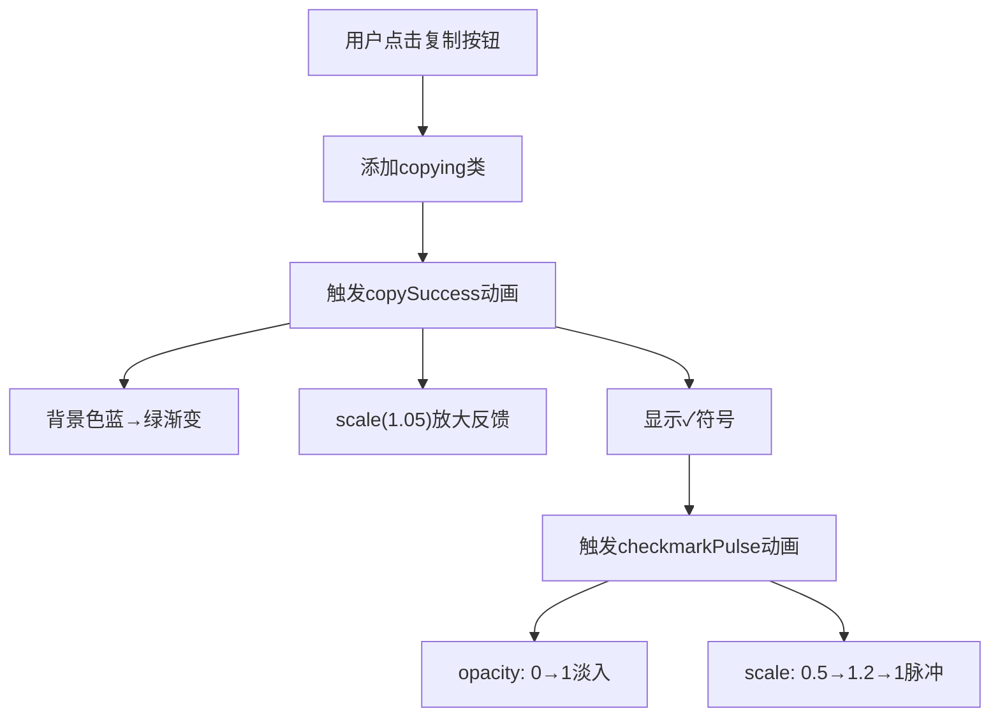
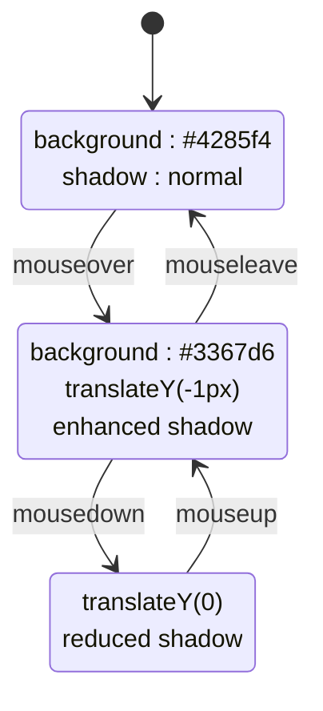

# 动态交互行为

<cite>
**Referenced Files in This Document **   
- [popup.css](file://src/styles/popup.css)
- [sidebar.css](file://src/popup/sidebar.css)
- [ContentArea.tsx](file://src/components/ContentArea.tsx)
</cite>

## 目录
1. [引言](#引言)
2. [核心动画机制分析](#核心动画机制分析)
3. [微交互设计原理](#微交互设计原理)
4. [状态过渡优化策略](#状态过渡优化策略)
5. [用户体验影响评估](#用户体验影响评估)

## 引言
本文档深入剖析AIHCX扩展程序中按钮系统的动态交互实现机制。重点解析复制成功动画（copySuccess）的关键帧序列、对勾脉冲动画（checkmarkPulse）的协同效应，以及整体微交互设计如何提升用户操作信心。

## 核心动画机制分析

### copySuccess关键帧序列解析
`copySuccess`动画通过CSS @keyframes定义了从初始状态到完成态的完整视觉反馈流程：

- **0%起始状态**：按钮背景色为蓝色（#4285f4），缩放比例为1:1，呈现标准待命状态
- **50%中间状态**：触发transform: scale(1.05)的放大反馈，产生轻微弹跳感，增强点击确认的物理反馈
- **100%完成状态**：背景色渐变为绿色（#28a745），保持1.05倍缩放，表示操作成功完成

该动画应用于`.result-container button.copying`和`.action-buttons button.copying`选择器，通过`animation: copySuccess 0.3s ease-out`执行，持续时间为300毫秒，采用缓出曲线确保结束时的平滑性。

**Section sources**
- [popup.css](file://src/styles/popup.css#L678-L750)

### checkmarkPulse脉冲动画协同效应
`checkmarkPulse`动画与`transform: scale(1.05)`形成双重强化反馈：

**Diagram sources **
- [popup.css](file://src/styles/popup.css#L678-L750)

**Section sources**
- [popup.css](file://src/styles/popup.css#L678-L750)

## 微交互设计原理

### 视觉层次构建
通过多维度视觉变化构建丰富的反馈层次：

| 变化维度 | 初始状态 | 过渡效果 | 完成状态 |
|---------|--------|-------|--------|
| 背景色 | #4285f4 (蓝色) | 渐变过渡 | #28a745 (绿色) |
| 缩放比例 | scale(1) | scale(1.05) | scale(1.05) |
| 阴影强度 | rgba(66,133,244,0.3) | 增强至rgba(40,167,69,0.3) | 持续增强阴影 |
| 内容元素 | 无 | 添加✓符号 | 显示✓符号 |

box-shadow的强度变化从`0 1px 2px`增强到`0 2px 8px`，不仅增加了深度感，还通过光晕扩散模拟了"点亮"效果，显著增强了点击确认感。

**Section sources**
- [popup.css](file://src/styles/popup.css#L678-L750)

## 状态过渡优化策略

### hover/active状态流畅性
`:hover`和`:active`状态间的过渡通过`transition: all 0.2s ease`实现统一优化：

- **hover状态**：背景色变深(#3367d6)，上移1px(`translateY(-1px)`)，阴影增强
- **active状态**：恢复原位(`translateY(0)`)，阴影减弱

这种设计模拟了物理世界的按压-释放过程，200毫秒的过渡时间经过精心调校，既不会过快导致突兀，也不会过慢影响响应感。

**Diagram sources **
- [popup.css](file://src/styles/popup.css#L678-L750)
- [sidebar.css](file://src/popup/sidebar.css#L649-L706)

**Section sources**
- [popup.css](file://src/styles/popup.css#L678-L750)
- [sidebar.css](file://src/popup/sidebar.css#L649-L706)

## 用户体验影响评估

### 操作信心提升机制
这些微交互共同构建了完整的操作确认闭环：

1. **即时反馈**：点击瞬间的缩放变化提供即时触觉模拟
2. **过程可视化**：动画序列清晰展示操作进度
3. **结果确认**：绿色背景+对勾符号明确标识成功状态
4. **防误触保护**：`pointer-events: none`防止重复点击

这种多层次的反馈系统有效降低了用户的认知负荷，使操作结果一目了然，显著提升了用户对系统响应的信任度和操作信心。

**Section sources**
- [popup.css](file://src/styles/popup.css#L678-L750)
- [ContentArea.tsx](file://src/components/ContentArea.tsx#L0-L116)