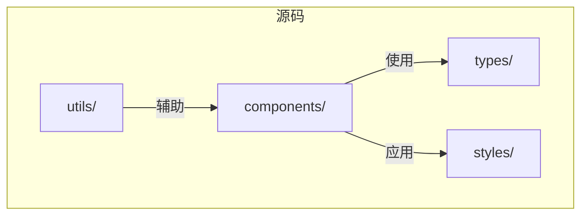
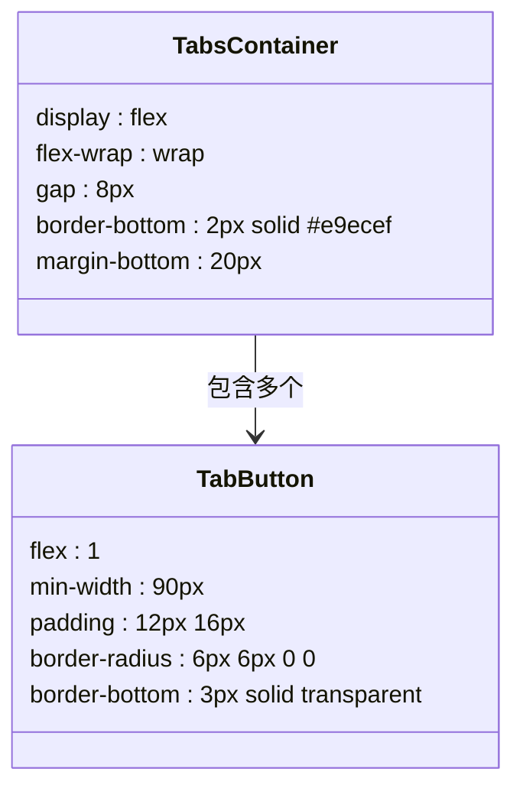
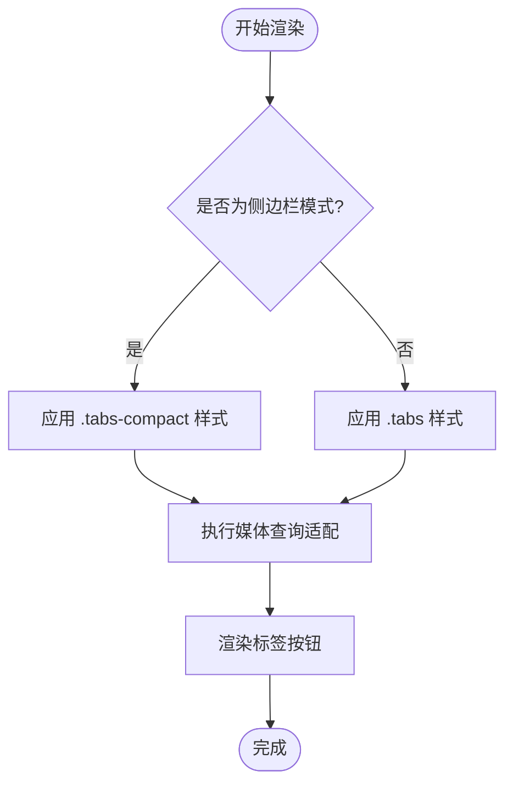

# 标签导航基础布局

<cite>
**本文档中引用的文件**
- [TabNavigation.tsx](file://src/components/TabNavigation.tsx)
- [popup.css](file://src/styles/popup.css)
- [sidebar.css](file://src/popup/sidebar.css)
- [index.ts](file://src/types/index.ts)
</cite>

## 目录
1. [简介](#简介)
2. [项目结构](#项目结构)
3. [核心组件](#核心组件)
4. [弹性布局机制分析](#弹性布局机制分析)
5. [响应式行为与设备适配](#响应式行为与设备适配)
6. [视觉设计与UI层次](#视觉设计与ui层次)
7. [依赖关系分析](#依赖关系分析)
8. [优化建议](#优化建议)
9. [结论](#结论)

## 简介
本项目为AIHC助手浏览器扩展，提供针对特定平台的功能增强。其中标签导航系统是用户界面的核心交互组件之一，负责在不同功能视图之间进行切换。该系统采用现代CSS弹性布局技术实现自适应、可维护且具有良好用户体验的导航结构。

## 项目结构
项目遵循典型的React + TypeScript前端架构模式，按功能模块组织代码。主要目录包括`components`（UI组件）、`styles`（样式表）、`types`（类型定义）等，确保高内聚低耦合的设计原则。



**Diagram sources**
- [TabNavigation.tsx](file://src/components/TabNavigation.tsx)
- [popup.css](file://src/styles/popup.css)
- [index.ts](file://src/types/index.ts)

**Section sources**
- [TabNavigation.tsx](file://src/components/TabNavigation.tsx)
- [popup.css](file://src/styles/popup.css)

## 核心组件
`TabNavigation` 组件是标签系统的主控逻辑单元，接收当前激活标签、参数状态和页面名称作为属性输入，并根据业务条件动态渲染可见标签项。其通过`TaskParams`接口判断各功能模块的数据可用性，实现智能显示控制。

**Section sources**
- [TabNavigation.tsx](file://src/components/TabNavigation.tsx#L3-L88)
- [index.ts](file://src/types/index.ts#L12-L73)

## 弹性布局机制分析
`.tabs` 容器采用 `display: flex` 与 `flex-wrap: wrap` 协同工作，形成二维自适应布局体系。此组合允许子元素在主轴方向上尽可能展开，当容器空间不足时自动换行至下一行，避免溢出或压缩。

`gap: 8px` 属性统一控制所有标签之间的间距，在水平和垂直方向均生效，消除传统margin处理带来的复杂性和不一致性问题。这种间距策略在多分辨率设备下表现稳定，无需额外媒体查询干预。

`min-width: 90px` 结合 `flex: 1` 实现了“等分布局优先，最小宽度保障”的双重效果：在空间充足时所有标签平均分配剩余空间；在窄屏环境下则保持至少90px的可点击区域，提升移动端操作体验。



**Diagram sources**
- [popup.css](file://src/styles/popup.css#L555-L584)

**Section sources**
- [popup.css](file://src/styles/popup.css#L555-L584)

## 响应式行为与设备适配
系统通过两套独立样式规则应对不同场景：常规弹窗模式使用 `.tabs` 类，而侧边栏嵌入模式则启用 `.tabs-compact` 类。后者进一步缩小内边距、调整字体大小并限制最大宽度，以适应更狭窄的空间。

在极小屏幕（如小于320px）下，系统通过媒体查询逐步降低最小宽度阈值和文字尺寸，确保关键功能仍可访问。同时启用横向滚动条（仅限紧凑模式），保证所有标签始终可见且可操作。



**Diagram sources**
- [sidebar.css](file://src/popup/sidebar.css#L448-L533)

**Section sources**
- [popup.css](file://src/styles/popup.css#L555-L584)
- [sidebar.css](file://src/popup/sidebar.css#L448-L533)

## 视觉设计与UI层次
`border-bottom: 2px solid #e9ecef` 作为视觉锚点，明确划分导航区与内容区，增强界面分区感知。活动标签通过蓝色下划线突出显示，形成清晰的状态反馈。

`border-radius: 6px 6px 0 0` 仅对顶部两个角应用圆角，既保留现代UI的柔和感，又避免底部圆角可能引发的内容割裂错觉。这种半圆角设计强化了“标签页”这一隐喻，使用户直观理解其堆叠关系。

颜色过渡从默认灰色到悬停蓝色再到激活蓝色，配合轻微背景色变化（`rgba(66, 133, 244, 0.1)`），构建出丰富的交互反馈层次。

**Section sources**
- [popup.css](file://src/styles/popup.css#L555-L584)

## 依赖关系分析
标签系统依赖于多个核心类型定义：
- `TabType` 枚举限定合法标签类型
- `TaskParams` 接口提供数据存在性判断依据
- `TabNavigationProps` 定义组件输入契约

这些类型共同构成类型安全的通信协议，确保运行时行为符合预期。

```mermaid
erDiagram
TAB_TYPE ||--o{ TAB_NAVIGATION : "使用"
TASK_PARAMS ||--o{ TAB_NAVIGATION : "驱动"
TAB_NAVIGATION_PROP }|--|| TAB_NAVIGATION : "定义"
class TAB_TYPE {
cli
commandScript
json
yaml
apiDocs
chat
}
class TASK_PARAMS {
cliItems[]
commandScript?
jsonItems[]
yamlItems[]
apiDocs[]
chatConfig?
isDataDownloadPage?
}
class TAB_NAVIGATION_PROP {
activeTab: TabType
onTabChange: Function
taskParams: TaskParams
pageName: string
}
```

**Diagram sources**
- [index.ts](file://src/types/index.ts#L12-L73)
- [TabNavigation.tsx](file://src/components/TabNavigation.tsx#L3-L8)

**Section sources**
- [index.ts](file://src/types/index.ts#L12-L73)
- [TabNavigation.tsx](file://src/components/TabNavigation.tsx#L3-L8)

## 优化建议
1. **无障碍支持**：增加ARIA标签以提升可访问性。
2. **动画平滑度**：考虑引入`will-change: transform`优化悬停动画性能。
3. **主题化支持**：将颜色变量抽离为CSS自定义属性，便于未来支持深色模式。
4. **触控优化**：在移动设备上适当增大点击热区。
5. **加载状态管理**：为异步数据加载过程添加骨架屏占位符。

## 结论
该标签导航系统通过合理运用CSS弹性布局特性，实现了高度自适应、语义清晰且视觉友好的用户界面。其结合TypeScript强类型系统，保障了代码的可维护性与稳定性，为复杂功能集成提供了坚实基础。未来可通过渐进式增强策略持续提升用户体验。