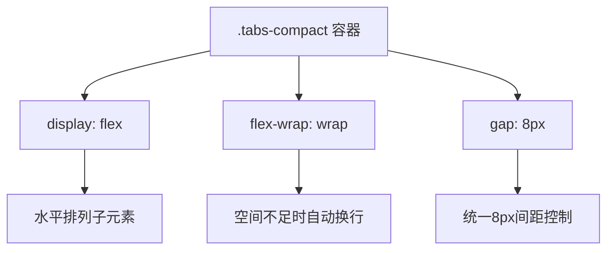
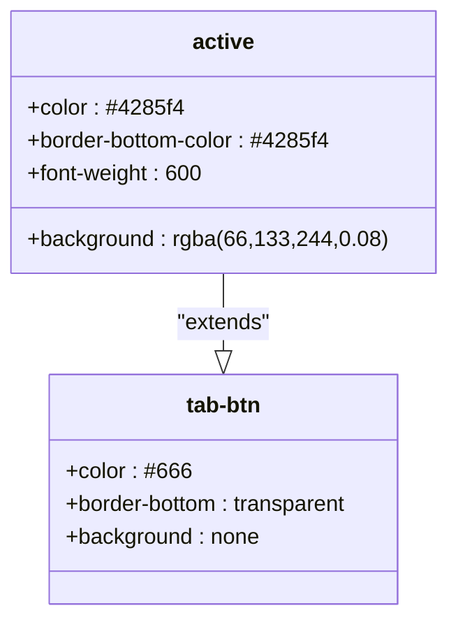
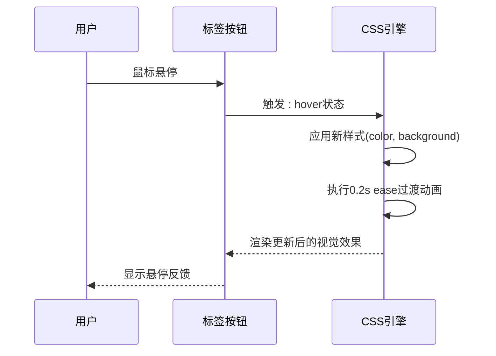

# 标签导航样式

<cite>
**Referenced Files in This Document **   
- [TabNavigation.tsx](file://src/components/TabNavigation.tsx)
- [sidebar.css](file://src/popup/sidebar.css)
- [popup.css](file://src/styles/popup.css)
</cite>

## 目录
1. [简介](#简介)
2. [核心组件分析](#核心组件分析)
3. [布局与间距体系](#布局与间距体系)
4. [激活状态设计模式](#激活状态设计模式)
5. [交互反馈机制](#交互反馈机制)
6. [视觉引导策略](#视觉引导策略)

## 简介
本文档全面解析AIHCX扩展程序中标签导航（Tabs）的样式体系。重点分析`.tabs-compact`容器及其内部按钮的CSS实现，涵盖自适应布局、状态管理、交互反馈和视觉引导等关键设计要素。

## 核心组件分析

文档详细解析了标签导航的核心实现，包括React组件结构与对应的CSS样式规则。

**Section sources**
- [TabNavigation.tsx](file://src/components/TabNavigation.tsx#L10-L88)
- [sidebar.css](file://src/popup/sidebar.css#L448-L560)
- [popup.css](file://src/styles/popup.css#L555-L584)

## 布局与间距体系

### Flex弹性布局实现
标签容器采用`display: flex`结合`flex-wrap: wrap`的弹性布局方案，实现了响应式的自适应标签布局。这种设计确保在不同屏幕尺寸下，标签能够自动换行排列，保持良好的可读性和可用性。



**Diagram sources **
- [sidebar.css](file://src/popup/sidebar.css#L448)

### 统一间距控制
通过`gap: 8px`属性实现标签间的统一间距控制，替代传统的margin方案。这种方法简化了布局计算，避免了边距重叠问题，并提供了更精确的空间管理。

**Section sources**
- [sidebar.css](file://src/popup/sidebar.css#L448)

## 激活状态设计模式

### 视觉突出机制
激活状态（`.active`）通过`border-bottom-color`突显选中项的设计模式，创建清晰的视觉焦点。选中标签的底部边框变为蓝色（#4285f4），与未选中状态形成鲜明对比。

### 可点击性增强
配合背景透明度变化（`background: rgba(66, 133, 244, 0.08)`），增强按钮的可点击性感知。这种双重视觉提示（边框+背景）帮助用户明确识别当前活动的标签页。



**Diagram sources **
- [sidebar.css](file://src/popup/sidebar.css#L497)

**Section sources**
- [sidebar.css](file://src/popup/sidebar.css#L497)

## 交互反馈机制

### 悬停效果
`:hover`伪类触发颜色过渡动画，当用户将鼠标悬停在标签上时，文本颜色渐变为蓝色（#4285f4），同时背景色轻微变暗（`rgba(66, 133, 244, 0.05)`），提供即时的视觉反馈。

### 过渡动画
通过`transition: all 0.2s ease`属性实现所有可动画属性的平滑过渡，包括颜色、背景、变换等。这种200毫秒的缓动动画创造了流畅的交互体验，避免了突兀的状态切换。



**Diagram sources **
- [sidebar.css](file://src/popup/sidebar.css#L504)

**Section sources**
- [sidebar.css](file://src/popup/sidebar.css#L504)

## 视觉引导策略

### 圆角设计意义
`border-radius`仅应用于顶部圆角（`border-radius: 4px 4px 0 0`），这一设计具有重要的视觉引导意义：

1. **层级暗示**：顶部圆角暗示标签位于内容区域之上，形成视觉层级
2. **连接性指示**：直角底部与内容区域无缝连接，表明标签与下方内容的相关性
3. **界面整洁**：避免底部圆角造成的视觉割裂，保持界面整体性

该设计遵循了现代UI设计中的"卡片式"原则，通过微妙的几何形状引导用户理解界面元素之间的关系。

```mermaid
flowchart LR
    A["矩形标签"] --> B["添加顶部圆角"]
    B --> C["形成卡片视觉"]
    C --> D["暗示层级关系"]
    D --> E["引导用户关注内容区