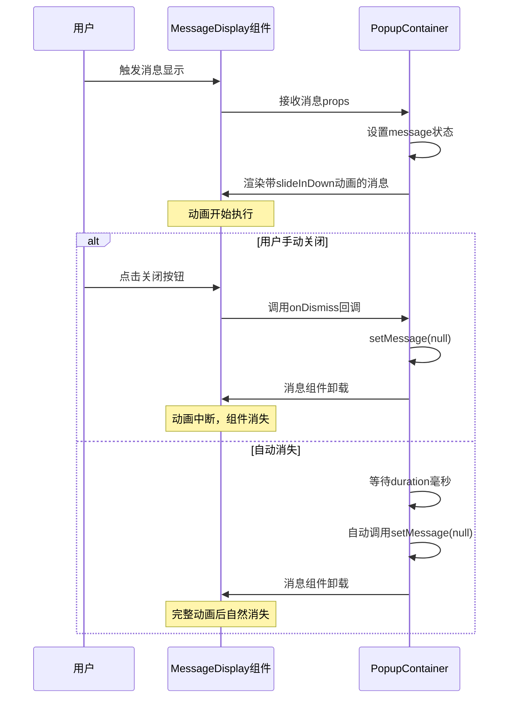

# 消息提示动画

<cite>
**Referenced Files in This Document **   
- [popup.css](file://src/styles/popup.css)
- [MessageDisplay.tsx](file://src/components/MessageDisplay.tsx)
- [PopupContainer.tsx](file://src/components/PopupContainer.tsx)
- [index.ts](file://src/types/index.ts)
</cite>

## 目录
1. [关键帧动画时序控制策略](#关键帧动画时序控制策略)
2. [复合变换对用户感知流畅度的影响](#复合变换对用户感知流畅度的影响)
3. [CSS Transitions与Animations性能对比](#css-transitions与animations性能对比)
4. [基于will-change属性的渲染优化方案](#基于will-change属性的渲染优化方案)
5. [动画中断处理最佳实践](#动画中断处理最佳实践)

## 关键帧动画时序控制策略

`@keyframes slideInDown`关键帧动画采用`cubic-bezier(0.25, 0.1, 0.25, 1)`贝塞尔曲线作为缓动函数，实现了自然流畅的进入效果。该动画定义了从初始状态到最终状态的完整过渡过程：起始时元素完全透明且位于上方`transform: translateY(-10px)`，结束时元素完全不透明并回到正常位置`transform: translateY(0)`。

此贝塞尔曲线的特点是开始阶段加速度较小，随后逐渐加快，最后平滑减速至停止，模拟了物理世界中的惯性运动规律。这种缓动模式避免了机械式的线性运动，使用户感知到更加自然和舒适的界面反馈。

**Section sources**
- [popup.css](file://src/styles/popup.css#L738-L750)

## 复合变换对用户感知流畅度的影响

`slideInDown`动画通过组合`opacity`和`transform: translateY()`两个CSS属性实现复合视觉效果。`opacity`属性控制元素的透明度变化，创造淡入视觉感受；`transform: translateY()`属性则负责垂直位移，产生从上向下的滑动效果。

这种复合变换充分利用了浏览器对`transform`和`opacity`属性的硬件加速支持，确保动画在各种设备上都能保持高帧率运行。同时，两个属性的变化相互配合，既提供了明确的空间移动指示，又通过渐显效果减轻了突然出现带来的视觉冲击，显著提升了用户界面的感知流畅度和专业感。

**Section sources**
- [popup.css](file://src/styles/popup.css#L738-L750)
- [MessageDisplay.tsx](file://src/components/MessageDisplay.tsx#L8-L19)

## CSS Transitions与Animations性能对比

在消息提示场景下，CSS Animations相比Transitions具有更优的适用性和性能表现。本项目中采用`@keyframes`定义的Animation而非Transition，主要原因在于Animation提供了更精确的时序控制能力。

Animation允许定义多阶段的关键帧，支持复杂的运动路径和属性变化序列，而Transition仅能描述两个状态间的简单过渡。对于需要精细控制的消息提示动画，Animation的`from-to`语义比Transition的`hover-active`等状态驱动模式更为直观和可靠。此外，Animation独立于元素状态，不会因DOM属性意外变化而中断，提高了用户体验的一致性。

**Section sources**
- [popup.css](file://src/styles/popup.css#L738-L750)
- [MessageDisplay.tsx](file://src/components/MessageDisplay.tsx#L8-L19)

## 基于will-change属性的渲染优化方案

尽管当前代码库中未显式使用`will-change`属性，但在高性能要求的场景下，建议为频繁动画的元素添加`will-change: transform, opacity`声明。该属性能够提前通知浏览器哪些元素将要发生变换，促使浏览器提前进行图层提升和硬件加速准备。

对于消息提示组件，由于其可能频繁创建和销毁，过度使用`will-change`可能导致内存占用增加。因此推荐采用动态添加策略：在消息即将显示前通过JavaScript临时添加`will-change`样式，动画完成后立即移除。这种按需优化的方式既能获得性能提升，又能避免长期占用过多GPU资源。

**Section sources**
- [popup.css](file://src/styles/popup.css#L738-L750)

## 动画中断处理最佳实践

消息提示组件的动画中断处理通过React组件生命周期和状态管理实现。当用户快速触发多个消息时，系统会自动管理消息队列，确保每个消息都能完整展示后再被新消息替换或消失。

具体实现中，`PopupContainer`组件维护一个消息状态，通过`setMessage`更新消息内容，并设置定时器自动清除。若在定时器触发前有新消息到来，旧消息的状态会被新状态覆盖，实现平滑的动画过渡。关闭按钮的点击事件处理器会立即清除消息状态，中断正在进行的动画并直接卸载组件，符合用户直觉的操作反馈。

**Diagram sources **
- [MessageDisplay.tsx](file://src/components/MessageDisplay.tsx#L8-L19)
- [PopupContainer.tsx](file://src/components/PopupContainer.tsx#L165-L175)

**Section sources**
- [MessageDisplay.tsx](file://src/components/MessageDisplay.tsx#L8-L19)
- [PopupContainer.tsx](file://src/components/PopupContainer.tsx#L165-L175)