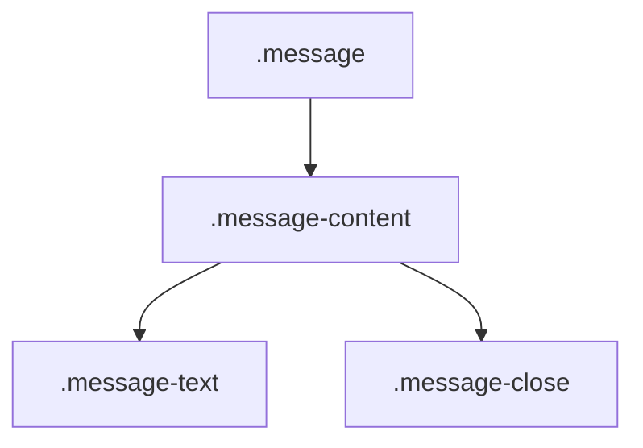

# 消息提示结构

<cite>
**Referenced Files in This Document **  
- [MessageDisplay.tsx](file://src/components/MessageDisplay.tsx)
- [popup.css](file://src/styles/popup.css)
</cite>

## 目录
1. [布局架构概览](#布局架构概览)  
2. [视觉留白与信息层级](#视觉留白与信息层级)  
3. 弹性盒子模型解析  
   - [flex: 1 的自适应机制](#flex-1-的自适应机制)  
   - [flex-shrink: 0 的尺寸锁定原理](#flex-shrink-0-的尺寸锁定原理)  
4. 响应式行为分析  
   - [不同屏幕尺寸下的布局重构](#不同屏幕尺寸下的布局重构)  
5. 可复用的布局优化建议  
6. 结论  

## 布局架构概览

消息提示组件（`.message`）采用嵌套式布局设计，其核心结构由外层容器、内容区域和交互元素三部分构成。该组件通过语义化的类名组织层级关系，确保结构清晰且易于维护。



**Diagram sources **  
- [MessageDisplay.tsx](file://src/components/MessageDisplay.tsx#L8-L19)

**Section sources**  
- [MessageDisplay.tsx](file://src/components/MessageDisplay.tsx#L8-L19)

## 视觉留白与信息层级

`.message` 组件通过 `border-left: 4px solid` 设计实现视觉上的层次区分。左侧边框不仅作为装饰性元素，更承担了分类标识的功能——不同颜色对应不同类型的消息（如成功、错误、警告），从而在用户扫视界面时快速传递语义信息。

这种设计利用了人类视觉对边缘敏感的特性，在不增加额外图标或文字的前提下强化信息识别效率。同时，左侧留白避免了内容区域被边框侵占，保持文本可读性。

```css
.message {
  border-left: 4px solid;
}
.message.success { border-left-color: #28a745; }
.message.error { border-left-color: #dc3545; }
.message.warning { border-left-color: #ffc107; }
.message.info { border-left-color: #17a2b8; }
```

**Section sources**  
- [popup.css](file://src/styles/popup.css#L799-L815)

## 弹性盒子模型解析

### flex: 1 的自适应机制

`.message-content` 使用 Flexbox 布局，其中 `.message-text` 设置为 `flex: 1`，表示其将占据主轴上所有可用空间。这一设置使得文本内容能够根据容器宽度动态伸缩，尤其在窄屏设备中仍能充分利用横向空间进行换行显示。

当 `.message-close` 按钮固定宽度后，剩余空间全部分配给 `.message-text`，形成“收缩-扩展”联动效应，保障主要内容优先展示。

```css
.message-content {
  display: flex;
  justify-content: space-between;
  width: 100%;
  gap: 8px;
}

.message-text {
  flex: 1;
  line-height: 1.4;
}
```

**Section sources**  
- [popup.css](file://src/styles/popup.css#L779-L785)

### flex-shrink: 0 的尺寸锁定原理

尽管 CSS 中未显式声明 `flex-shrink: 0`，但 `.message-close` 元素通过以下方式实现等效效果：

- 显式设定宽高：`width: 24px !important; height: 24px !important;`
- 禁止缩放：`flex-shrink: 0 !important;`
- 固定尺寸单位避免弹性压缩

这确保关闭按钮在任何情况下均保持一致尺寸，不会因父容器挤压而变形，提升交互稳定性与用户体验一致性。

```css
.message-close {
  width: 24px !important;
  height: 24px !important;
  flex-shrink: 0 !important;
}
```

**Section sources**  
- [popup.css](file://src/styles/popup.css#L786-L798)

## 响应式行为分析

### 不同屏幕尺寸下的布局重构

组件在响应式场景下表现出良好的适应能力。通过 `gap: 8px` 控制子元素间距，并结合 `justify-content: space-between` 实现两端对齐，即使在小屏幕环境下也能维持合理的视觉节奏。

此外，动画属性 `animation: slideInDown 0.3s ease-out` 在移动设备上提供流畅的入场效果，增强反馈感知而不影响布局流。

```css
@media (max-width: 480px) {
  .tabs {
    flex-direction: column;
  }
  .action-buttons {
    flex-direction: column;
    width: 100%;
  }
}
```

虽然当前样式表中未针对 `.message` 本身定义媒体查询，但其基于 Flexbox 的弹性布局天然支持响应式重构，无需额外断点干预即可完成内容重排。

**Section sources**  
- [popup.css](file://src/styles/popup.css#L1444-L1455)

## 可复用的布局优化建议

1. **统一使用 Flexbox 构建水平排列组件**：以 `display: flex` 替代浮动或绝对定位，提升布局健壮性。
2. **为主内容区设置 `flex: 1`**：确保关键信息优先获得空间资源。
3. **为操作控件添加 `flex-shrink: 0`**：防止按钮、图标等交互元素被压缩。
4. **利用 `gap` 属性管理间距**：取代传统 margin 手动计算，简化响应式调整。
5. **采用语义化类名组织结构**：如 `.message`, `.message-content` 形成明确父子关系，便于团队协作与后期维护。

## 结论

`.message` 组件通过精巧的 CSS 设计实现了高效的信息传达与优雅的视觉呈现。其核心在于合理运用 Flexbox 的弹性分配机制与视觉留白策略，在保证功能完整性的同时兼顾跨设备兼容性。未来可进一步引入 CSS 自定义属性（Custom Properties）提升主题定制能力，使样式系统更具扩展性。