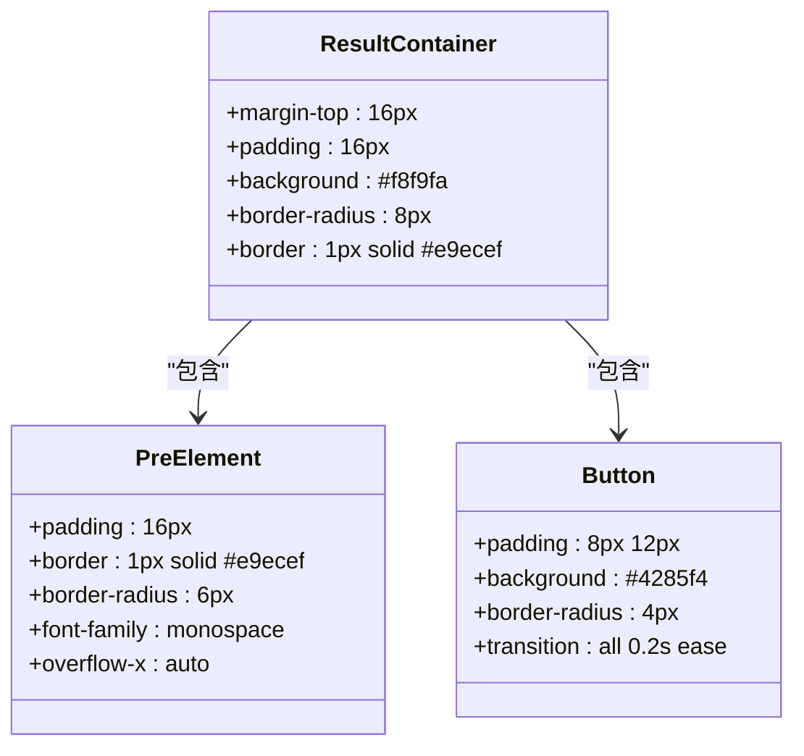
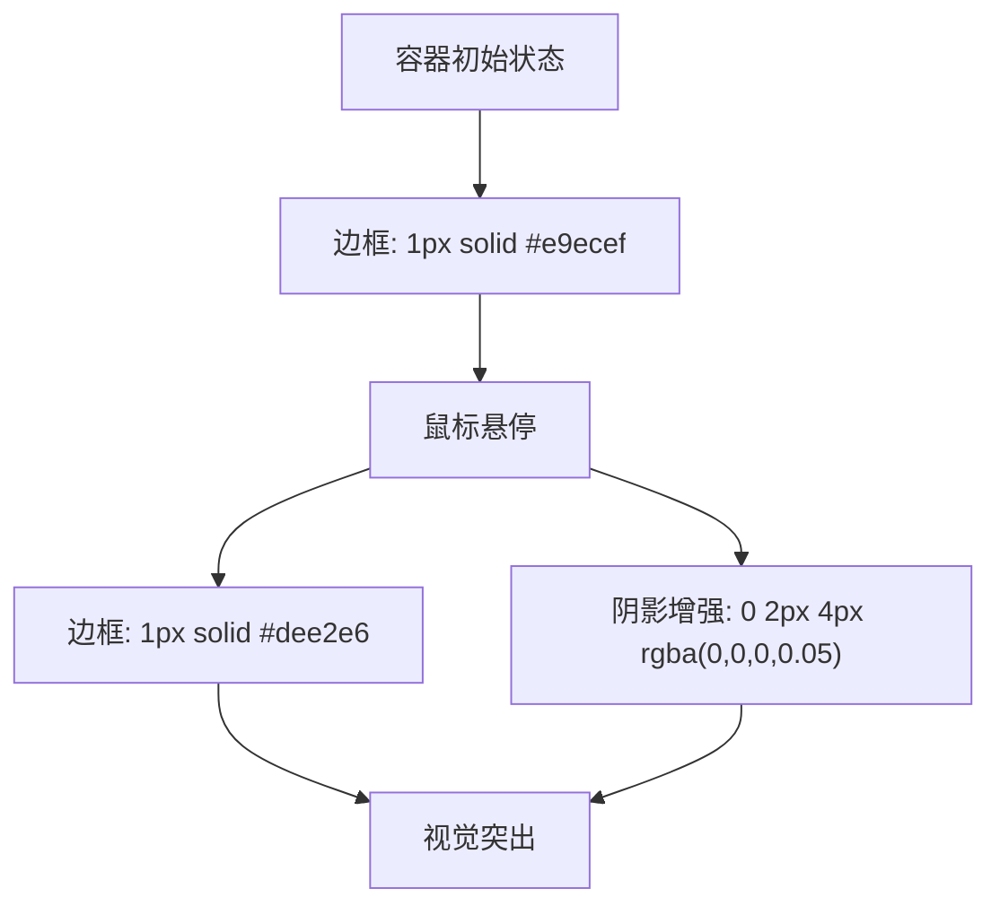
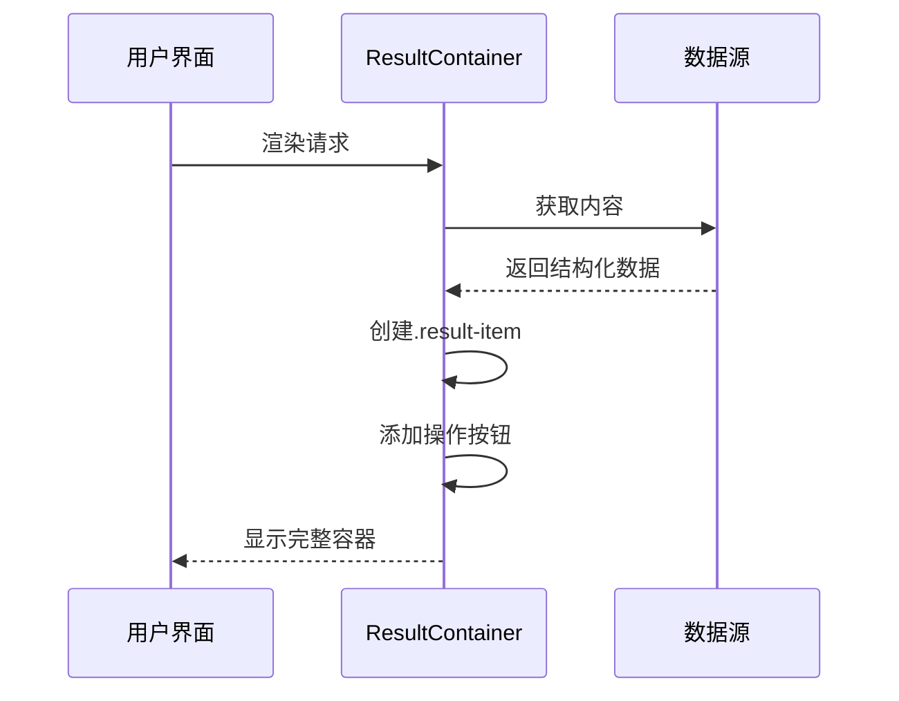

# 结果容器布局设计

<cite>
**Referenced Files in This Document**   
- [popup.css](file://src/styles/popup.css)
- [sidebar.css](file://src/popup/sidebar.css)
- [PopupContainer.tsx](file://src/components/PopupContainer.tsx)
</cite>

## Table of Contents
1. [结果容器核心样式分析](#结果容器核心样式分析)
2. [视觉呼吸空间与内边距策略](#视觉呼吸空间与内边距策略)
3. [圆角边框的视觉柔和化作用](#圆角边框的视觉柔和化作用)
4. [边框隔离机制与色彩选择](#边框隔离机制与色彩选择)
5. [响应式设计表现](#响应式设计表现)
6. [内容承载功能实现](#内容承载功能实现)
7. [与父级容器的样式继承关系](#与父级容器的样式继承关系)

## 结果容器核心样式分析

`.result-container` 是插件UI中的核心内容展示区域，其样式定义主要位于 `popup.css` 和 `sidebar.css` 两个文件中。该容器作为信息呈现的主要载体，在不同界面模式下展现出一致的设计语言。

**Diagram sources**
- [popup.css](file://src/styles/popup.css#L597-L611)
- [sidebar.css](file://src/popup/sidebar.css#L566-L572)

**Section sources**
- [popup.css](file://src/styles/popup.css#L597-L611)
- [sidebar.css](file://src/popup/sidebar.css#L566-L572)

## 视觉呼吸空间与内边距策略

`.result-container` 采用 **16px 的内边距（padding）** 来创造充足的视觉呼吸空间。这种设计策略在用户体验层面具有多重优势：

1. **内容隔离性**：通过在容器内部创建缓冲区，有效防止内容元素紧贴边界，避免了视觉上的拥挤感。
2. **阅读舒适度**：符合人体工学的阅读习惯，为用户提供了自然的视线引导路径。
3. **层次分明**：与外部元素形成清晰的间距层次，强化了信息架构的层级关系。

在桌面端和移动端均保持一致的内边距策略，确保跨设备体验的一致性。当与其他组件组合使用时，如 `.tab-content`，会通过外边距（margin-top: 16px）形成统一的垂直节奏。

**Section sources**
- [popup.css](file://src/styles/popup.css#L605-L606)

## 圆角边框的视觉柔和化作用

容器采用 **8px 的圆角边框（border-radius）**，这一设计决策体现了现代UI设计的趋势：

- **降低视觉攻击性**：相较于直角，圆角能够减少界面元素的"尖锐感"，营造更加友好、温和的视觉氛围。
- **增强可点击感知**：圆角形状天然带有按钮或可交互元素的暗示，提升了用户的操作预期。
- **适应多尺寸屏幕**：在小尺寸屏幕上，圆角能更好地适配手指触控区域，提高交互准确性。

值得注意的是，在侧边栏模式下（`sidebar.css`），虽然基础圆角值仍为8px，但整体布局更为紧凑，体现了对有限空间的有效利用。

**Section sources**
- [popup.css](file://src/styles/popup.css#L605-L606)
- [sidebar.css](file://src/popup/sidebar.css#L566-L572)

## 边框隔离机制与色彩选择

`.result-container` 使用 **1px 实线边框** 配合 **#e9ecef 灰色** 实现与其他界面元素的有效隔离：

- **功能性隔离**：边框作为明确的视觉边界，将容器内的内容与周围环境分隔开来，帮助用户快速识别信息区块。
- **色彩心理学应用**：#e9ecef 属于浅灰色系，既足够明显以区分边界，又不会过于突兀而分散注意力。
- **状态反馈**：配合 `:hover` 状态下的边框颜色变化（变为 #dee2e6）和轻微阴影效果，提供即时的交互反馈。

**Diagram sources**
- [popup.css](file://src/styles/popup.css#L605-L606)
- [popup.css](file://src/styles/popup.css#L610-L611)

**Section sources**
- [popup.css](file://src/styles/popup.css#L605-L611)

## 响应式设计表现

`.result-container` 在不同屏幕尺寸下表现出良好的自适应能力：

- **流体布局**：容器宽度设置为100%，能够根据父容器动态调整，充分利用可用空间。
- **断点优化**：在 `sidebar.css` 中针对小屏幕设备进行了专门优化，减小了内边距至8px，并调整了字体大小和按钮尺寸。
- **溢出处理**：对于长代码块等可能超出容器的内容，通过 `overflow-x: auto` 实现水平滚动，保证内容完整性。

在移动设备上，容器的紧凑设计确保了主要内容的可见性，同时保留了关键的视觉特征（如背景色、边框），维持品牌识别度。

**Section sources**
- [popup.css](file://src/styles/popup.css#L597-L611)
- [sidebar.css](file://src/popup/sidebar.css#L566-L572)

## 内容承载功能实现

作为内容承载容器，`.result-container` 承担着组织和展示多样化信息的核心职责：

- **结构化输出**：通过嵌套的 `.result-item` 元素，支持多条目信息的有序排列。
- **富文本支持**：内部的 `<pre>` 标签用于展示格式化代码或命令行输出，保持原始格式不变。
- **交互集成**：内置操作按钮（复制、保存等），实现"查看-操作"一体化的工作流。

在 `PopupContainer.tsx` 组件中，该容器被动态渲染，根据当前页面状态显示相应的API文档、CLI命令或其他数据内容，体现了高度的灵活性和复用性。

**Diagram sources**
- [PopupContainer.tsx](file://src/components/PopupContainer.tsx#L20-L566)
- [popup.css](file://src/styles/popup.css#L597-L611)

**Section sources**
- [PopupContainer.tsx](file://src/components/PopupContainer.tsx#L20-L566)

## 与父级容器的样式继承关系

`.result-container` 与其父级 `.popup-container` 存在明确的样式继承与覆盖关系：

- **继承方面**：
  - 字体家族和基本颜色继承自根容器
  - 布局流遵循父容器的flex或block布局模式

- **覆盖方面**：
  - 定义独立的背景色（#f8f9fa）以区别于主背景
  - 设置专属的边框和圆角样式
  - 覆盖内边距值，建立自己的内容空间

这种设计模式遵循了CSS的最佳实践——在保持整体风格统一的同时，允许特定组件拥有独特的视觉特征。通过精确的类名控制，避免了样式污染，确保了组件的可维护性和可复用性。

**Section sources**
- [popup.css](file://src/styles/popup.css#L597-L611)
- [popup.css](file://src/styles/popup.css#L48-L54)