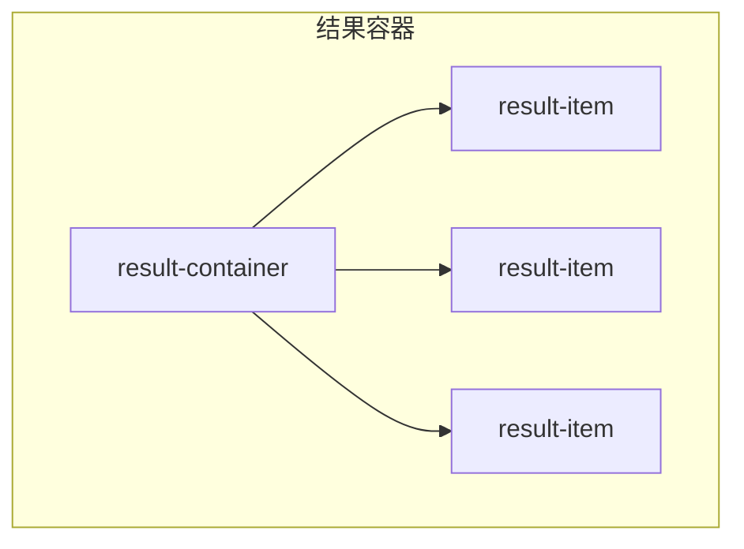
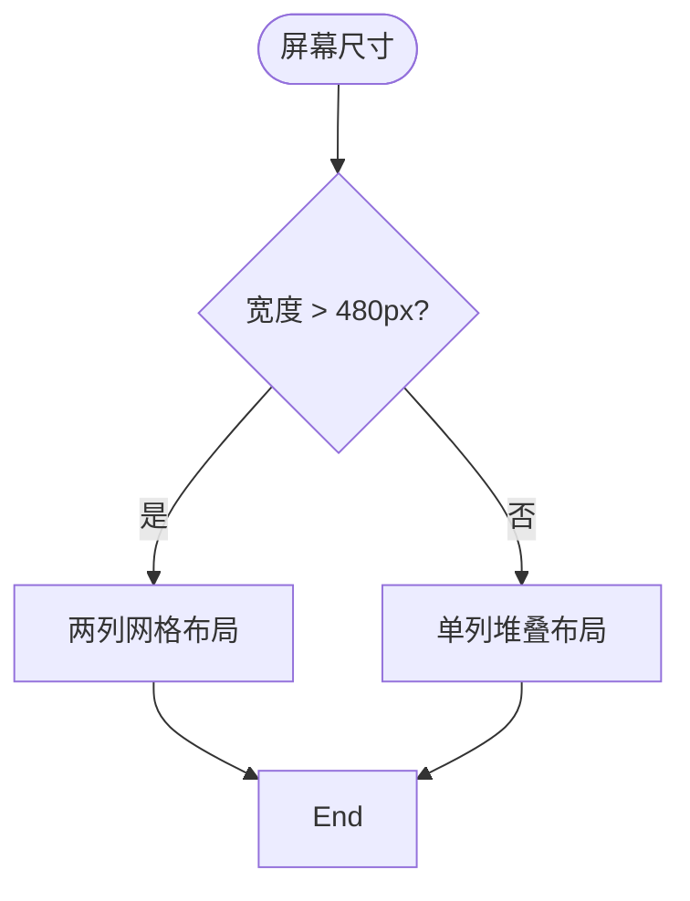
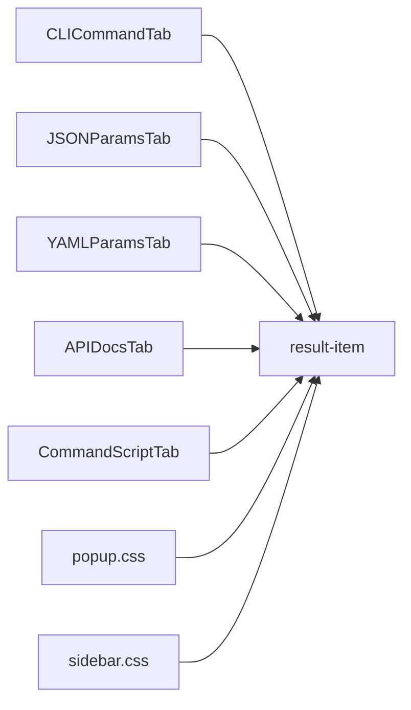

# 结果项结构样式

<cite>
**本文档引用的文件**
- [popup.css](file://src/styles/popup.css)
- [sidebar.css](file://src/popup/sidebar.css)
- [CLICommandTab.tsx](file://src/components/tabs/CLICommandTab.tsx)
- [JSONParamsTab.tsx](file://src/components/tabs/JSONParamsTab.tsx)
- [YAMLParamsTab.tsx](file://src/components/tabs/YAMLParamsTab.tsx)
- [APIDocsTab.tsx](file://src/components/tabs/APIDocsTab.tsx)
- [CommandScriptTab.tsx](file://src/components/tabs/CommandScriptTab.tsx)
- [DataDownloadInput.tsx](file://src/components/DataDownloadInput.tsx)
</cite>

## 目录
1. [简介](#简介)
2. [项目结构](#项目结构)
3. [核心组件](#核心组件)
4. [架构概述](#架构概述)
5. [详细组件分析](#详细组件分析)
6. [依赖分析](#依赖分析)
7. [性能考虑](#性能考虑)
8. [故障排除指南](#故障排除指南)
9. [结论](#结论)

## 简介
`.result-item` 类是本扩展程序中用于展示各类信息结果的核心UI组件。它通过精心设计的间距、布局和响应式特性，为用户提供清晰、一致且易于理解的信息展示体验。该组件广泛应用于CLI命令、JSON参数、YAML参数等多种场景，体现了良好的封装性和复用性。

## 项目结构
`.result-item` 组件主要分布在 `src/components/tabs/` 目录下的多个标签页组件中，并通过 `src/styles/popup.css` 和 `src/popup/sidebar.css` 进行样式定义。其作为独立的信息单元，被嵌套在 `.result-container` 容器内，构成了扩展程序弹窗界面的主要内容区域。

## 核心组件
`.result-item` 类的设计旨在创建一个具有明确视觉层次的独立信息块。其核心样式规则位于 `popup.css` 和 `sidebar.css` 文件中，通过 `margin-bottom: 20px` (或 `10px`) 来为每个项目之间创建足够的垂直空间，从而避免信息拥挤，提升可读性。

**中文来源**
- [popup.css](file://src/styles/popup.css#L526-L611)
- [sidebar.css](file://src/popup/sidebar.css#L549-L605)

## 架构概述
整个结果展示系统的架构围绕着 `.result-container` 和 `.result-item` 两个核心类构建。容器负责提供统一的背景、边框和内边距，而每个结果项则在其内部进行独立的内容组织和样式渲染。这种父子结构确保了整体风格的一致性，同时允许子元素拥有灵活的内容布局。



**图表来源**
- [popup.css](file://src/styles/popup.css#L526-L611)
- [sidebar.css](file://src/popup/sidebar.css#L549-L605)

## 详细组件分析

### .result-item 样式设计分析
`.result-item` 的结构化样式设计是其功能性的关键。20px（或10px）的底部外边距（`margin-bottom`）在视觉上将各个信息单元分隔开，构建了一个清晰的信息层次结构。用户可以轻松地识别出哪些内容属于同一个逻辑组，哪些是不同的条目。

然而，如果不对最后一个 `.result-item` 进行特殊处理，容器底部将会出现多余的空白。为此，CSS 中使用了 `:last-child` 选择器来精确地选中并重置最后一个子元素的 `margin-bottom` 为 `0`。这一技术有效地消除了末尾的多余间距，使整体布局更加紧凑和美观。

#### 对象关系图
```mermaid
classDiagram
class ResultContainer {
+margin-top : 16px
+padding : 16px
+background : #f8f9fa
+border-radius : 8px
}
class ResultItem {
+margin-bottom : 20px
+h3 margin : 0 0 8px 0
+pre styles...
}
ResultContainer --> ResultItem : contains
ResultItem : last-child → margin-bottom : 0
```

**图表来源**
- [popup.css](file://src/styles/popup.css#L526-L611)
- [sidebar.css](file://src/popup/sidebar.css#L549-L605)

**中文来源**
- [popup.css](file://src/styles/popup.css#L526-L611)
- [sidebar.css](file://src/popup/sidebar.css#L549-L605)

### 在 .result-container 中的排列方式
`.result-item` 元素在 `.result-container` 中以块级元素的形式垂直堆叠排列。这种线性的排列方式简单直观，符合用户的阅读习惯。每个 `.result-item` 都是一个独立的“卡片”，包含了标题（`h3`）、操作按钮（`.action-buttons`）以及主要内容（如 `pre` 代码块）。这种封装性使得 `.result-item` 成为一个高度自治的UI单元，可以方便地在不同上下文中复用。

**中文来源**
- [popup.css](file://src/styles/popup.css#L526-L611)
- [CLICommandTab.tsx](file://src/components/tabs/CLICommandTab.tsx#L25-L72)

### 复用模式与DOM结构示例
`.result-item` 组件在多种标签页中被复用，展示了其强大的通用性。

#### CLI命令标签页
在 `CLICommandTab.tsx` 中，每个CLI命令及其说明都被封装在一个 `.result-item` 中。
```tsx
<div className="result-container">
  {items.map((item, index) => (
    <div key={index} className="result-item">
      <h3>{item.title}<span className="action-buttons">...</span></h3>
      <pre>{item.text}</pre>
    </div>
  ))}
</div>
```

#### JSON参数标签页
在 `JSONParamsTab.tsx` 中，每个JSON配置片段同样使用 `.result-item` 进行包裹。
```tsx
<div className="result-container">
  {items.map((item, index) => (
    <div key={index} className="result-item">
      <h3>{item.title}<span className="action-buttons">...</span></h3>
      <pre>{item.text}</pre>
    </div>
  ))}
</div>
```
此模式也适用于 `YAMLParamsTab.tsx` 和 `APIDocsTab.tsx`，证明了 `.result-item` 是一个标准化的结果展示模板。

**中文来源**
- [CLICommandTab.tsx](file://src/components/tabs/CLICommandTab.tsx#L25-L72)
- [JSONParamsTab.tsx](file://src/components/tabs/JSONParamsTab.tsx#L25-L66)
- [YAMLParamsTab.tsx](file://src/components/tabs/YAMLParamsTab.tsx#L25-L66)
- [APIDocsTab.tsx](file://src/components/tabs/APIDocsTab.tsx#L25-L80)

### 响应式断点下的堆叠行为
`.result-item` 的响应式行为主要由其父容器 `.result-container` 或更高级别的布局（如 `data-download-input` 中的 `result-grid`）控制。例如，在 `DataDownloadInput.tsx` 组件中，`.result-grid` 使用CSS Grid布局，当屏幕宽度大于480px时，`.result-item` 会以两列网格形式显示；而在小屏幕上，则自动堆叠为单列。`.result-item` 自身的垂直外边距在这种堆叠行为下依然有效，确保了在任何设备上都有良好的阅读体验。



**图表来源**
- [popup.css](file://src/styles/popup.css#L377-L445)
- [DataDownloadInput.tsx](file://src/components/DataDownloadInput.tsx#L25-L369)

**中文来源**
- [popup.css](file://src/styles/popup.css#L377-L445)
- [DataDownloadInput.tsx](file://src/components/DataDownloadInput.tsx#L25-L369)

## 依赖分析
`.result-item` 组件的样式依赖于 `popup.css` 和 `sidebar.css` 两个样式表，其中 `popup.css` 定义了主弹窗样式的 `.result-item`，而 `sidebar.css` 则针对侧边栏模式提供了特定的、更紧凑的样式覆盖。其功能实现依赖于多个 `tabs` 目录下的React组件，这些组件负责将数据映射到 `.result-item` 的DOM结构中。



**图表来源**
- [popup.css](file://src/styles/popup.css)
- [sidebar.css](file://src/popup/sidebar.css)
- [CLICommandTab.tsx](file://src/components/tabs/CLICommandTab.tsx)
- [JSONParamsTab.tsx](file://src/components/tabs/JSONParamsTab.tsx)

## 性能考虑
从性能角度看，`.result-item` 的设计是高效的。它使用了标准的CSS盒模型和选择器（如 `:last-child`），这些在现代浏览器中都有很好的优化。其简单的DOM结构减少了渲染开销。唯一的潜在问题是当结果项数量极大时，大量的 `pre` 元素可能会导致内存占用增加，但考虑到这是一个浏览器扩展，通常展示的数据量有限，因此影响不大。

## 故障排除指南
如果发现 `.result-item` 的样式未正确应用，请检查以下几点：
1.  **样式表加载**：确认 `popup.css` 或 `sidebar.css` 已正确引入。
2.  **CSS优先级**：`sidebar.css` 中的样式使用了 `!important`，这可能会影响主弹窗样式的应用，需注意样式冲突。
3.  **DOM结构**：确保 `.result-item` 被正确地放置在 `.result-container` 内，并且HTML标签闭合正确。
4.  **:last-child 生效条件**：确认 `.result-item` 确实是其父容器的最后一个子元素，中间不能有其他非空的文本节点或兄弟元素。

**中文来源**
- [popup.css](file://src/styles/popup.css)
- [sidebar.css](file://src/popup/sidebar.css)

## 结论
`.result-item` 类通过其20px的底部外边距和 `:last-child` 选择器的巧妙运用，成功构建了一个清晰、美观且无冗余间距的信息层次结构。它在 `.result-container` 中的垂直堆叠排列方式，以及在CLI、JSON、YAML等不同标签页中的广泛复用，充分体现了其作为独立信息单元的优秀封装性。结合响应式设计，该组件能够在各种设备和场景下为用户提供一致且优质的视觉体验，是本扩展程序UI设计中的一个典范。