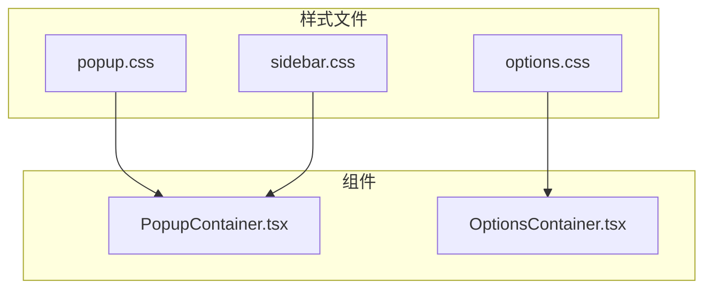
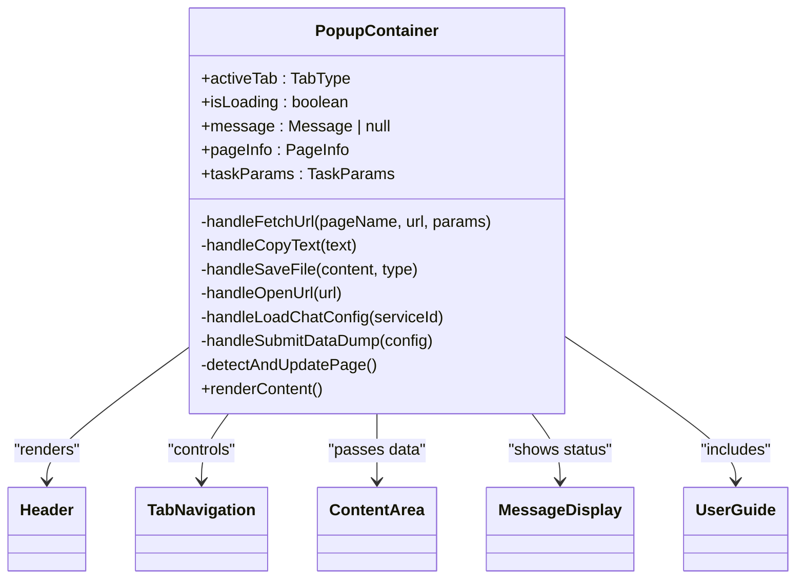

# 样式系统

<cite>
**Referenced Files in This Document**   
- [popup.css](file://src/styles/popup.css)
- [options.css](file://src/styles/options.css)
- [sidebar.css](file://src/popup/sidebar.css)
- [PopupContainer.tsx](file://src/components/PopupContainer.tsx)
- [OptionsContainer.tsx](file://src/components/OptionsContainer.tsx)
</cite>

## 目录
1. [简介](#简介)
2. [项目结构与样式架构](#项目结构与样式架构)
3. [核心组件分析](#核心组件分析)
4. [弹窗界面样式体系](#弹窗界面样式体系)
5. [选项页面定制化设计](#选项页面定制化设计)
6. [侧边栏UI适配策略](#侧边栏ui适配策略)
7. [设计语言一致性实现](#设计语言一致性实现)
8. [主题扩展可能性](#主题扩展可能性)

## 简介

本文档详细阐述AIHC助手扩展程序的CSS架构和视觉设计原则。通过分析`popup.css`、`options.css`和`sidebar.css`三个核心样式文件，揭示了该浏览器插件在不同使用场景下的界面表现机制。文档重点说明了弹窗界面的基础样式定义、选项页面的特定样式定制、侧边栏模式的响应式断点处理以及深色模式适配等关键技术细节。

整个样式系统遵循模块化设计理念，针对不同功能区域（弹出窗口、设置页面、侧边栏）分别构建独立但风格统一的样式规则集。色彩系统采用渐变背景与品牌色相结合的方式，字体排版注重可读性与层次感，间距规范确保界面元素间的合理呼吸空间。这些设计决策共同构成了一个既专业又友好的用户界面体验。

**Section sources**
- [popup.css](file://src/styles/popup.css#L1-L1537)
- [options.css](file://src/styles/options.css#L1-L333)
- [sidebar.css](file://src/popup/sidebar.css#L1-L1696)

## 项目结构与样式架构

AIHC助手的项目结构清晰地体现了功能分离的设计理念。样式文件被组织在`src/styles/`目录下，主要包含`popup.css`和`options.css`两个全局样式表，而`src/popup/`目录下的`sidebar.css`则专门用于侧边栏模式的特殊样式覆盖。

这种分层的样式架构允许开发者为不同的UI上下文应用适当的视觉规则：`popup.css`定义了弹出窗口的标准外观，`options.css`专注于设置页面的表单交互体验，而`sidebar.css`则提供了针对狭窄视口的紧凑布局方案。所有样式文件都采用了CSS原生语法，避免了预处理器的引入，降低了技术栈复杂度。

组件层面，React组件如`PopupContainer`和`OptionsContainer`通过className属性与相应的CSS类名建立关联，实现了逻辑与表现的解耦。这种架构不仅提高了代码的可维护性，也为未来的主题化改造奠定了基础。



**Diagram sources**
- [popup.css](file://src/styles/popup.css#L1-L1537)
- [options.css](file://src/styles/options.css#L1-L333)
- [sidebar.css](file://src/popup/sidebar.css#L1-L1696)
- [PopupContainer.tsx](file://src/components/PopupContainer.tsx#L20-L566)
- [OptionsContainer.tsx](file://src/components/OptionsContainer.tsx#L4-L143)

**Section sources**
- [popup.css](file://src/styles/popup.css#L1-L1537)
- [options.css](file://src/styles/options.css#L1-L333)
- [sidebar.css](file://src/popup/sidebar.css#L1-L1696)

## 核心组件分析

### 弹窗容器组件

`PopupContainer`作为插件的主要交互界面，负责协调多个子组件的显示逻辑。它通过状态管理跟踪当前激活的标签页、加载状态和消息提示，并根据页面支持情况动态渲染内容区域。组件内部集成了防抖机制，以优化频繁的页面变化检测带来的性能开销。



**Diagram sources**
- [PopupContainer.tsx](file://src/components/PopupContainer.tsx#L20-L566)

**Section sources**
- [PopupContainer.tsx](file://src/components/PopupContainer.tsx#L20-L566)

### 设置容器组件

`OptionsContainer`组件提供了一个简洁的凭证管理界面，允许用户配置百度云API所需的Access Key和Secret Key。该组件实现了完整的表单验证流程，包括输入状态管理、错误提示和异步保存操作。通过useEffect钩子，组件在初始化时自动加载已保存的凭证信息。

```mermaid
classDiagram
class OptionsContainer {
+credentials : BaiduCredentials
+isLoading : boolean
+message : {type, text} | null
-loadCredentials()
-handleSave(e)
-handleInputChange(field, value)
-showMessage(type, text)
}
OptionsContainer --> "credentials-form" : "uses CSS"
OptionsContainer --> "form-group" : "uses CSS"
OptionsContainer --> "form-actions" : "uses CSS"
OptionsContainer --> "help-section" : "uses CSS"
```

**Diagram sources**
- [OptionsContainer.tsx](file://src/components/OptionsContainer.tsx#L4-L143)

**Section sources**
- [OptionsContainer.tsx](file://src/components/OptionsContainer.tsx#L4-L143)

## 弹窗界面样式体系

`popup.css`文件定义了弹出窗口界面的基础样式和布局结构，采用现代化的CSS特性构建了一个直观且富有视觉吸引力的用户界面。该样式表的核心是`.data-download-input`组件，它通过精心设计的间距、圆角和阴影效果营造出卡片式的视觉层次。

### 布局与结构

弹窗界面采用垂直流式布局，从上至下依次排列标题区、输入区、示例区和结果展示区。各区域之间通过外边距（margin）保持适当的垂直间距，确保内容的可读性和视觉节奏。`.input-with-button`类使用Flexbox布局将URL输入框和解析按钮水平对齐，实现了响应式的空间分配。

### 视觉元素

- **渐变背景**：标题文字使用线性渐变背景配合`-webkit-background-clip: text`实现多彩的文字效果
- **微动效**：按钮悬停时有轻微的上浮动画（`transform: translateY(-2px)`），增强了交互反馈
- **加载状态**：`.url-input.loading`类通过背景位置动画模拟进度条效果
- **阴影系统**：多层级的box-shadow创造深度感，主卡片使用`0 4px 12px rgba(0,0,0,0.05)`

### 交互反馈

样式系统为各种用户交互提供了即时视觉反馈：
- 输入框获得焦点时边框变为蓝色并出现内发光效果
- 按钮点击时有压下动画（`transform: translateY(0)`）
- 复制成功后按钮短暂变为绿色并显示勾选图标
- 错误状态通过红色边框和背景色明确标识

**Section sources**
- [popup.css](file://src/styles/popup.css#L1-L1537)

## 选项页面定制化设计

`options.css`文件针对设置页面进行了特定的样式定制，创建了一个专业且易于使用的凭证管理界面。与弹窗界面相比，设置页面采用了更宽松的布局和更大的字体，适应长时间停留的操作场景。

### 表单设计

`.credentials-form`容器采用居中布局，最大宽度限制为800px，确保在大屏幕上也不会因过宽而影响阅读舒适度。每个`.form-group`包含标签、输入框和辅助文本三部分，形成清晰的信息层级：

- **标签**：14px加粗字体，深灰色，位于输入框上方
- **输入框**：14px常规字体，白色背景，浅灰色边框，聚焦时变为蓝色
- **辅助文本**：12px小字，浅灰色，提供操作指引

### 响应式适配

设置页面特别关注移动端体验，在`@media (max-width: 768px)`和`@media (max-width: 480px)`断点处进行了针对性优化：
- 容器内边距从40px减少到16px
- 提交按钮在小屏幕上占据整行宽度
- 字体大小适度减小以适应窄屏幕
- 表单元素的内边距相应调整

### 深色模式支持

`options.css`前瞻性地包含了深色模式支持，通过`@media (prefers-color-scheme: dark)`媒体查询为偏好深色主题的用户提供舒适的夜间浏览体验。在此模式下：
- 背景色从白色变为深灰（#1a1a1a）
- 文字颜色从深灰变为浅灰（#e0e0e0）
- 表单背景色调整为中等灰度（#2d2d2d）
- 输入框背景色为稍亮的灰色（#3a3a3a）

**Section sources**
- [options.css](file://src/styles/options.css#L1-L333)

## 侧边栏UI适配策略

`sidebar.css`文件专门用于解决侧边栏模式下的UI挑战，通过一系列精细化的样式覆盖，使原本为弹出窗口设计的界面能够优雅地适应狭窄的侧边栏空间。

### 尺寸压缩

侧边栏样式的首要任务是尺寸优化，几乎所有视觉元素的尺寸都被系统性地缩小：
- 内边距从24px降至16px或更低
- 字体大小普遍减少2-4px
- 按钮高度从14px降至10px
- 图标尺寸从20px降至16px
- 间距从16px降至8px或更小

### 布局重构

为了在有限宽度内容纳更多内容，布局进行了重新设计：
- `.tabs-compact`类创建了水平滚动的标签导航，每个标签包含图标和简短文字
- 标签文字使用`text-overflow: ellipsis`处理溢出，确保界面整洁
- `scrollbar-width: none`隐藏了滚动条，提升美观度
- 在极窄屏幕（<280px）上进一步简化