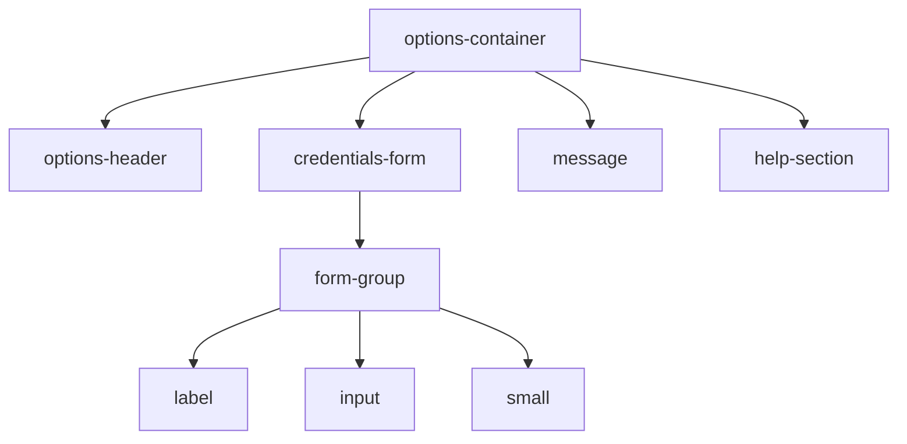
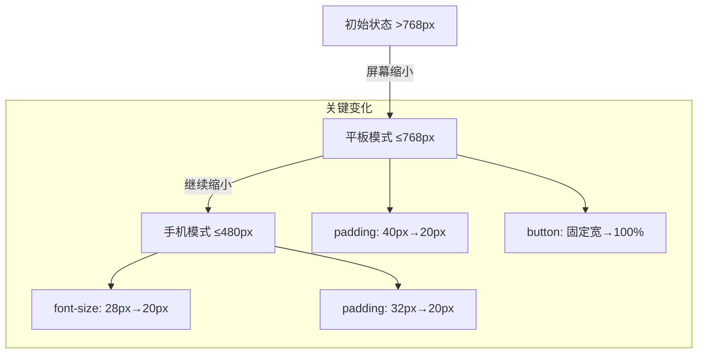

# 布局结构

<cite>
**Referenced Files in This Document **  
- [OptionsContainer.tsx](file://src/components/OptionsContainer.tsx)
- [options.css](file://src/styles/options.css)
</cite>

## 目录
1. [介绍](#介绍)
2. [核心布局设计](#核心布局设计)
3. [响应式策略](#响应式策略)
4. [可访问性实践](#可访问性实践)

## 介绍
`options-container` 是 AIHC 助手扩展程序设置页面的核心容器组件，负责组织和呈现用户凭证配置界面。该容器采用现代化的 CSS 布局技术，结合 React 组件化架构，实现了美观、功能完整且高度可用的用户界面。

**Section sources**
- [OptionsContainer.tsx](file://src/components/OptionsContainer.tsx#L4-L143)

## 核心布局设计

### 居中对齐与最大宽度限制
`.options-container` 容器通过 `margin: 0 auto` 实现水平居中对齐，确保在桌面端大屏幕下内容不会紧贴边缘，提供舒适的阅读体验。同时，通过 `max-width: 800px` 设置最大宽度限制，防止内容区域在超宽屏幕上过度拉伸，保持最佳可读性。

容器采用 `padding: 40px 20px` 提供内边距，在不同方向上创建适当的空白区域，避免内容与视口边界直接接触。`box-sizing: border-box` 确保内边距和边框包含在元素的总宽度和高度内，简化了盒模型计算。

### 弹性布局基础
虽然主要布局依赖于传统的块级流式布局，但整体结构体现了现代 Web 布局的最佳实践。容器内部的子组件（如表单、帮助区域）通过清晰的语义化 HTML 结构和 CSS 类名进行组织，形成层次分明的内容区块。

**Diagram sources **
- [options.css](file://src/styles/options.css#L2-L20)



**Section sources**
- [options.css](file://src/styles/options.css#L2-L30)

## 响应式策略

### 桌面端布局
在桌面端（>768px），容器保持其标准布局：
- 最大宽度为 800px
- 内边距为 40px 左右，20px 上下
- 表单和帮助区域具有较大的内填充（32px）
- 保存按钮保持固定宽度，居中显示

### 平板适配（≤768px）
当屏幕宽度小于或等于 768px 时，应用第一层媒体查询：
- 容器内边距减小至 `20px 16px`
- 表单和帮助区域内填充减小至 24px
- 保存按钮变为全宽，以适应更窄的屏幕空间

```css
@media (max-width: 768px) {
  .options-container {
    padding: 20px 16px;
  }
  .credentials-form {
    padding: 24px;
  }
  .form-actions button {
    width: 100%;
  }
}
```

### 手机适配（≤480px）
针对手机等小屏幕设备，应用第二层媒体查询：
- 容器内边距进一步减小至 `16px 12px`
- 头部标题字体大小减小至 20px
- 表单内填充减小至 20px
- 输入框内边距减小，以适应紧凑布局
- 整体间距更加紧凑，优化小屏幕空间利用率

```css
@media (max-width: 480px) {
  .options-container {
    padding: 16px 12px;
  }
  .options-header h1 {
    font-size: 20px;
  }
  .credentials-form {
    padding: 20px;
  }
}
```

**Diagram sources **
- [options.css](file://src/styles/options.css#L200-L332)



**Section sources**
- [options.css](file://src/styles/options.css#L200-L270)

## 可访问性实践

### 焦点管理
为了提升键盘用户的可访问性，样式文件包含了专门的 `:focus-visible` 规则：
- 输入框和按钮在获得焦点时显示蓝色轮廓线（`outline: 2px solid #4285f4`）
- 轮廓线带有偏移量（`outline-offset: 2px`），使其与元素本身分离，提高视觉清晰度
- 这种设计既满足了无障碍要求，又保持了良好的视觉效果

### 深色模式支持
通过 `@media (prefers-color-scheme: dark)` 媒体查询，容器支持系统级深色模式：
- 背景色自动切换为深灰色调（`#1a1a1a`, `#2d2d2d`）
- 文字颜色调整为浅色系（`#e0e0e0`, `#ffffff`）
- 表单元素背景和边框相应变暗
- 成功和错误消息的颜色也调整为适合深色背景的高对比度配色

这种自适应配色方案无需用户手动切换，即可提供舒适的夜间使用体验。

**Section sources**
- [options.css](file://src/styles/options.css#L310-L332)