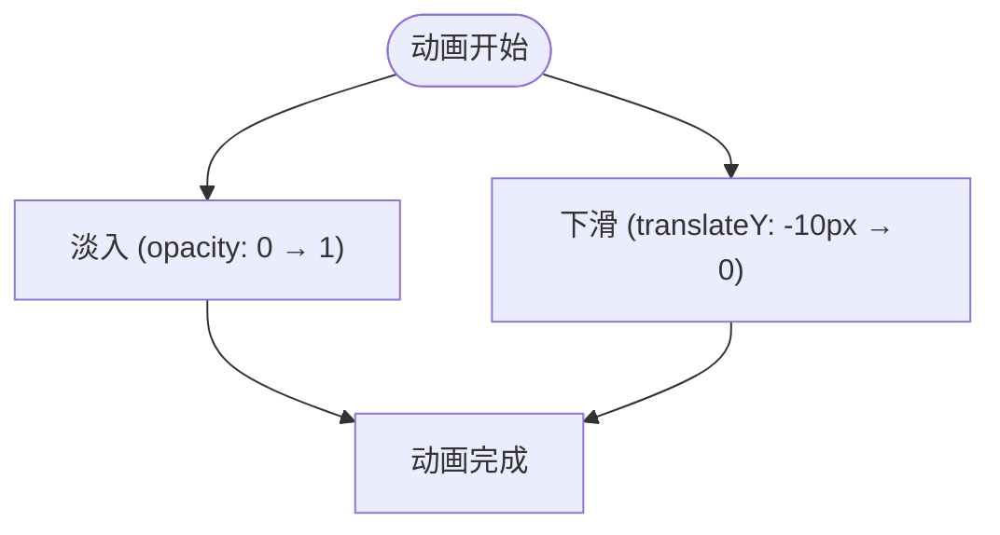

# 消息提示

<cite>
**Referenced Files in This Document **   
- [MessageDisplay.tsx](file://src/components/MessageDisplay.tsx)
- [popup.css](file://src/styles/popup.css)
- [options.css](file://src/styles/options.css)
</cite>

## 目录
1. [成功与错误状态样式差异](#成功与错误状态样式差异)
2. [@keyframes slideInDown动画实现原理](#@keyframes-slideindown动画实现原理)
3. [深色/浅色模式下的可读性对比](#深色浅色模式下的可读性对比)
4. [视觉引导设计考量](#视觉引导设计考量)

## 成功与错误状态样式差异

消息组件通过语义化的配色方案区分不同状态类型，其核心差异体现在背景色、文字颜色及左侧边框色彩编码三个方面。`.success`类别的消息采用绿色系渐变背景（#d4edda → #c3e6cb），搭配深绿色文字（#155724）和左边界绿色边框（#28a745），传达积极、成功的语义含义；而`.error`类别则使用红色系渐变背景（#f8d7da → #f5c6cb），配合深红色文字（#721c24）与左边界红色边框（#dc3545），明确标识错误或警告信息。

这种设计遵循了通用的色彩心理学原则：绿色代表成功、安全，红色代表错误、危险，使用户能够快速识别消息性质。同时，两种状态均配有轻微的边框描边（rgba(40, 167, 69, 0.2) / rgba(220, 53, 69, 0.2)）和柔和阴影，增强视觉层次感而不显突兀。

**Section sources**
- [popup.css](file://src/styles/popup.css#L778-L789)

## @keyframes slideInDown动画实现原理

`@keyframes slideInDown` 定义了一个从上方滑入的入场动效，用于提升用户体验的流畅性。该动画通过两个关键帧控制元素的初始与最终状态：起始帧（`from`）设置元素完全透明（`opacity: 0`）并向上偏移10像素（`transform: translateY(-10px)`），使其在视口外不可见；结束帧（`to`）则恢复为完全不透明（`opacity: 1`）且位置归零（`transform: translateY(0)`）。

当应用于消息组件时，此动画结合CSS `animation` 属性以0.3秒的缓出时间函数（`ease-out`）执行，创造出元素从顶部轻柔“飘落”至目标位置的视觉效果，有效吸引用户注意力，同时避免生硬出现带来的突兀感。

**Diagram sources **
- [popup.css](file://src/styles/popup.css#L752-L760)
- [options.css](file://src/styles/options.css#L137-L145)

## 深色/浅色模式下的可读性对比

消息组件在不同主题模式下均保持良好的可读性表现。在浅色模式中，`.success` 和 `.error` 类别分别采用低饱和度的绿/红背景与高对比度的文字颜色组合，确保文本清晰易读的同时不造成视觉压迫。而在深色模式下，系统通过媒体查询 `@media (prefers-color-scheme: dark)` 启用优化后的配色方案：成功消息背景调整为深绿基调（#1a3a2e），文字变为亮绿色（#4ade80）；错误消息背景设为暗红（#3a1a1a），文字使用亮红色（#f87171）。

这种适配策略保证了即使在暗背景下，文字与背景之间仍维持足够的亮度对比度，符合无障碍访问标准，提升了各类用户的阅读体验。

**Section sources**
- [options.css](file://src/styles/options.css#L310-L330)

## 视觉引导设计考量

消息组件通过 `border-left-width` 与 `padding-left` 的协同设计强化视觉引导效果。左侧较宽的彩色边框（由 `border-left-color` 控制色彩）作为首要视觉锚点，迅速引导用户注意消息类型；而适当的左内边距（`padding-left`）则在边框与文本间建立合理间距，防止内容紧贴边界导致的拥挤感，提升整体排版美感与可读性。

这一设计不仅增强了信息层级结构，还利用色彩带的长度形成自然的视线流动路径，帮助用户快速定位并理解消息内容，体现了细节处的用户体验优化。

**Section sources**
- [popup.css](file://src/styles/popup.css#L778-L789)