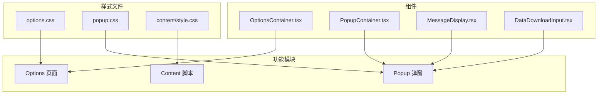
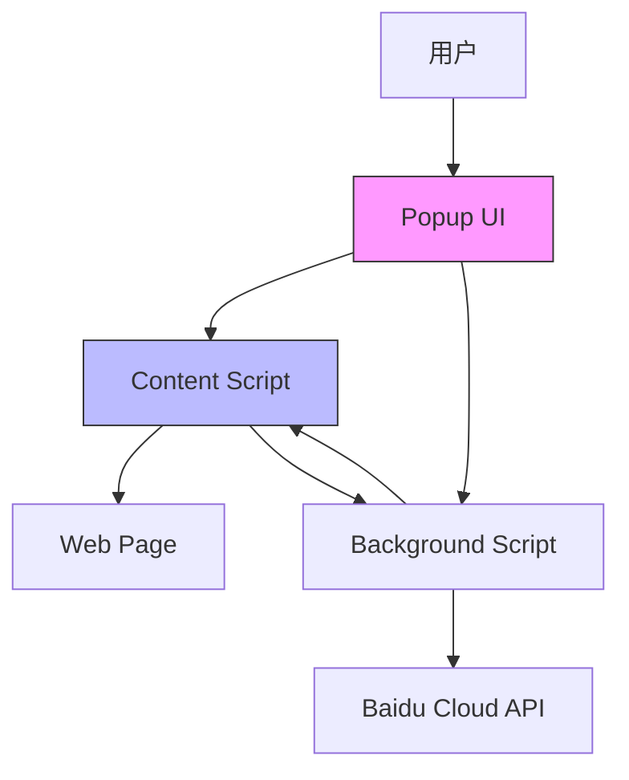
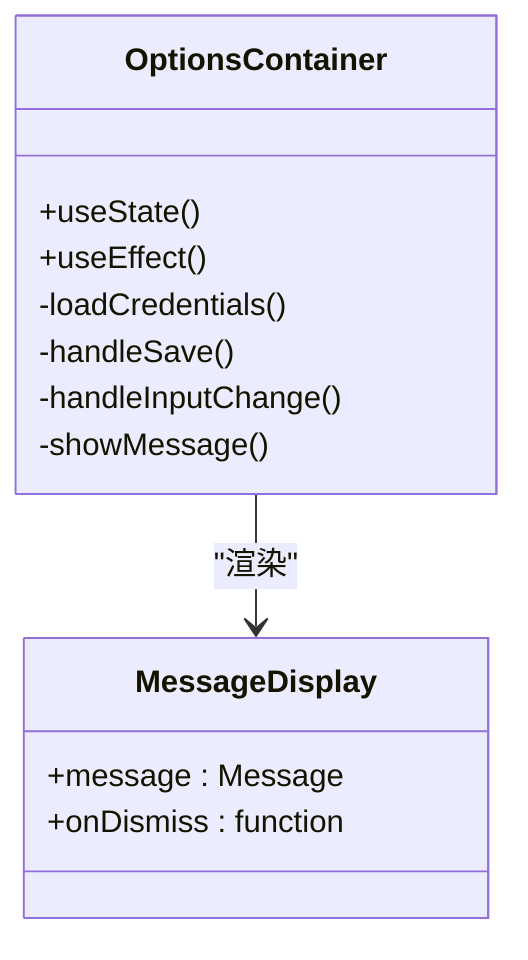
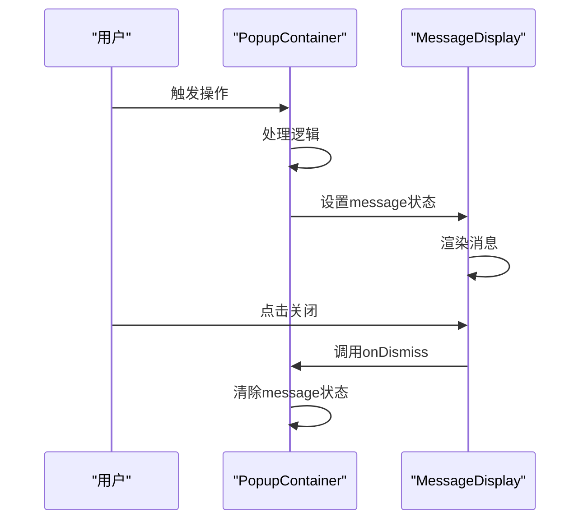
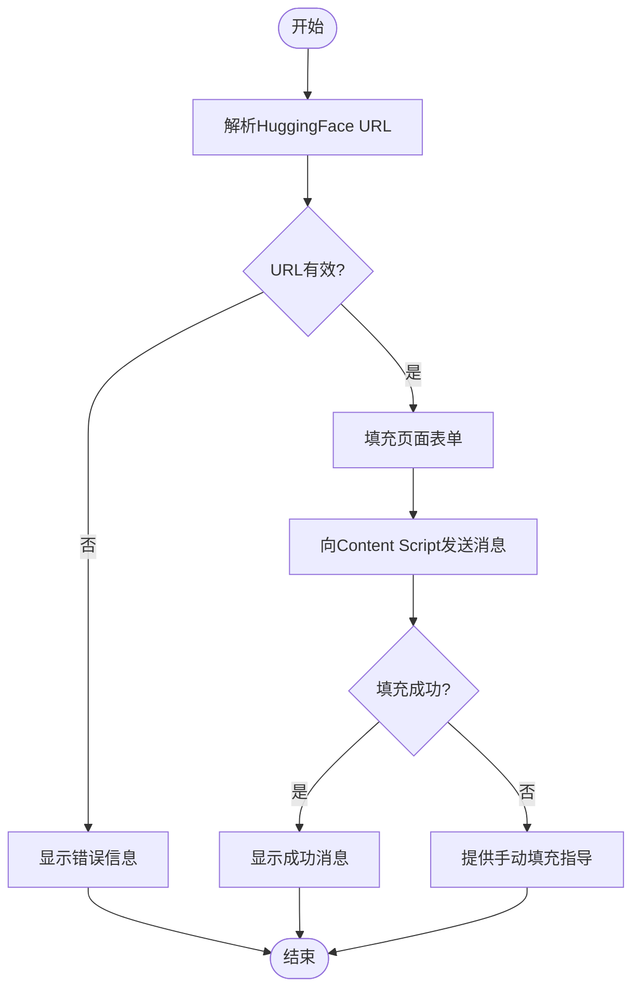
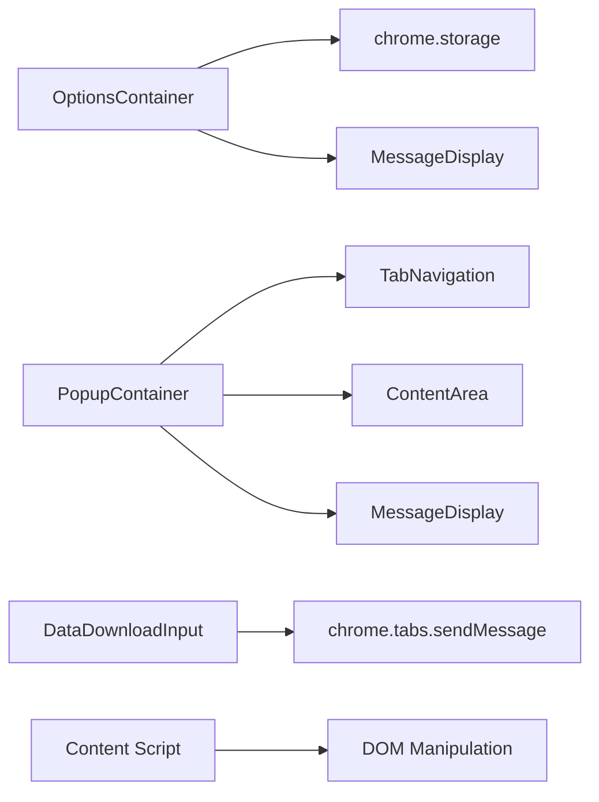

# 深色模式支持

<cite>
**本文档引用的文件**
- [options.css](file://src/styles/options.css)
- [sidebar.css](file://src/popup/sidebar.css)
- [OptionsContainer.tsx](file://src/components/OptionsContainer.tsx)
- [MessageDisplay.tsx](file://src/components/MessageDisplay.tsx)
- [DataDownloadInput.tsx](file://src/components/DataDownloadInput.tsx)
</cite>

## 目录
1. [简介](#简介)
2. [项目结构](#项目结构)
3. [核心组件](#核心组件)
4. [架构概述](#架构概述)
5. [详细组件分析](#详细组件分析)
6. [依赖分析](#依赖分析)
7. [性能考虑](#性能考虑)
8. [故障排除指南](#故障排除指南)
9. [结论](#结论)
10. [附录](#附录)（如有必要）

## 简介
本技术文档深入讲解了通过CSS媒体查询 `(prefers-color-scheme: dark)` 实现的深色主题切换机制。文档详细对比了浅色与深色模式下的背景色、文字色、边框色等变量替换策略，说明了如何为表单输入框、消息提示、帮助区域等UI组件定义对应的暗色系配色方案，确保视觉一致性与可读性。同时强调了颜色对比度必须达标以满足WCAG可访问性标准，并提供了开发者自定义主题扩展的最佳实践路径。

## 项目结构
该项目是一个浏览器扩展程序，主要包含内容脚本(content scripts)、弹出窗口(popup)和选项页面(options)三大功能模块。样式文件被组织在独立的styles目录中，其中`options.css`包含了主选项页面的全部样式定义，包括响应式设计和深色模式支持。组件采用React函数式组件开发，通过TypeScript进行类型安全控制，整体架构清晰，关注点分离。

**图表来源**
- [options.css](file://src/styles/options.css)
- [OptionsContainer.tsx](file://src/components/OptionsContainer.tsx)

**章节来源**
- [src/styles/options.css](file://src/styles/options.css)
- [src/components/OptionsContainer.tsx](file://src/components/OptionsContainer.tsx)

## 核心组件
核心组件主要包括`OptionsContainer`用于管理用户凭证设置，`MessageDisplay`用于展示操作反馈信息，以及`DataDownloadInput`用于解析HuggingFace地址并自动填充表单。这些组件都遵循一致的设计语言，并通过CSS类名与外部样式表关联，实现了良好的可维护性和可扩展性。特别是`MessageDisplay`组件，其成功、错误等不同状态的消息样式在深色模式下也保持了高可读性。

**章节来源**
- [OptionsContainer.tsx](file://src/components/OptionsContainer.tsx)
- [MessageDisplay.tsx](file://src/components/MessageDisplay.tsx)
- [DataDownloadInput.tsx](file://src/components/DataDownloadInput.tsx)

## 架构概述
系统架构采用典型的浏览器扩展三层结构：内容脚本负责与网页交互，弹出窗口提供用户界面，后台脚本处理业务逻辑。UI层基于React构建，利用props传递数据和回调函数，实现了组件间的松耦合。样式管理上，使用CSS原生特性而非预处理器，通过`(prefers-color-scheme)`媒体查询实现深色模式的无缝切换，避免了JavaScript介入，提升了性能和用户体验。

**图表来源**
- [PopupContainer.tsx](file://src/components/PopupContainer.tsx)
- [index.ts](file://src/content/index.ts)

## 详细组件分析

### OptionsContainer 组件分析
该组件是插件的主要配置界面，允许用户输入百度云API凭证。它使用React Hooks管理状态，并通过Chrome Storage API持久化数据。组件结构清晰，包含表单验证、异步加载和消息提示等完整功能。

#### 对象导向组件：

**图表来源**
- [OptionsContainer.tsx](file://src/components/OptionsContainer.tsx)
- [MessageDisplay.tsx](file://src/components/MessageDisplay.tsx)

### 消息显示机制分析
消息提示系统通过`MessageDisplay`组件实现，支持成功、错误等多种类型。该组件接收`message`对象和关闭回调函数，展示了典型的React受控组件模式。

#### API/服务组件：

**图表来源**
- [PopupContainer.tsx](file://src/components/PopupContainer.tsx)
- [MessageDisplay.tsx](file://src/components/MessageDisplay.tsx)

### 数据下载输入分析
`DataDownloadInput`组件实现了复杂的URL解析和表单填充逻辑。它能够识别HuggingFace的数据集和模型URL，提取关键信息，并通过Chrome Messaging API将数据发送到内容脚本以自动填充目标页面。

#### 复杂逻辑组件：

**图表来源**
- [DataDownloadInput.tsx](file://src/components/DataDownloadInput.tsx)
- [index.ts](file://src/content/index.ts)

**章节来源**
- [DataDownloadInput.tsx](file://src/components/DataDownloadInput.tsx)
- [index.ts](file://src/content/index.ts)

## 依赖分析
项目依赖关系清晰，前端组件之间通过props进行通信，与浏览器API的交互被封装在utils目录下的工具函数中。样式文件与组件一一对应，降低了耦合度。值得注意的是，深色模式的实现完全依赖于CSS媒体查询，没有引入额外的主题管理库，保持了轻量级和高性能。

**图表来源**
- [go.mod](file://package.json)
- [OptionsContainer.tsx](file://src/components/OptionsContainer.tsx)
- [PopupContainer.tsx](file://src/components/PopupContainer.tsx)

**章节来源**
- [package.json](file://package.json)
- [components/](file://src/components/)

## 性能考虑
从代码分析来看，项目在性能方面做了充分考虑。例如，在页面检测时使用了防抖(debounce)技术，避免频繁触发昂贵的操作；在HTTP请求中使用AbortController来取消过期请求，防止内存泄漏；样式规则使用!important确保优先级，减少了运行时样式计算的开销。深色模式的实现不涉及JavaScript重绘，仅由浏览器原生处理，对性能影响极小。

## 故障排除指南
当遇到问题时，首先检查浏览器控制台是否有错误日志。对于消息显示异常，请确认`MessageDisplay`组件接收到的`message`对象格式正确。若自动填充功能失效，需检查目标页面的DOM结构是否发生变化，或查看`fillPageForm`函数中的选择器是否需要更新。深色模式不生效时，请确认操作系统级别的深色模式设置是否已开启。

**章节来源**
- [errors.ts](file://src/utils/errorFilter.ts)
- [debug.ts](file://src/content/index.ts)

## 结论
该浏览器扩展项目结构合理，代码质量较高，特别是在深色模式的支持上采用了现代CSS最佳实践。通过`(prefers-color-scheme)`媒体查询，实现了优雅的主题切换，无需JavaScript干预，既保证了性能又提升了用户体验。建议未来可以考虑将颜色变量提取到CSS自定义属性中，以便更灵活地支持多主题切换。