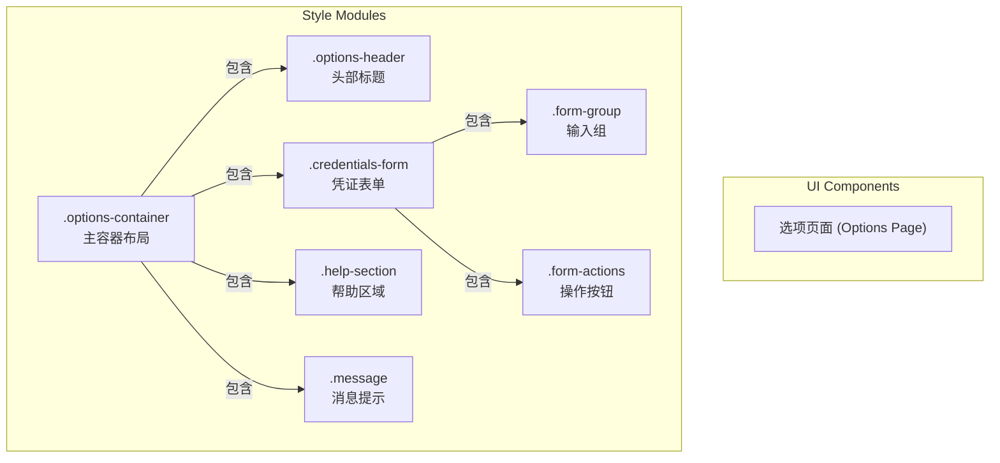
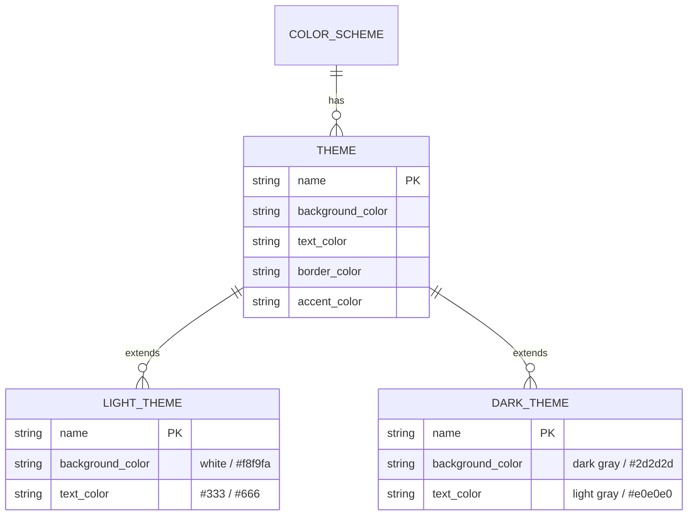

# 选项页面样式

<cite>
**本文档引用的文件**
- [options.css](file://src/styles/options.css)
</cite>

## 目录
1. [简介](#简介)
2. [项目结构](#项目结构)
3. [核心组件](#核心组件)
4. [架构概览](#架构概览)
5. [详细组件分析](#详细组件分析)
6. [依赖分析](#依赖分析)
7. [性能考虑](#性能考虑)
8. [故障排除指南](#故障排除指南)
9. [结论](#结论)

## 简介
本技术文档全面解析 `options.css` 文件中针对配置页面的样式设计，重点阐述 `.options-container` 的整体布局结构及其在不同屏幕尺寸下的响应式适配策略。文档详细说明 `.credentials-form` 表单区域的视觉设计，包括 `.form-group` 输入框的聚焦效果、验证状态样式及过渡动画机制。同时分析 `.form-actions` 操作按钮的视觉表现与交互反馈，并解释 `.message` 消息提示组件的成功与错误状态样式差异及其动画实现原理。特别关注深色模式支持的实现方式，通过 `(prefers-color-scheme: dark)` 媒体查询展示主题切换的技术细节，并提供可访问性优化实践指导。

## 项目结构
该样式文件位于项目的 `src/styles/` 目录下，专为扩展程序的选项页面（Options Page）提供完整的视觉样式定义。其主要职责是为 `OptionsContainer.tsx` 组件及其他相关 UI 元素提供一致且现代化的外观和交互体验。样式设计遵循模块化原则，将页面划分为容器、表单、操作区、帮助信息和消息提示等独立但相互关联的区块。



**Diagram sources**
- [options.css](file://src/styles/options.css#L1-L332)

**Section sources**
- [options.css](file://src/styles/options.css#L1-L332)

## 核心组件
`options.css` 定义了选项页面的所有核心视觉组件，确保用户界面的一致性和专业性。`.options-container` 作为根级容器，采用居中布局并设置了最大宽度，以保证在大屏幕上内容不会过度拉伸。`.credentials-form` 提供了一个带有轻微阴影和边框的卡片式表单区域，增强了内容的层次感。`.message` 组件利用左侧的彩色边框和滑入动画，有效吸引用户对关键系统反馈的注意力。所有组件均设计有完善的响应式规则，确保在移动设备上也能提供良好的用户体验。

**Section sources**
- [options.css](file://src/styles/options.css#L1-L332)

## 架构概览
该 CSS 文件的架构清晰地反映了选项页面的视觉层级。它从全局容器开始，逐层细化到具体的表单元素和交互控件。样式组织遵循 BEM（Block, Element, Modifier）命名法的变体，使用连字符分隔的语义化类名（如 `form-group`, `form-actions`），提高了代码的可读性和可维护性。整个样式集被划分为逻辑区块：基础布局、表单控件、操作按钮、消息提示、帮助信息、响应式断点和深色模式适配。

```mermaid
graph TD
A[options.css] --> B[基础布局]
A --> C[表单样式]
A --> D[按钮样式]
A --> E[消息提示]
A --> F[帮助区域]
A --> G[响应式设计]
A --> H[深色模式]
B --> B1[.options-container]
B --> B2[.options-header]
C --> C1[.credentials-form]
C --> C2[.form-group]
D --> D1[.form-actions button]
E --> E1[.message.success]
E --> E2[.message.error]
G --> G1[@media max-width: 768px]
G --> G2[@media max-width: 480px]
H --> H1[@media prefers-color-scheme: dark]
```

**Diagram sources**
- [options.css](file://src/styles/options.css#L1-L332)

## 详细组件分析

### 主容器与响应式布局分析
`.options-container` 类定义了页面的主容器，采用 `max-width: 800px` 和 `margin: 0 auto` 实现水平居中，确保内容在宽屏显示器上保持最佳阅读宽度。`min-height: 100vh` 确保容器至少占据整个视口高度，防止内容过少时出现布局塌陷。文件通过两个媒体查询实现了多阶段的响应式适配：
- 在 **768px 及以下**（平板/小桌面）：减小内边距、调整字体大小，并将操作按钮设为全宽。
- 在 **480px 及以下**（手机）：进一步缩小内边距和字体，优化移动端触控体验。

这种渐进式的断点设计确保了从桌面到移动设备的平滑过渡。

**Section sources**
- [options.css](file://src/styles/options.css#L1-L20)
- [options.css](file://src/styles/options.css#L240-L280)

### 凭证表单与输入框交互分析
`.credentials-form` 作为一个独立的视觉单元，使用浅灰色背景 (`#f8f9fa`)、圆角边框和轻微阴影来突出其重要性。`.form-group` 负责组织标签和输入框，确保清晰的垂直节奏。

#### 输入框交互状态
```mermaid
stateDiagram-v2
[*] --> Normal
Normal --> Hover : 鼠标悬停
Normal --> Focus : 键盘或鼠标聚焦
Focus --> Normal : 失去焦点
state Normal {
border : #e9ecef
background : white
}
state Hover {
border : #dee2e6
}
state Focus {
border : #4285f4
box-shadow : 0 0 0 3px rgba(66,133,244,0.1)
outline : none
}
```

**Diagram sources**
- [options.css](file://src/styles/options.css#L50-L78)

**Section sources**
- [options.css](file://src/styles/options.css#L50-L78)

### 操作按钮交互反馈分析
`.form-actions` 中的按钮采用了 Google Material Design 风格的蓝色调 (`#4285f4`)。其交互反馈机制通过 CSS 过渡 (`transition: all 0.2s ease`) 实现：
- **悬停**：背景色加深至 `#3367d6`，产生轻微上浮效果 (`transform: translateY(-1px)`) 并增加阴影，模拟“抬起”感。
- **激活**：移除上浮和强阴影，恢复原位，模拟“按下”感。
- **禁用**：背景变为灰色，光标显示为禁止符号，移除所有动态效果，明确指示不可操作状态。

```mermaid
flowchart TD
Start([按钮初始状态]) --> Hover["鼠标悬停"]
Hover --> Active["鼠标点击"]
Active --> End([释放])
Hover --> |transform: translateY(-1px)<br/>box-shadow: 强| Feedback["视觉反馈"]
Active --> |transform: translateY(0)<br/>box-shadow: 弱| Feedback
```

**Diagram sources**
- [options.css](file://src/styles/options.css#L80-L108)

**Section sources**
- [options.css](file://src/styles/options.css#L80-L108)

### 消息提示组件与动画分析
`.message` 组件通过左侧的粗边框颜色区分成功和错误状态。其核心动画 `slideInDown` 使用 `@keyframes` 定义，从上方 `10px` 处以淡入效果滑入，持续时间为 `0.3秒`，缓动函数为 `ease-out`，使动画开始快结束慢，符合自然运动规律。

#### 状态样式对比
| 状态 | 背景色 | 文字色 | 边框色 |
| :--- | :--- | :--- | :--- |
| 成功 | `#f0f9ff` | `#065f46` | `#10b981` |
| 错误 | `#fef2f2` | `#991b1b` | `#ef4444` |

**Diagram sources**
- [options.css](file://src/styles/options.css#L110-L138)

**Section sources**
- [options.css](file://src/styles/options.css#L110-L138)

### 深色模式与可访问性分析
文件通过 `(prefers-color-scheme: dark)` 媒体查询实现了对系统级深色模式的支持。当检测到用户偏好深色主题时，所有背景、文字和边框颜色都会切换到相应的暗色调，例如背景从白色 (`#ffffff`) 变为深灰 (`#1a1a1a`)，文字从深灰 (`#333`) 变为浅灰 (`#e0e0e0`)。

此外，文件还包含了对键盘导航的可访问性优化。`focus-visible` 伪类确保只有通过键盘操作获得焦点的元素才会显示蓝色轮廓线，避免了鼠标用户看到不必要的视觉干扰，同时保证了残障用户的操作可见性。



**Diagram sources**
- [options.css](file://src/styles/options.css#L282-L332)

**Section sources**
- [options.css](file://src/styles/options.css#L282-L332)

## 依赖分析
`options.css` 文件是一个自包含的样式表，不直接依赖于其他 CSS 文件。它的功能是为特定的 React 组件（如 `OptionsContainer.tsx`）提供样式。这些组件通过类名（className）与 CSS 规则建立连接。因此，其主要依赖关系是语义上的，即 HTML 结构必须与 CSS 选择器相匹配。

**Section sources**
- [options.css](file://src/styles/options.css#L1-L332)

## 性能考虑
该 CSS 文件经过良好优化，具有以下性能优势：
- **选择器效率高**：主要使用类选择器，避免了低效的通用或后代选择器。
- **体积小巧**：代码精简，无冗余规则。
- **动画性能佳**：`transform` 和 `opacity` 属性的动画由 GPU 加速，流畅且不阻塞主线程。
- **条件加载**：深色模式规则仅在需要时由浏览器应用，不影响默认加载性能。

## 故障排除指南
若选项页面样式未正确应用，请检查以下几点：
1. 确认 `main.tsx` 是否正确导入了 `options.css`。
2. 检查组件中的 `className` 是否与 CSS 文件中的类名完全匹配。
3. 查看浏览器开发者工具的“网络”标签页，确认 CSS 文件已成功加载。
4. 在“元素”标签页中检查是否有更具体的 CSS 规则覆盖了当前样式。
5. 验证是否存在 JavaScript 错误导致组件未能正确渲染。

**Section sources**
- [options.css](file://src/styles/options.css#L1-L332)

## 结论
`options.css` 是一个设计精良、功能完备的样式表，为 AIHC 助手的选项页面提供了现代化、响应式且用户友好的视觉体验。其模块化的结构、细致的交互反馈、对深色模式的支持以及对可访问性的重视，共同构成了一个高质量的前端样式解决方案。该文件不仅满足了基本的视觉需求，还通过动画和状态管理提升了产品的整体质感和专业度。