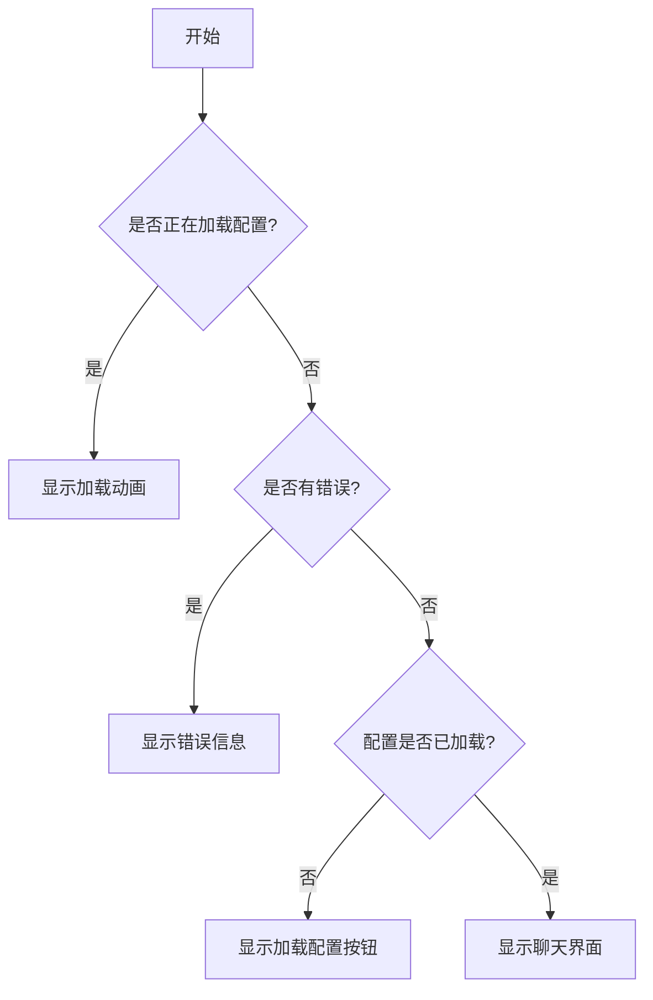
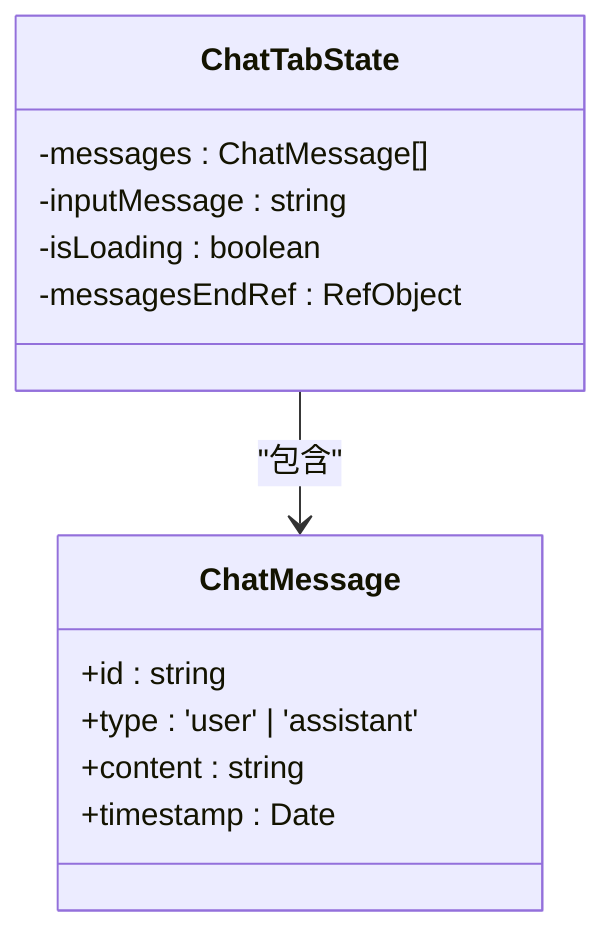
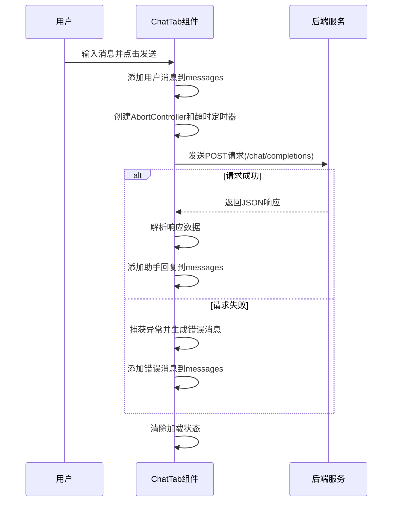
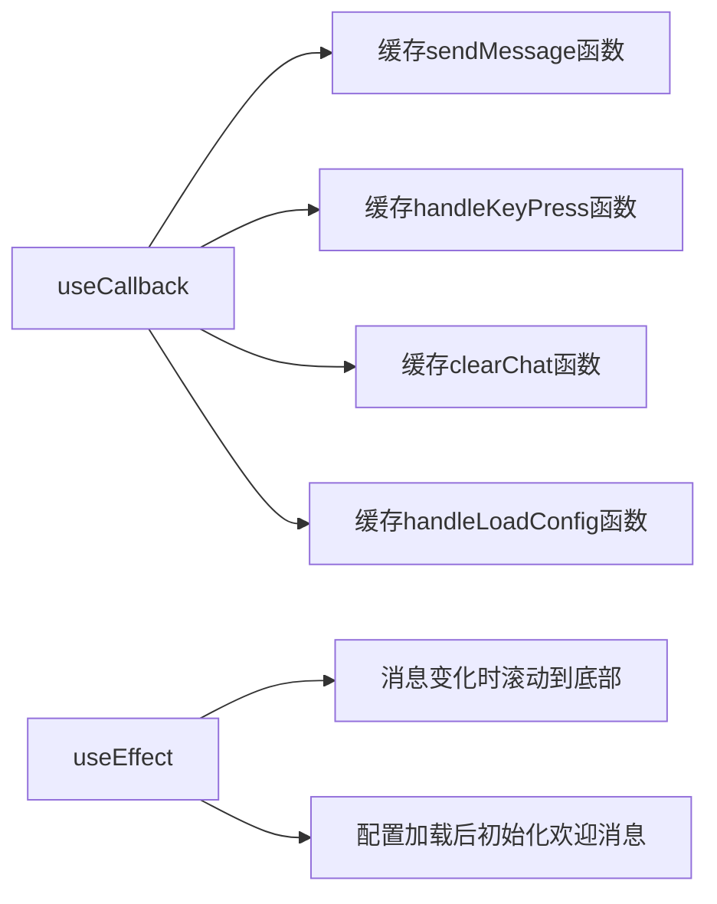
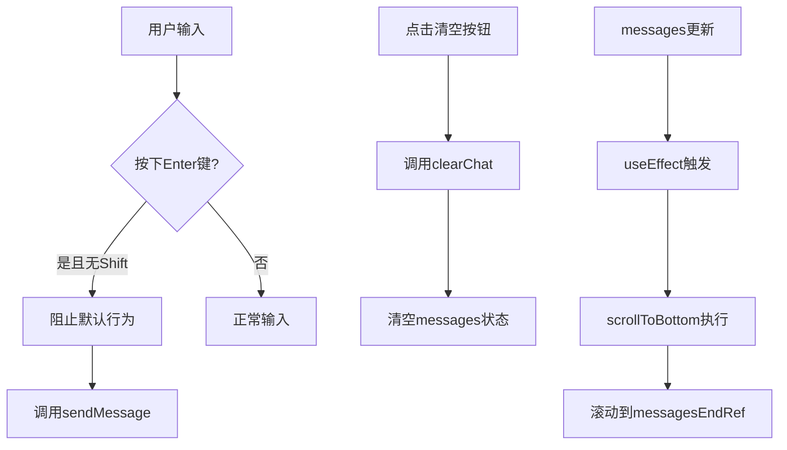
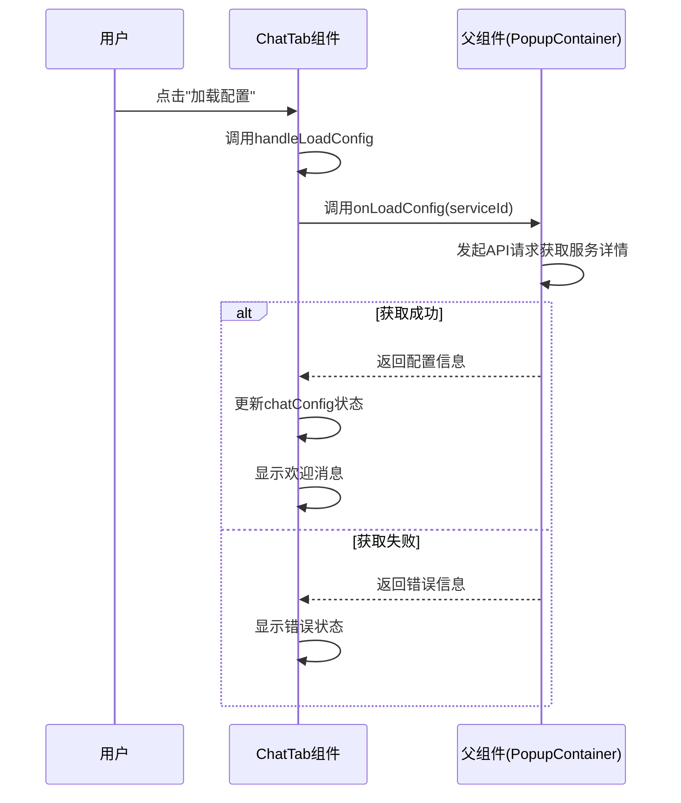
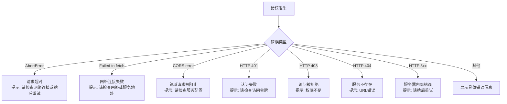

# AI聊天功能

<cite>
**本文档引用的文件**
- [ChatTab.tsx](file://src/components/tabs/ChatTab.tsx)
- [aihcApi.ts](file://src/services/aihcApi.ts)
- [ContentArea.tsx](file://src/components/ContentArea.tsx)
- [PopupContainer.tsx](file://src/components/PopupContainer.tsx)
- [index.ts](file://src/types/index.ts)
</cite>

## 目录
1. [简介](#简介)
2. [核心组件分析](#核心组件分析)
3. [消息状态与输入控制](#消息状态与输入控制)
4. [异步请求逻辑](#异步请求逻辑)
5. [性能优化策略](#性能优化策略)
6. [UI交互细节](#ui交互细节)
7. [配置加载机制](#配置加载机制)
8. [错误处理与用户提示](#错误处理与用户提示)

## 简介
本系统文档全面解析了AIHCX扩展程序中的智能对话界面实现。该功能作为浏览器扩展的一部分，为用户提供了一个与AI服务进行实时交互的聊天界面。通过深入分析`ChatTab`组件及其相关服务，本文档详细阐述了从状态管理到网络通信的完整技术实现。

**Section sources**
- [ChatTab.tsx](file://src/components/tabs/ChatTab.tsx#L0-L354)

## 核心组件分析
`ChatTab`组件是整个AI聊天功能的核心实现，采用React函数式组件配合Hooks的方式构建。该组件接收外部传入的聊天配置信息，并根据不同的状态展示相应的UI界面。组件主要分为三个状态：配置加载中、配置加载失败和正常聊天界面。

**Diagram sources**
- [ChatTab.tsx](file://src/components/tabs/ChatTab.tsx#L22-L351)

**Section sources**
- [ChatTab.tsx](file://src/components/tabs/ChatTab.tsx#L22-L351)

## 消息状态与输入控制
组件使用多个React Hooks来管理聊天界面的状态。`messages`状态存储所有聊天记录，`inputMessage`管理用户输入框的内容，`isLoading`控制发送消息时的加载状态。

**Diagram sources**
- [ChatTab.tsx](file://src/components/tabs/ChatTab.tsx#L22-L351)

**Section sources**
- [ChatTab.tsx](file://src/components/tabs/ChatTab.tsx#L22-L351)

## 异步请求逻辑
`sendMessage`函数实现了完整的异步请求流程，包括请求构建、超时控制和响应处理。该函数使用`fetch` API向后端服务发送POST请求，并通过`AbortController`实现30秒的超时控制。

**Diagram sources**
- [ChatTab.tsx](file://src/components/tabs/ChatTab.tsx#L48-L152)

**Section sources**
- [ChatTab.tsx](file://src/components/tabs/ChatTab.tsx#L48-L152)

## 性能优化策略
组件采用了多种性能优化手段，主要包括`useCallback`和`useEffect`的合理使用。`useCallback`用于缓存回调函数，避免不必要的重新渲染；`useEffect`用于在消息更新后自动滚动到底部。

**Diagram sources**
- [ChatTab.tsx](file://src/components/tabs/ChatTab.tsx#L22-L351)

**Section sources**
- [ChatTab.tsx](file://src/components/tabs/ChatTab.tsx#L22-L351)

## UI交互细节
聊天界面提供了丰富的用户交互功能，包括回车发送消息、清空聊天记录和自动滚动等。这些功能通过事件处理器和DOM操作实现，确保了流畅的用户体验。

**Diagram sources**
- [ChatTab.tsx](file://src/components/tabs/ChatTab.tsx#L22-L351)

**Section sources**
- [ChatTab.tsx](file://src/components/tabs/ChatTab.tsx#L22-L351)

## 配置加载机制
`handleLoadConfig`函数负责加载聊天所需的配置信息。该函数通过调用父组件传递的`onLoadConfig`回调函数，获取服务URL和访问令牌等关键信息。

**Diagram sources**
- [ChatTab.tsx](file://src/components/tabs/ChatTab.tsx#L165-L185)
- [PopupContainer.tsx](file://src/components/PopupContainer.tsx#L186-L296)

**Section sources**
- [ChatTab.tsx](file://src/components/tabs/ChatTab.tsx#L165-L185)
- [PopupContainer.tsx](file://src/components/PopupContainer.tsx#L186-L296)

## 错误处理与用户提示
系统实现了完善的错误处理机制，能够识别和处理多种类型的错误，包括网络连接问题、认证失败和服务器内部错误等。每种错误都有对应的用户友好提示。

**Diagram sources**
- [ChatTab.tsx](file://src/components/tabs/ChatTab.tsx#L48-L152)

**Section sources**
- [ChatTab.tsx](file://src/components/tabs/ChatTab.tsx#L48-L152)