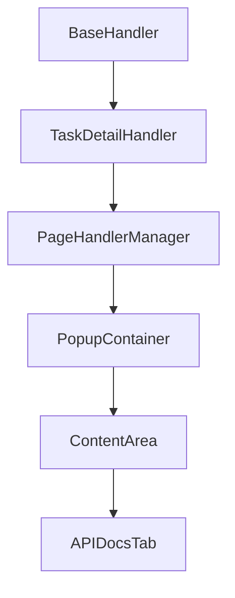
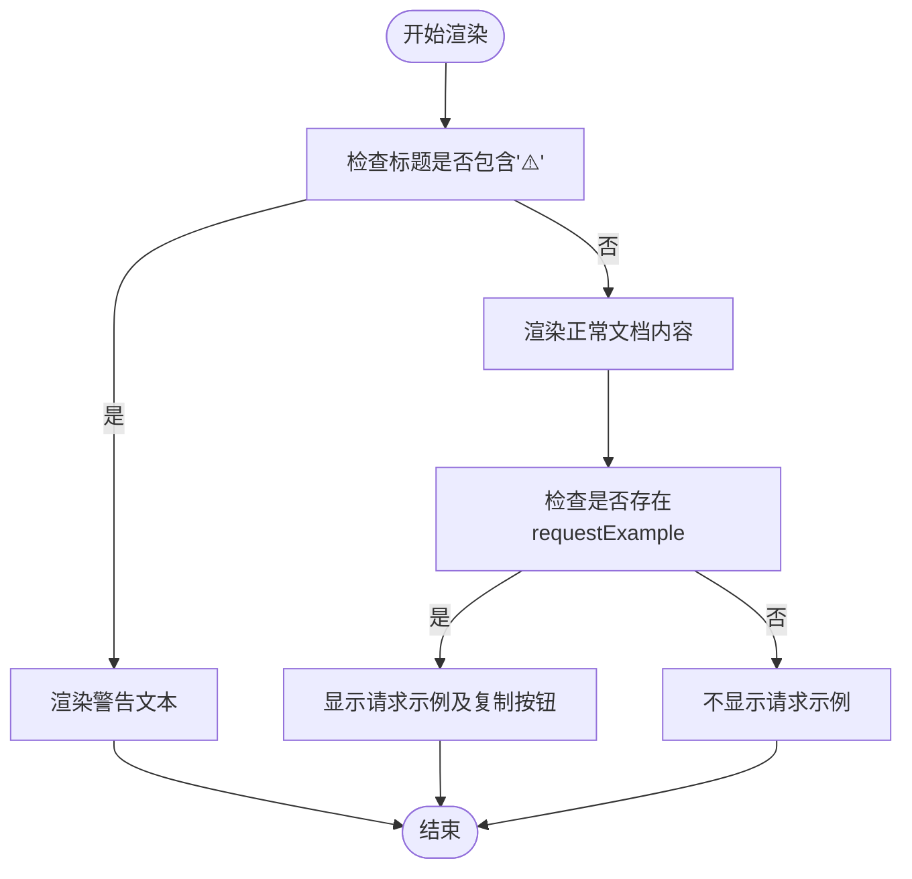
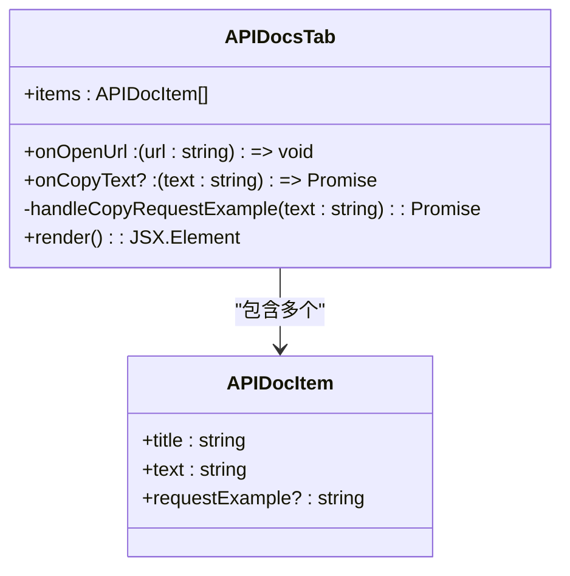
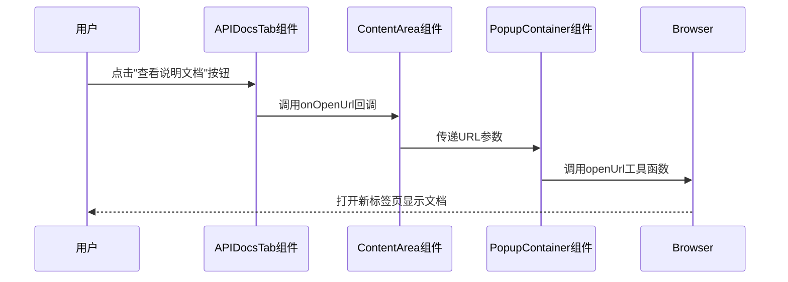
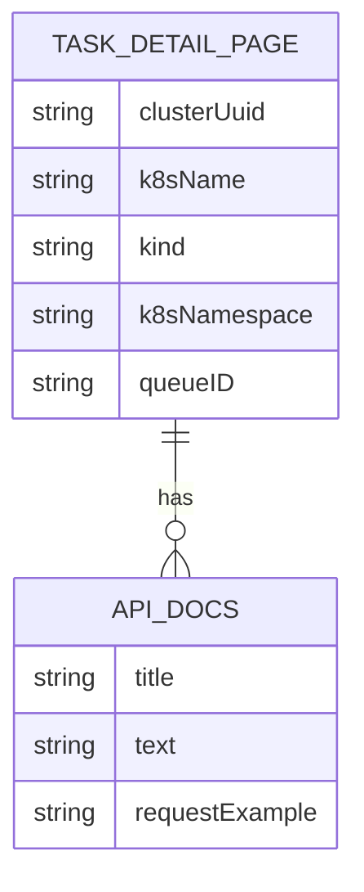

# API文档集成

<cite>
**本文档中引用的文件**
- [APIDocsTab.tsx](file://src/components/tabs/APIDocsTab.tsx)
- [ContentArea.tsx](file://src/components/ContentArea.tsx)
- [TaskDetailHandler.ts](file://src/handlers/pages/TaskDetailHandler.ts)
- [BaseHandler.ts](file://src/handlers/BaseHandler.ts)
- [PageHandlerManager.ts](file://src/handlers/PageHandlerManager.ts)
- [PopupContainer.tsx](file://src/components/PopupContainer.tsx)
- [index.ts](file://src/types/index.ts)
</cite>

## 目录
1. [简介](#简介)
2. [组件结构与数据流](#组件结构与数据流)
3. [核心功能实现](#核心功能实现)
4. [渲染逻辑分析](#渲染逻辑分析)
5. [回调机制协同工作](#回调机制协同工作)
6. [安全性与用户体验](#安全性与用户体验)
7. [实际应用场景](#实际应用场景)
8. [结论](#结论)

## 简介

`APIDocsTab` 组件是百度云AIHC扩展程序中的关键功能模块，专门用于展示API文档链接、请求示例及其复制功能。该组件通过动态加载当前页面上下文相关的API文档，帮助开发者快速查阅和调用百度云AIHC API。它不仅提供了标准的接口文档地址展示，还实现了警告提示的特殊渲染逻辑，并集成了超链接与按钮的互补交互模式。

本组件作为整个扩展程序信息展示体系的一部分，与其他组件如 `CLICommandTab`、`JSONParamsTab` 等共同构成了完整的开发辅助工具链。其设计充分考虑了用户体验和安全性，在提供便捷操作的同时确保了外部链接的安全访问。

**Section sources**
- [APIDocsTab.tsx](file://src/components/tabs/APIDocsTab.tsx#L1-L80)
- [ContentArea.tsx](file://src/components/ContentArea.tsx#L1-L116)

## 组件结构与数据流

`APIDocsTab` 组件采用React函数式组件的形式实现，接收一个包含API文档条目的数组以及两个回调函数作为props。数据流从顶层容器组件 `PopupContainer` 开始，经过 `ContentArea` 中转，最终传递到 `APIDocsTab` 进行渲染。



**Diagram sources**
- [PopupContainer.tsx](file://src/components/PopupContainer.tsx#L20-L566)
- [ContentArea.tsx](file://src/components/ContentArea.tsx#L13-L114)
- [APIDocsTab.tsx](file://src/components/tabs/APIDocsTab.tsx#L14-L78)

数据源由 `PageHandlerManager` 统一管理，根据不同页面类型实例化相应的处理器，如 `TaskDetailHandler`、`DatasetVersionsHandler` 等。这些处理器继承自 `BaseHandler` 抽象类，实现了统一的接口规范。当用户浏览支持的页面时，系统会自动检测页面类型并调用对应的处理器生成API文档数据。

**Section sources**
- [PageHandlerManager.ts](file://src/handlers/PageHandlerManager.ts#L1-L94)
- [TaskDetailHandler.ts](file://src/handlers/pages/TaskDetailHandler.ts#L7-L272)
- [BaseHandler.ts](file://src/handlers/BaseHandler.ts#L1-L37)

## 核心功能实现

### API文档条目定义

组件使用 `APIDocItem` 接口定义单个API文档条目的结构，包含标题、文本内容和可选的请求示例字段：

```typescript
interface APIDocItem {
  title: string;
  text: string;
  requestExample?: string;
}
```

这个接口定义在 `APIDocsTab.tsx` 文件中，为组件的数据输入提供了类型安全保障。其中 `requestExample` 字段是可选的，允许组件灵活处理不同类型的文档条目。

**Section sources**
- [APIDocsTab.tsx](file://src/components/tabs/APIDocsTab.tsx#L2-L6)

### 条件渲染策略

组件的核心功能之一是根据文档条目是否包含警告标识（⚠️）来决定渲染方式。这种条件渲染策略通过简单的字符串匹配实现：



**Diagram sources**
- [APIDocsTab.tsx](file://src/components/tabs/APIDocsTab.tsx#L23-L78)

对于正常文档条目，组件会同时显示接口文档地址和请求示例；而对于警告条目，则只显示警告文本内容。这种差异化渲染使得重要提示能够突出显示，提高用户的注意力。

**Section sources**
- [APIDocsTab.tsx](file://src/components/tabs/APIDocsTab.tsx#L23-L78)

## 渲染逻辑分析

### 正常文档条目渲染

当文档条目不包含警告标识时，组件会渲染完整的API文档信息，包括接口文档地址和请求示例。接口文档地址以超链接形式展示，并配有独立的"查看说明文档"按钮，形成双重访问入口。


**Diagram sources**
- [APIDocsTab.tsx](file://src/components/tabs/APIDocsTab.tsx#L50-L56)

请求示例部分则使用 `<pre>` 标签保持格式，并提供"复制请求示例"按钮。只有当 `onCopyText` 回调函数存在时，才会渲染复制按钮，体现了良好的防御性编程实践。

**Section sources**
- [APIDocsTab.tsx](file://src/components/tabs/APIDocsTab.tsx#L57-L72)

### 警告提示渲染

当文档条目标题包含"⚠️"符号时，组件进入警告模式，仅渲染警告文本内容。这种设计简化了警告信息的展示，避免了不必要的元素干扰。



**Diagram sources**
- [APIDocsTab.tsx](file://src/components/tabs/APIDocsTab.tsx#L1-L80)

警告文本被包裹在具有特定样式的 `warning-text` 类中，确保视觉上的突出效果。这种方式既简单又有效，符合前端开发的最佳实践。

**Section sources**
- [APIDocsTab.tsx](file://src/components/tabs/APIDocsTab.tsx#L47-L49)

## 回调机制协同工作

### onOpenUrl回调

`onOpenUrl` 回调函数负责处理外部链接的打开操作。该回调由 `PopupContainer` 组件提供，最终调用浏览器API打开新标签页。这种设计实现了关注点分离，使 `APIDocsTab` 专注于UI渲染，而将业务逻辑交给上层组件处理。



**Diagram sources**
- [APIDocsTab.tsx](file://src/components/tabs/APIDocsTab.tsx#L55)
- [ContentArea.tsx](file://src/components/ContentArea.tsx#L16)
- [PopupContainer.tsx](file://src/components/PopupContainer.tsx#L158)

### onCopyText回调

`onCopyText` 回调用于处理文本复制操作。与 `onOpenUrl` 类似，该回调也由上层组件注入。组件内部通过 `handleCopyRequestExample` 函数包装此回调，增加了空值检查，提高了代码的健壮性。

```typescript
const handleCopyRequestExample = async (text: string) => {
  if (onCopyText) {
    await onCopyText(text);
  }
};
```

这种封装模式避免了直接调用可能不存在的回调函数，防止运行时错误的发生。

**Section sources**
- [APIDocsTab.tsx](file://src/components/tabs/APIDocsTab.tsx#L23-L27)

## 安全性与用户体验

### 外部链接安全防护

组件在渲染外部链接时采用了最佳安全实践，通过 `rel="noopener noreferrer"` 属性确保新打开的页面无法访问原页面的 `window.opener` 对象。这可以防止潜在的钓鱼攻击和性能问题。

```html
<a href={item.text} target="_blank" rel="noopener noreferrer">
  {item.text}
</a>
```

这种做法遵循了现代Web开发的安全标准，保护了用户的隐私和安全。

**Section sources**
- [APIDocsTab.tsx](file://src/components/tabs/APIDocsTab.tsx#L52)

### 交互设计优化

组件采用了超链接与按钮的互补设计模式，为用户提供多种访问途径。超链接适合习惯点击链接的用户，而按钮则更适合需要明确操作指引的场景。这种双重入口设计提升了整体的可用性和用户体验。

此外，复制功能的条件渲染也体现了对用户界面简洁性的追求。只有当存在可复制内容且系统支持复制操作时，才会显示复制按钮，避免了界面上出现无效或禁用的控件。

**Section sources**
- [APIDocsTab.tsx](file://src/components/tabs/APIDocsTab.tsx#L50-L72)

## 实际应用场景

### 任务详情页面

在任务详情页面，`APIDocsTab` 组件展示了获取任务详情和创建任务的API文档。通过 `TaskDetailHandler` 处理器，系统能够根据URL参数动态生成相应的请求示例，包括POST方法的DescribeJob和CreateJob操作。



**Diagram sources**
- [TaskDetailHandler.ts](file://src/handlers/pages/TaskDetailHandler.ts#L8-L145)

### 数据集版本管理

在数据集版本列表页面，组件展示了获取数据集版本列表和详细信息的API文档。这些文档包含了GET请求的完整示例，帮助开发者快速理解如何调用相关接口。

### 在线服务部署

对于在线服务部署详情页面，组件不仅提供API文档，还集成了Chat配置功能。虽然这部分主要由 `ChatTab` 处理，但 `APIDocsTab` 为其提供了必要的API调用基础。

**Section sources**
- [TaskDetailHandler.ts](file://src/handlers/pages/TaskDetailHandler.ts#L8-L145)
- [DatasetVersionsHandler.ts](file://src/handlers/pages/DatasetVersionsHandler.ts#L8-L33)
- [OnlineServiceDeploymentDetailHandler.ts](file://src/handlers/pages/OnlineServiceDeploymentDetailHandler.ts#L8-L47)

## 结论

`APIDocsTab` 组件通过精心设计的架构和实现，成功地为百度云AIHC开发者提供了一个高效、安全的API文档查阅工具。其核心优势体现在以下几个方面：

1. **灵活的渲染逻辑**：通过简单的条件判断实现了正常文档和警告提示的差异化渲染。
2. **安全的外部链接处理**：采用 `noopener noreferrer` 属性保障用户安全。
3. **友好的用户体验**：超链接与按钮的互补设计，以及复制功能的智能呈现。
4. **良好的扩展性**：基于接口的设计使其易于集成到不同的页面上下文中。

该组件的成功实现得益于清晰的职责划分和合理的数据流设计，为类似的前端开发项目提供了有价值的参考范例。