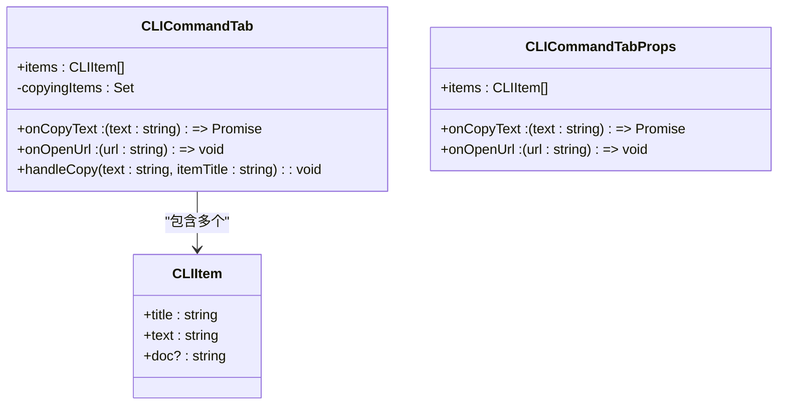
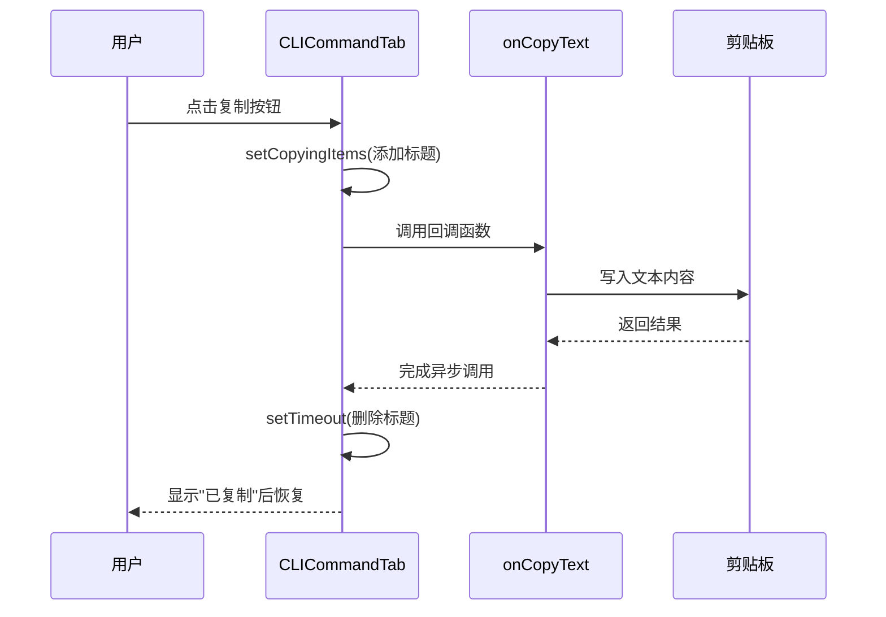
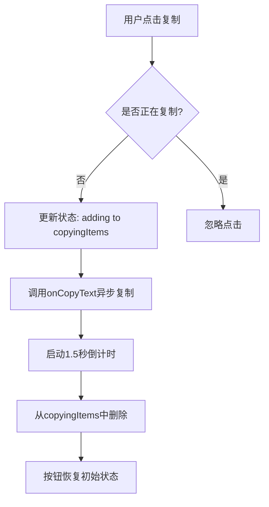
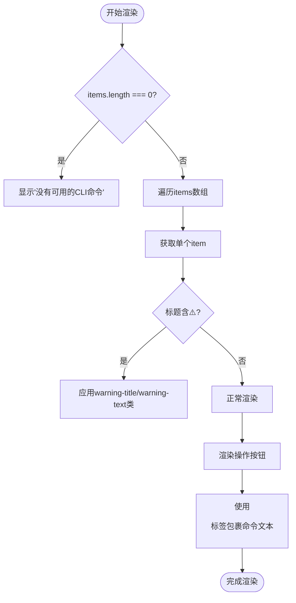
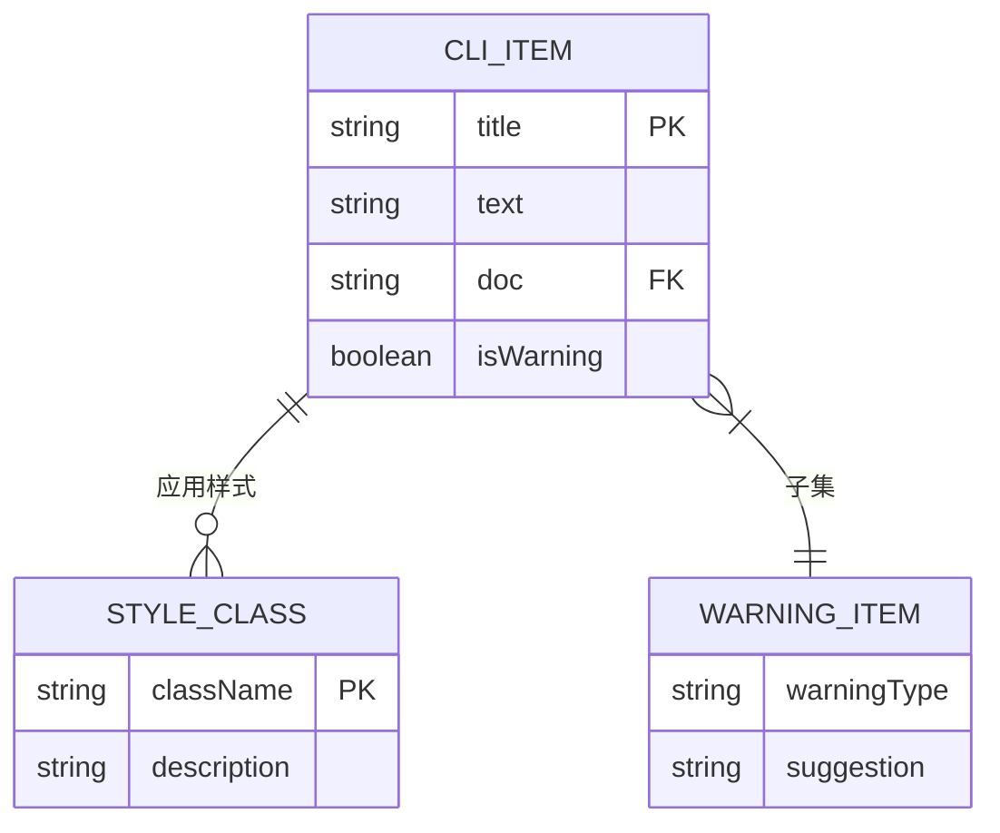
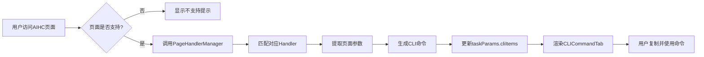

# CLI命令生成

<cite>
**本文档引用的文件**   
- [CLICommandTab.tsx](file://src/components/tabs/CLICommandTab.tsx)
- [PopupContainer.tsx](file://src/components/PopupContainer.tsx)
- [ContentArea.tsx](file://src/components/ContentArea.tsx)
- [TaskDetailHandler.ts](file://src/handlers/pages/TaskDetailHandler.ts)
- [PageHandlerManager.ts](file://src/handlers/PageHandlerManager.ts)
- [types/index.ts](file://src/types/index.ts)
</cite>

## 目录
1. [简介](#简介)
2. [组件结构与状态管理](#组件结构与状态管理)
3. [异步复制功能实现](#异步复制功能实现)
4. [用户反馈机制](#用户反馈机制)
5. [CLI命令项渲染逻辑](#cli命令项渲染逻辑)
6. [警告样式处理与pre标签作用](#警告样式处理与pre标签作用)
7. [实际使用场景分析](#实际使用场景分析)
8. [结论](#结论)

## 简介
`CLICommandTab` 组件是 AIHC 助手浏览器扩展中的核心功能模块之一，负责在百舸AIHC控制台页面自动生成并展示对应的 aihc CLI 命令。该组件基于 React 函数式组件构建，通过接收外部传入的命令列表和回调函数，动态渲染多个可操作的 CLI 命令项，并提供一键复制、查看手册等交互功能。

本组件作为插件弹窗界面的一部分，由 `ContentArea` 根据当前激活的标签页类型进行条件渲染，确保用户能够在不同上下文中获取最相关的 CLI 操作指令。

## 组件结构与状态管理
`CLICommandTab` 是一个典型的 React 函数式组件，采用 TypeScript 类型系统定义清晰的接口契约。其主要结构包括两个关键接口：

- `CLIItem`：定义单个命令项的数据结构，包含标题（title）、命令文本（text）和可选的文档链接（doc）
- `CLICommandTabProps`：定义组件对外暴露的属性接口，包括命令项数组 `items`、文本复制回调 `onCopyText` 和 URL 打开回调 `onOpenUrl`

组件内部使用 `useState` Hook 管理一个名为 `copyingItems` 的状态，该状态以 `Set<string>` 类型存储当前正在执行复制操作的命令项标题集合。这种设计避免了重复渲染未发生变化的项目，仅对正在进行复制操作的按钮进行视觉反馈更新。

**Diagram sources**
- [CLICommandTab.tsx](file://src/components/tabs/CLICommandTab.tsx#L3-L20)

**Section sources**
- [CLICommandTab.tsx](file://src/components/tabs/CLICommandTab.tsx#L1-L72)

## 异步复制功能实现
组件的核心交互功能之一是异步文本复制操作，其实现依赖于 `handleCopy` 异步函数。当用户点击“一键复制”按钮时，触发以下流程：

1. 将当前命令项的标题添加到 `copyingItems` 集合中，触发 UI 更新显示“已复制”状态
2. 调用父级传递的 `onCopyText` 回调函数执行实际的剪贴板写入操作
3. 设置一个 1500 毫秒的延迟定时器，在复制动作完成后自动从 `copyingItems` 中移除该项，恢复按钮原始状态

此机制保证了即使浏览器剪贴板 API 存在延迟或需要用户权限授权的情况，UI 也能及时响应并给予明确反馈，同时防止短时间内多次复制导致的状态混乱。

**Diagram sources**
- [CLICommandTab.tsx](file://src/components/tabs/CLICommandTab.tsx#L14-L29)

**Section sources**
- [CLICommandTab.tsx](file://src/components/tabs/CLICommandTab.tsx#L14-L29)
- [PopupContainer.tsx](file://src/components/PopupContainer.tsx#L138-L142)

## 用户反馈机制
为了提升用户体验，`CLICommandTab` 实现了一套直观的按钮状态变化反馈机制。具体表现为：

- 当某个命令项被点击复制时，对应按钮的文字立即从“一键复制”变为“已复制”
- 按钮外观通过 CSS 类名 `copying` 发生视觉变化（如颜色、图标等）
- 状态保持 1.5 秒后自动还原，允许用户再次复制同一命令

这一机制不仅让用户清楚地知道复制操作已被接受，还避免了因快速连续点击而导致的误判。此外，对于带有文档链接的命令项，额外提供“CLI使用手册”按钮，引导用户查阅官方文档，形成完整的帮助闭环。

**Diagram sources**
- [CLICommandTab.tsx](file://src/components/tabs/CLICommandTab.tsx#L21-L29)

**Section sources**
- [CLICommandTab.tsx](file://src/components/tabs/CLICommandTab.tsx#L21-L29)

## CLI命令项渲染逻辑
组件通过 `map` 方法遍历 `items` 数组，为每个 `CLIItem` 生成独立的命令展示区块。每个区块包含：

- **标题区域**：使用 `<h3>` 标签显示命令标题，支持富文本格式
- **操作按钮组**：位于标题右侧的浮动操作区，包含“一键复制”和“CLI使用手册”按钮
- **命令内容区**：使用 `<pre>` 标签包裹实际的 CLI 命令文本，保留原始格式

渲染过程中，组件会根据 `item.title.includes('⚠️')` 判断是否为警告类信息，若是则应用特殊样式类 `warning-title` 和 `warning-text`，使警告信息在视觉上更加突出，提醒用户注意潜在风险或特殊情况。

**Diagram sources**
- [CLICommandTab.tsx](file://src/components/tabs/CLICommandTab.tsx#L34-L72)

**Section sources**
- [CLICommandTab.tsx](file://src/components/tabs/CLICommandTab.tsx#L34-L72)

## 警告样式处理与pre标签作用
组件对含有“⚠️”表情符号的标题进行特殊处理，识别为警告信息并应用独立的 CSS 类名 `warning-title` 和 `warning-text`。这种设计使得开发者可以通过简单地在标题前添加警告符号，即可让该命令项以醒目的方式呈现，适用于提示用户某些命令可能存在副作用或需谨慎执行的场景。

同时，非警告类型的命令文本被包裹在 `<pre>` 标签内，这确保了 CLI 命令中原有的空格、换行和缩进格式得以完整保留。这对于多行 shell 命令尤其重要，因为这些命令往往依赖特定的格式才能正确解析和执行。

**Diagram sources**
- [CLICommandTab.tsx](file://src/components/tabs/CLICommandTab.tsx#L45-L50)
- [CLICommandTab.tsx](file://src/components/tabs/CLICommandTab.tsx#L65-L68)

**Section sources**
- [CLICommandTab.tsx](file://src/components/tabs/CLICommandTab.tsx#L45-L50)
- [CLICommandTab.tsx](file://src/components/tabs/CLICommandTab.tsx#L65-L68)

## 实际使用场景分析
当用户访问百舸AIHC控制台的任意支持页面（如任务详情页、模型管理页等）时，AIHC 助手会自动检测当前页面类型并通过 `PageHandlerManager` 调用相应的处理器（如 `TaskDetailHandler`）。这些处理器从页面上下文提取参数，生成对应的 CLI 命令集合，并通过 `taskParams.cliItems` 传递给 `CLICommandTab` 组件。

例如，在“任务详情”页面中，系统会生成类似 `aihc job get <job-name> -p <pool-id>` 的查询命令以及完整的创建命令。用户可通过点击“一键复制”将命令粘贴至终端直接执行，极大提升了运维效率。

整个数据流路径如下：
1. 页面变更 → 触发 `detectAndUpdatePage`
2. 获取当前页面信息 → 调用 `handleFetchUrl`
3. 使用 `PageHandlerManager` 分发处理 → 返回 `Partial<TaskParams>`
4. 更新 `taskParams` → 触发 `ContentArea` 渲染 `CLICommandTab`

**Diagram sources**
- [PageHandlerManager.ts](file://src/handlers/PageHandlerManager.ts#L0-L94)
- [TaskDetailHandler.ts](file://src/handlers/pages/TaskDetailHandler.ts#L0-L273)
- [PopupContainer.tsx](file://src/components/PopupContainer.tsx#L105-L142)
- [ContentArea.tsx](file://src/components/ContentArea.tsx#L45-L55)

**Section sources**
- [PageHandlerManager.ts](file://src/handlers/PageHandlerManager.ts#L0-L94)
- [TaskDetailHandler.ts](file://src/handlers/pages/TaskDetailHandler.ts#L0-L273)
- [PopupContainer.tsx](file://src/components/PopupContainer.tsx#L105-L142)
