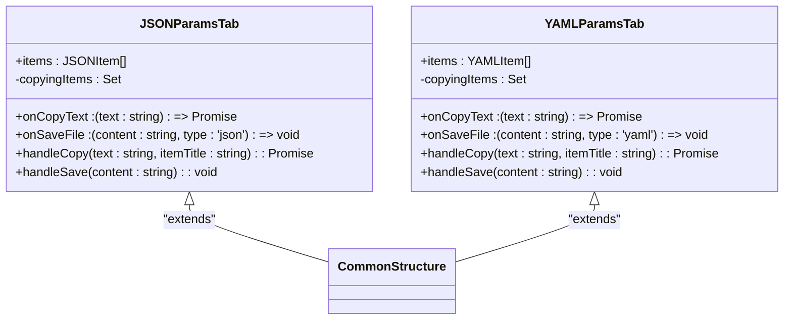
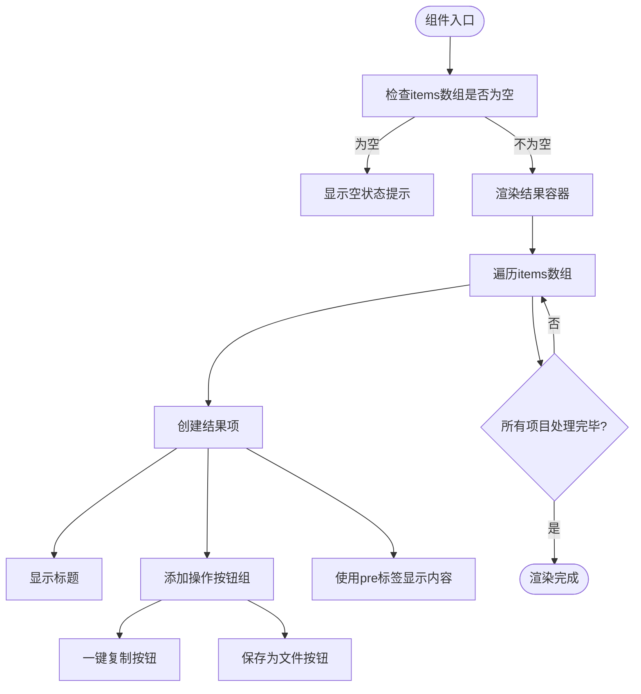
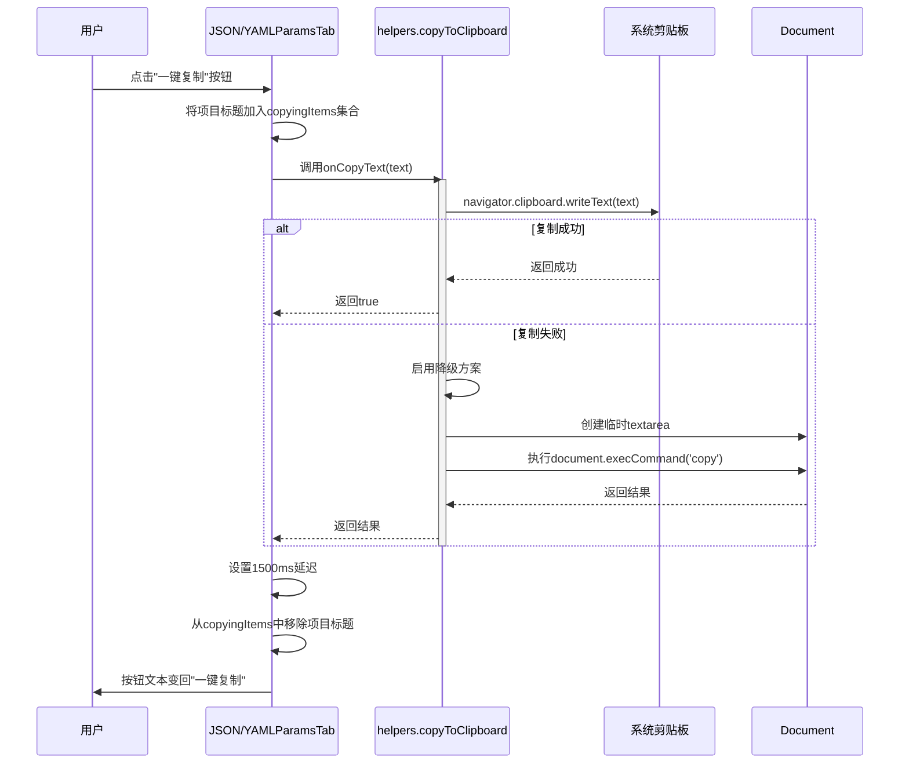
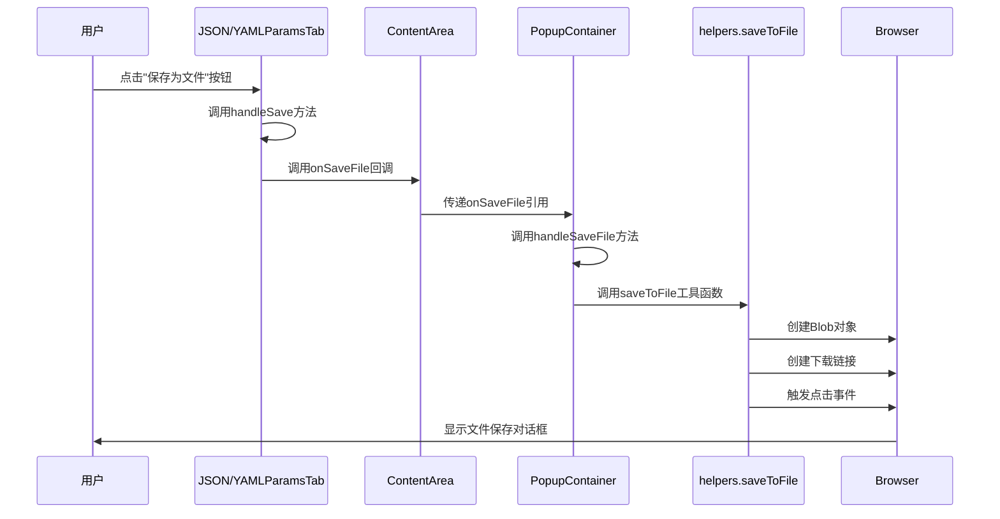
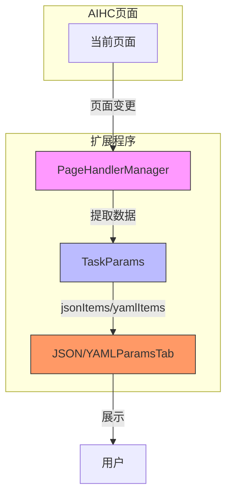

# JSON/YAML参数导出

<cite>
**Referenced Files in This Document **  
- [JSONParamsTab.tsx](file://src/components/tabs/JSONParamsTab.tsx)
- [YAMLParamsTab.tsx](file://src/components/tabs/YAMLParamsTab.tsx)
- [ContentArea.tsx](file://src/components/ContentArea.tsx)
- [PopupContainer.tsx](file://src/components/PopupContainer.tsx)
- [helpers.ts](file://src/utils/helpers.ts)
</cite>

## 目录
1. [简介](#简介)
2. [核心组件分析](#核心组件分析)
3. [统一UI模式设计](#统一ui模式设计)
4. [异步操作与用户反馈机制](#异步操作与用户反馈机制)
5. [文件下载流程](#文件下载流程)
6. [配置信息提取与格式转换](#配置信息提取与格式转换)
7. [结论](#结论)

## 简介
本文档深入解析AIHCX-EXT扩展程序中的`JSONParamsTab`和`YAMLParamsTab`两个核心组件，详细阐述它们在功能实现、代码结构上的相似性与差异。重点说明如何通过统一的UI模式展示结构化参数数据，包括结果容器、项目列表、一键复制和保存为文件等功能。同时，将解释`pre`标签对保持JSON/YAML格式的重要性，以及从AIHC页面提取配置信息并转换为标准JSON/YAML格式的完整过程。

## 核心组件分析

### 组件结构对比

`JSONParamsTab`和`YAMLParamsTab`是两个高度相似的React函数式组件，分别用于展示JSON和YAML格式的参数信息。它们共享几乎完全相同的代码结构和逻辑，仅在文件类型标识上有所区别。

**Diagram sources**
- [JSONParamsTab.tsx](file://src/components/tabs/JSONParamsTab.tsx#L1-L66)
- [YAMLParamsTab.tsx](file://src/components/tabs/YAMLParamsTab.tsx#L1-L66)

**Section sources**
- [JSONParamsTab.tsx](file://src/components/tabs/JSONParamsTab.tsx#L1-L66)
- [YAMLParamsTab.tsx](file://src/components/tabs/YAMLParamsTab.tsx#L1-L66)

### 功能相似性与差异

两个组件在功能实现上具有高度的一致性：

1. **状态管理**：都使用`useState<Set<string>>`来跟踪正在复制的项目，确保用户界面能及时反映操作状态。
2. **空状态处理**：当没有可用参数时，分别显示"没有可用的JSON参数"和"没有可用的YAML参数"的提示信息。
3. **UI布局**：采用相同的DOM结构，包含结果容器(`result-container`)、结果项(`result-item`)、操作按钮组(`action-buttons`)等CSS类名。

主要差异体现在类型定义和文件类型标识上：
- `JSONParamsTab`使用`type: 'json'`作为文件类型标识
- `YAMLParamsTab`使用`type: 'yaml'`作为文件类型标识
- 对应的接口定义分别为`JSONItem`和`YAMLItem`，但结构完全相同

这种设计体现了DRY（Don't Repeat Yourself）原则，通过微小的差异化实现了两种格式的支持，便于维护和扩展。

## 统一UI模式设计

### 结构化参数展示

两个组件都采用了统一的UI模式来展示结构化参数数据，其核心设计理念是提供一致的用户体验和可预测的交互模式。

**Diagram sources**
- [JSONParamsTab.tsx](file://src/components/tabs/JSONParamsTab.tsx#L1-L66)
- [YAMLParamsTab.tsx](file://src/components/tabs/YAMLParamsTab.tsx#L1-L66)

#### 结果容器与项目列表

组件使用`div.result-container`作为外层容器，内部通过`map`方法遍历`items`数组生成多个`div.result-item`。每个结果项包含一个标题区域和内容区域，形成清晰的层次结构。

#### 一键复制功能

复制功能通过`button`元素实现，其文本会根据`copyingItems`集合的状态动态变化：
- 当项目不在复制状态时，显示"一键复制"
- 当项目正在复制时，显示"已复制"

按钮的样式也通过`className={copyingItems.has(item.title) ? 'copying' : ''}`进行动态控制，提供视觉反馈。

#### 保存为文件功能

保存功能同样通过`button`元素实现，点击后触发`handleSave`方法，将当前项目的文本内容和文件类型传递给父级组件处理。

### pre标签的重要性

`pre`标签在展示JSON/YAML格式数据时起着至关重要的作用：

1. **保留原始格式**：`pre`元素会保留文本中的空白字符和换行符，这对于JSON/YAML这类格式敏感的数据至关重要。
2. **等宽字体显示**：通常浏览器会对`pre`标签应用等宽字体，使代码结构更加清晰易读。
3. **防止自动换行**：避免长行代码被意外折行，保持数据的完整性。

这种设计确保了结构化数据能够以最接近原始格式的方式呈现给用户，提高了可读性和可用性。

## 异步操作与用户反馈机制

### handleCopy方法工作流程

`handleCopy`方法是处理复制操作的核心函数，其实现了一个完整的异步操作流程和用户反馈机制。

**Diagram sources**
- [JSONParamsTab.tsx](file://src/components/tabs/JSONParamsTab.tsx#L20-L35)
- [YAMLParamsTab.tsx](file://src/components/tabs/YAMLParamsTab.tsx#L20-L35)
- [helpers.ts](file://src/utils/helpers.ts#L1-L25)

**Section sources**
- [JSONParamsTab.tsx](file://src/components/tabs/JSONParamsTab.tsx#L20-L35)
- [YAMLParamsTab.tsx](file://src/components/tabs/YAMLParamsTab.tsx#L20-L35)

#### 状态更新机制

该方法的关键在于其状态更新机制：
1. 立即将当前项目标题添加到`copyingItems`集合中，触发UI更新，按钮立即变为"已复制"状态。
2. 异步执行复制操作，无论成功与否都不阻塞UI响应。
3. 使用`setTimeout`设置1500毫秒的延迟，之后从集合中移除项目标题，恢复按钮的初始状态。

这种设计提供了即时的视觉反馈，让用户清楚地知道操作已被接受，即使实际的复制操作可能需要一些时间完成。

#### 用户反馈体验

整个流程创造了流畅的用户体验：
- **即时响应**：点击后按钮立即变化，消除用户的等待焦虑。
- **明确状态**："已复制"文本明确告知用户操作结果。
- **自动恢复**：短暂延迟后自动恢复，不影响后续操作。

## 文件下载流程

### handleSave方法工作流程

`handleSave`方法负责处理文件保存操作，其核心是调用父级组件传递的`onSaveFile`回调函数。

**Diagram sources**
- [JSONParamsTab.tsx](file://src/components/tabs/JSONParamsTab.tsx#L37-L40)
- [YAMLParamsTab.tsx](file://src/components/tabs/YAMLParamsTab.tsx#L37-L40)
- [ContentArea.tsx](file://src/components/ContentArea.tsx#L90-L95)
- [PopupContainer.tsx](file://src/components/PopupContainer.tsx#L480-L482)
- [helpers.ts](file://src/utils/helpers.ts#L27-L50)

**Section sources**
- [JSONParamsTab.tsx](file://src/components/tabs/JSONParamsTab.tsx#L37-L40)
- [YAMLParamsTab.tsx](file://src/components/tabs/YAMLParamsTab.tsx#L37-L40)

### onSaveFile回调链

文件下载流程涉及一个多层的回调链：
1. `JSONParamsTab`或`YAMLParamsTab`组件接收`onSaveFile`作为props
2. 在`ContentArea`组件中，`onSaveFile`被传递给具体的tab组件
3. `PopupContainer`作为顶层组件，提供了`handleSaveFile`方法作为`onSaveFile`的实际实现

这种设计遵循了React的单向数据流原则，将状态和行为集中在顶层组件，而展示型组件保持无状态或最小状态。

### saveToFile工具函数

最终的文件保存由`src/utils/helpers.ts`中的`saveToFile`函数实现，其工作原理如下：
1. 根据文件类型确定MIME类型
2. 创建包含内容的Blob对象
3. 生成对象URL
4. 创建隐藏的`a`标签并设置`download`属性
5. 触发点击事件启动下载
6. 清理创建的DOM元素和对象URL

这种方法兼容现代浏览器，并且不依赖任何外部库。

## 配置信息提取与格式转换

### 数据流架构

从AIHC页面提取配置信息并转换为标准JSON/YAML格式的过程涉及多个组件的协同工作。

**Diagram sources**
- [PopupContainer.tsx](file://src/components/PopupContainer.tsx#L150-L180)
- [ContentArea.tsx](file://src/components/ContentArea.tsx#L53-L107)
- [JSONParamsTab.tsx](file://src/components/tabs/JSONParamsTab.tsx#L1-L66)

**Section sources**
- [PopupContainer.tsx](file://src/components/PopupContainer.tsx#L150-L180)

### 页面处理器管理器

`PageHandlerManager`是整个数据提取流程的核心：
1. 监听浏览器标签页的变化
2. 识别当前是否为支持的AIHC页面
3. 根据页面类型调用相应的处理器
4. 提取页面中的配置信息
5. 将信息组织成结构化的`TaskParams`对象

### 格式化过程

当处理器提取到原始数据后，会进行以下处理：
1. **结构化**：将分散的配置信息组织成`{title: string, text: string}`的对象数组
2. **序列化**：对于JSON数据，确保其为有效的JSON字符串；对于YAML数据，确保其符合YAML语法
3. **分类存储**：分别存入`taskParams.jsonItems`和`taskParams.yamlItems`数组

### 实际示例

假设从AIHC的模型部署页面提取配置信息：
1. 页面处理器识别到这是模型部署详情页
2. 提取模型ID、版本、资源配置等信息
3. 将这些信息格式化为JSON和YAML两种表示
4. 分别添加到`jsonItems`和`yamlItems`数组
5. 触发UI更新，在对应的tab中显示格式化后的参数

这种设计使得用户可以方便地查看、复制或保存配置信息，极大地提高了工作效率。

## 结论

`JSONParamsTab`和`YAMLParamsTab`组件通过高度一致的设计模式，实现了对结构化参数数据的优雅展示。它们共享相同的UI模式、状态管理和交互逻辑，仅在文件类型标识上有所区分，体现了良好的代码复用和可维护性。

异步操作中的状态更新机制为用户提供了即时、明确的反馈，提升了用户体验。通过`pre`标签保持原始格式，确保了数据的可读性和完整性。文件下载功能通过多层回调链和工具函数的配合，实现了跨组件的无缝协作。

整个系统从页面信息提取到格式化展示的流程清晰高效，为用户提供了一种便捷的方式来管理和使用AIHC平台的配置信息。这种模块化、分层的设计思想值得在其他类似功能开发中借鉴和应用。