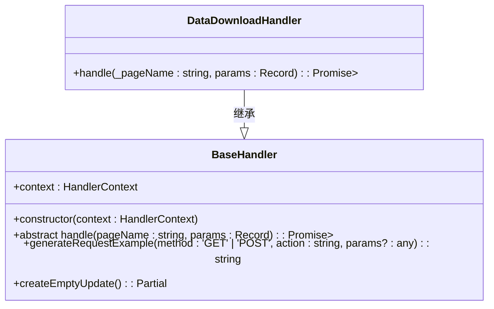

# 数据下载工具

<cite>
**本文档引用文件**
- [DataDownloadInput.tsx](file://src/components/DataDownloadInput.tsx)
- [DataDownloadHandler.ts](file://src/handlers/pages/DataDownloadHandler.ts)
- [BaseHandler.ts](file://src/handlers/BaseHandler.ts)
- [DataDumpForm.tsx](file://src/components/DataDumpForm.tsx)
</cite>

## 目录
1. [简介](#简介)
2. [前端交互机制](#前端交互机制)
3. [后端处理逻辑](#后端处理逻辑)
4. [全流程工作流程](#全流程工作流程)
5. [实际使用示例](#实际使用示例)

## 简介
数据下载工具旨在为用户提供便捷的HuggingFace数据集和模型下载功能。通过集成到浏览器扩展中，用户可以轻松地将HuggingFace上的资源信息自动填充到目标页面表单中，极大地简化了手动输入的繁琐过程。本工具从前端UI组件到后端处理器实现了完整的自动化流程。

## 前端交互机制

### DataDownloadInput 组件结构与功能
`DataDownloadInput` 组件是数据下载工具的核心前端界面，提供了直观的用户交互体验。该组件包含以下几个关键部分：

- **URL输入框**：允许用户粘贴HuggingFace数据集或模型的完整地址。
- **解析按钮**：触发URL解析和表单填充操作，支持点击或回车键激活。
- **加载状态指示器**：在解析过程中显示加载动画，提升用户体验。
- **结果展示区域**：成功解析后，显示提取出的关键信息，包括创建内容类型、名称、子路径等。

组件通过 `onParseUrl` 回调函数将解析后的数据传递给父组件，确保数据流的正确传递。此外，还提供多个示例地址供用户快速测试。

**Section sources**
- [DataDownloadInput.tsx](file://src/components/DataDownloadInput.tsx#L1-L370)

## 后端处理逻辑

### DataDownloadHandler 类实现
`DataDownloadHandler` 类继承自 `BaseHandler`，负责处理 `/dataDownload/create` 和 `/dataDownload/info` 页面的数据请求。其核心方法 `handle` 根据不同的页面名称返回相应的任务参数，并设置特定标志位以触发特殊UI处理。

当访问 `/dataDownload/info` 页面时，处理器会检查 `_pageName` 是否为“数据下载任务详情”，如果是，则返回包含 `isDataDumpPage` 标志的任务参数，同时携带 `datasetId` 和 `category` 信息。对于其他情况，返回带有 `isDataDownloadPage` 标志的基本任务参数，仅显示输入框而不显示任何Tab。

这种设计使得系统能够根据不同页面需求动态调整UI布局和功能，提高了灵活性和可维护性。

**Diagram sources**
- [DataDownloadHandler.ts](file://src/handlers/pages/DataDownloadHandler.ts#L7-L41)
- [BaseHandler.ts](file://src/handlers/BaseHandler.ts#L3-L36)

**Section sources**
- [DataDownloadHandler.ts](file://src/handlers/pages/DataDownloadHandler.ts#L7-L41)

## 全流程工作流程

### 从前端到后端的完整流程
1. 用户在 `DataDownloadInput` 组件中输入HuggingFace URL并点击解析按钮。
2. 组件调用 `parseHuggingFaceUrl` 方法验证并解析URL，提取必要的元数据。
3. 解析成功后，调用 `fillPageForm` 方法，通过 `chrome.tabs.sendMessage` 将数据发送至当前活动标签页的内容脚本。
4. 内容脚本接收消息后，自动填充目标页面的表单字段。
5. 如果填充失败，系统会生成手动填充指令并复制到剪贴板，指导用户进行后续操作。
6. 同时，`DataDownloadHandler` 在后台监听相关页面变化，根据页面类型返回适当的配置参数，确保UI正确渲染。

此流程保证了从用户输入到最终表单填充的无缝衔接，即使遇到网络问题也能提供有效的备选方案。

**Section sources**
- [DataDownloadInput.tsx](file://src/components/DataDownloadInput.tsx#L19-L366)
- [DataDownloadHandler.ts](file://src/handlers/pages/DataDownloadHandler.ts#L8-L40)

## 实际使用示例

### 用户如何通过粘贴链接实现自动填充
用户只需简单几步即可完成整个操作：
1. 打开目标页面（如数据下载创建页）。
2. 复制HuggingFace上的数据集或模型链接。
3. 在 `DataDownloadInput` 组件的输入框中粘贴链接。
4. 按下Enter键或点击“解析填充”按钮。
5. 系统自动解析链接并将相关信息填入页面表单，如数据集名称、存储子路径等。
6. 若一切顺利，用户将看到成功的提示信息；若出现异常，则按提供的指引手动执行填充代码。

这种方式不仅节省了大量时间，还减少了人为错误的可能性，显著提升了工作效率。

**Section sources**
- [DataDownloadInput.tsx](file://src/components/DataDownloadInput.tsx#L19-L366)
- [DataDumpForm.tsx](file://src/components/DataDumpForm.tsx#L30-L706)