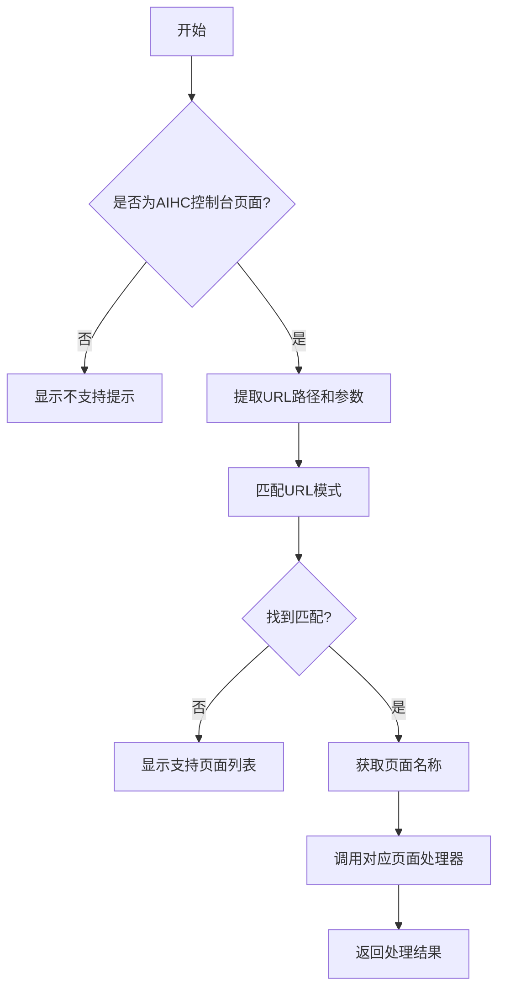
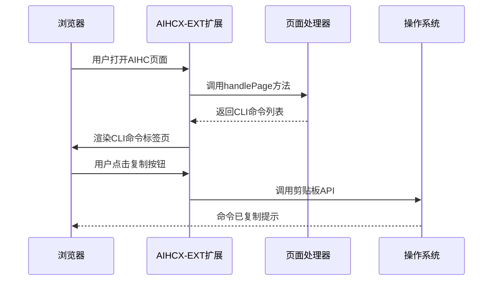
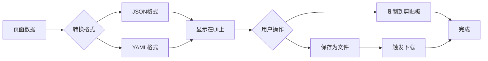
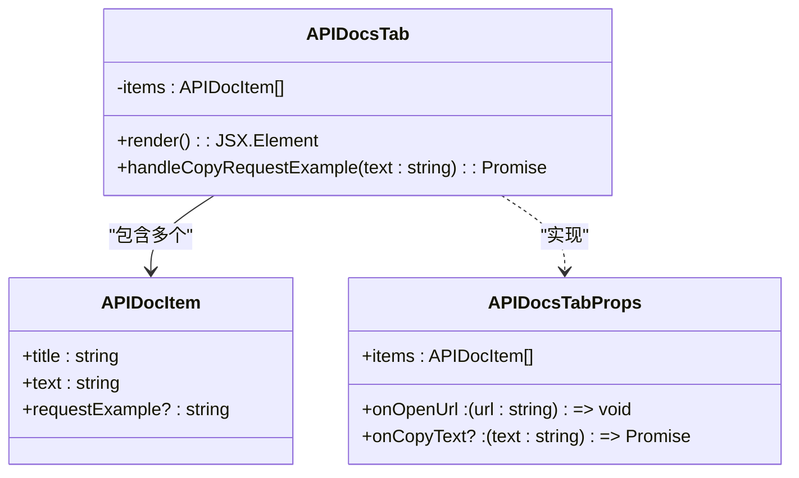
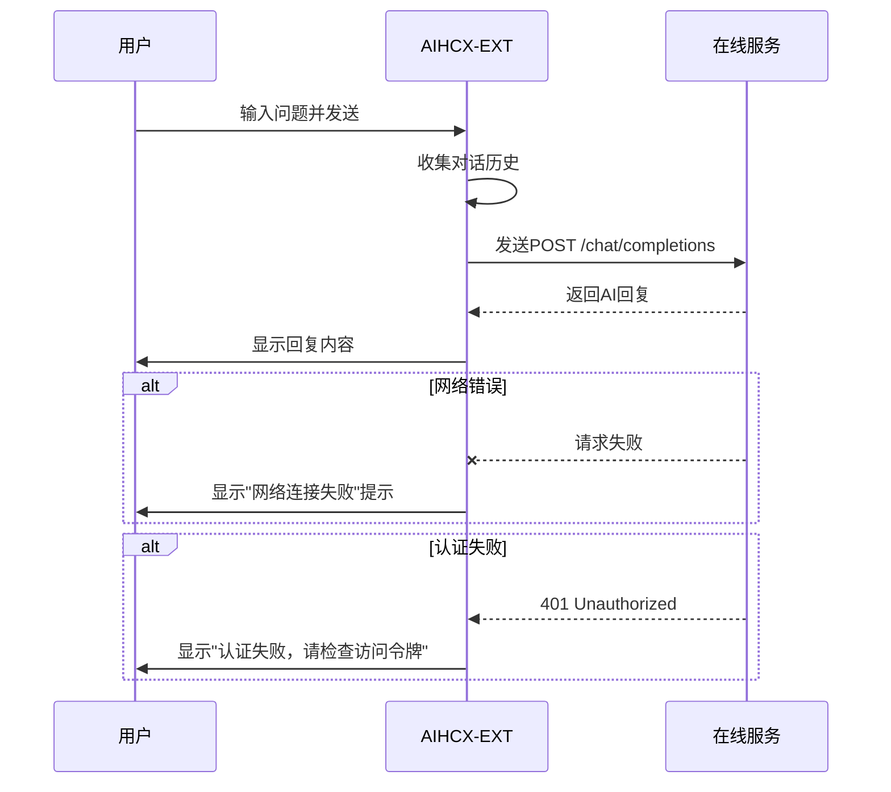

# 核心功能详解

<cite>
**本文档引用的文件**
- [PageHandlerManager.ts](file://src/handlers/PageHandlerManager.ts)
- [BaseHandler.ts](file://src/handlers/BaseHandler.ts)
- [pageDetection.ts](file://src/utils/pageDetection.ts)
- [CLICommandTab.tsx](file://src/components/tabs/CLICommandTab.tsx)
- [JSONParamsTab.tsx](file://src/components/tabs/JSONParamsTab.tsx)
- [YAMLParamsTab.tsx](file://src/components/tabs/YAMLParamsTab.tsx)
- [APIDocsTab.tsx](file://src/components/tabs/APIDocsTab.tsx)
- [ChatTab.tsx](file://src/components/tabs/ChatTab.tsx)
- [DataDownloadHandler.ts](file://src/handlers/pages/DataDownloadHandler.ts)
- [DataDownloadInput.tsx](file://src/components/DataDownloadInput.tsx)
- [DataDumpForm.tsx](file://src/components/DataDumpForm.tsx)
- [DatasetDetailHandler.ts](file://src/handlers/pages/DatasetDetailHandler.ts)
- [ModelDetailHandler.ts](file://src/handlers/pages/ModelDetailHandler.ts)
- [aihcApi.ts](file://src/services/aihcApi.ts)
</cite>

## 目录
1. [智能页面识别机制](#智能页面识别机制)
2. [CLI命令自动生成](#cli命令自动生成)
3. [JSON/YAML参数导出](#jsonyaml参数导出)
4. [API文档集成](#api文档集成)
5. [AI聊天功能](#ai聊天功能)
6. [数据下载工具](#数据下载工具)

## 智能页面识别机制

AIHCX-EXT通过URL模式匹配和页面名称映射实现智能页面识别。系统在`src/utils/pageDetection.ts`中定义了详细的URL模式表，将特定URL前缀映射到相应的中文页面名称。

当用户访问百舸AIHC控制台时，`detectPageType`函数会检查当前URL是否以`https://console.bce.baidu.com/aihc`开头，然后按照预定义的模式进行匹配。为了确保精确性，系统会对URL模式按长度降序排序，优先匹配更具体的模式。

页面处理器管理器`PageHandlerManager`负责维护所有支持的页面处理器实例。它在初始化时根据页面名称注册对应的处理器，如"任务详情"对应`TaskDetailHandler`，"数据集详情"对应`DatasetDetailHandler`等。

**图示来源**
- [pageDetection.ts](file://src/utils/pageDetection.ts#L1-L150)
- [PageHandlerManager.ts](file://src/handlers/PageHandlerManager.ts#L21-L93)

**本节来源**
- [pageDetection.ts](file://src/utils/pageDetection.ts#L1-L150)
- [PageHandlerManager.ts](file://src/handlers/PageHandlerManager.ts#L21-L93)

## CLI命令自动生成

CLI命令自动生成功能通过分析当前页面上下文，动态生成可执行的命令行指令。系统为不同类型的页面提供定制化的CLI命令，这些命令可以直接复制使用或参考其格式进行修改。

在`src/components/tabs/CLICommandTab.tsx`中，组件接收一个CLI项目数组作为输入，每个项目包含标题、命令文本和可选的文档链接。用户可以通过点击"一键复制"按钮将命令复制到剪贴板，或点击"CLI使用手册"查看详细文档。

对于特定页面，如数据集详情页，系统会生成相关的CLI命令。虽然具体命令内容未在代码中直接体现，但通过API文档集成可以推断出相应的CLI命令结构。例如，在数据集详情页面，可能会生成类似`bce aihc dataset describe --dataset-id <id>`的命令。

**图示来源**
- [CLICommandTab.tsx](file://src/components/tabs/CLICommandTab.tsx#L1-L72)
- [PageHandlerManager.ts](file://src/handlers/PageHandlerManager.ts#L62-L78)

**本节来源**
- [CLICommandTab.tsx](file://src/components/tabs/CLICommandTab.tsx#L1-L72)

## JSON/YAML参数导出

JSON/YAML参数导出功能允许用户将配置参数以标准格式导出，便于在自动化脚本或配置文件中使用。系统提供了独立的标签页分别展示JSON和YAML格式的参数。

`src/components/tabs/JSONParamsTab.tsx`和`src/components/tabs/YAMLParamsTab.tsx`实现了参数导出功能。两个组件具有相似的结构：显示参数标题、提供"一键复制"按钮和"保存为文件"按钮。用户可以选择将参数复制到剪贴板，或直接保存为`.json`或`.yaml`文件。

参数的生成逻辑由各个页面处理器实现。例如，`DatasetDetailHandler`会根据数据集ID生成相应的API请求参数。参数映射过程遵循严格的格式规范：
- 所有键名使用小驼峰命名法
- 字符串值用双引号包围
- 数组和对象正确缩进
- 特殊字符进行适当转义

**图示来源**
- [JSONParamsTab.tsx](file://src/components/tabs/JSONParamsTab.tsx#L1-L66)
- [YAMLParamsTab.tsx](file://src/components/tabs/YAMLParamsTab.tsx#L1-L66)

**本节来源**
- [JSONParamsTab.tsx](file://src/components/tabs/JSONParamsTab.tsx#L1-L66)
- [YAMLParamsTab.tsx](file://src/components/tabs/YAMLParamsTab.tsx#L1-L66)

## API文档集成

API文档集成功能根据当前页面动态展示相关API接口文档和请求示例。系统通过页面处理器生成API文档链接和请求示例，帮助开发者快速了解如何通过API操作当前资源。

在`src/components/tabs/APIDocsTab.tsx`中，组件渲染API文档项目列表，每个项目包含接口标题、文档链接和请求示例。用户可以点击"查看说明文档"跳转到详细API文档，或点击"复制请求示例"将示例代码复制到剪贴板。

页面处理器通过`generateRequestExample`方法生成标准化的请求示例。例如，`DatasetDetailHandler`在处理数据集详情页面时，会生成GET请求的示例，包含`DescribeDataset`操作和`datasetId`参数。同样，`ModelDetailHandler`会为模型详情页面生成`DescribeModel`请求示例。

**图示来源**
- [APIDocsTab.tsx](file://src/components/tabs/APIDocsTab.tsx#L1-L80)
- [DatasetDetailHandler.ts](file://src/handlers/pages/DatasetDetailHandler.ts#L1-L23)
- [ModelDetailHandler.ts](file://src/handlers/pages/ModelDetailHandler.ts#L1-L23)

**本节来源**
- [APIDocsTab.tsx](file://src/components/tabs/APIDocsTab.tsx#L1-L80)
- [DatasetDetailHandler.ts](file://src/handlers/pages/DatasetDetailHandler.ts#L1-L23)
- [ModelDetailHandler.ts](file://src/handlers/pages/ModelDetailHandler.ts#L1-L23)

## AI聊天功能

AI聊天功能提供了一个与在线服务交互的对话界面，特别适用于技术支持场景。该功能能够理解上下文，保持对话连贯性，并基于服务配置进行安全认证。

`src/components/tabs/ChatTab.tsx`实现了完整的聊天界面，包括消息历史、输入框和发送按钮。聊天配置包含服务URL、访问令牌等必要信息。当用户发送消息时，系统会构建包含完整对话历史的请求，确保AI助手能够理解上下文。

聊天功能的关键特性包括：
- **上下文理解**：发送请求时包含之前的所有消息，使AI能够理解对话历史
- **认证安全**：使用Bearer Token进行身份验证，保护服务安全
- **错误处理**：对网络超时、认证失败等常见问题提供友好的错误提示
- **流式响应**：支持流式传输，实时显示AI回复

实际应用场景中，用户可以在"在线服务部署详情"页面加载聊天配置后，直接向部署的服务提问，如"当前服务的性能指标如何？"或"最近是否有异常日志？"，AI助手会根据服务状态给出回答。

**图示来源**
- [ChatTab.tsx](file://src/components/tabs/ChatTab.tsx#L1-L354)

**本节来源**
- [ChatTab.tsx](file://src/components/tabs/ChatTab.tsx#L1-L354)

## 数据下载工具

数据下载工具提供了一键解析HuggingFace URL并自动填充表单的功能，极大简化了数据导入流程。该工具支持数据集和模型两种类型，能够从URL中提取必要的信息。

`src/handlers/pages/DataDownloadHandler.ts`处理数据下载相关页面的逻辑。当用户访问数据下载创建页面时，系统标记`isDataDownloadPage`为true；当访问数据下载任务详情页面时，除了标记外还提取`datasetId`和`category`参数用于数据转储。

`src/components/DataDownloadInput.tsx`实现了URL解析功能。它通过正则表达式匹配HuggingFace URL格式，区分数据集（包含`datasets/`前缀）和模型（不包含前缀）。解析成功后，系统会尝试自动填充页面表单，若失败则提供手动填充的JavaScript代码。

数据转储功能通过`DataDumpForm.tsx`实现