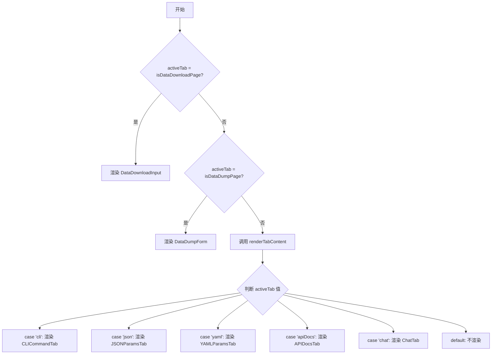

# ContentArea 组件

<cite>
**Referenced Files in This Document **   
- [ContentArea.tsx](file://src/components/ContentArea.tsx)
- [TabNavigation.tsx](file://src/components/TabNavigation.tsx)
- [CLICommandTab.tsx](file://src/components/tabs/CLICommandTab.tsx)
- [JSONParamsTab.tsx](file://src/components/tabs/JSONParamsTab.tsx)
- [DatasetDetailHandler.ts](file://src/handlers/pages/DatasetDetailHandler.ts)
- [BaseHandler.ts](file://src/handlers/BaseHandler.ts)
- [PageHandlerManager.ts](file://src/handlers/PageHandlerManager.ts)
</cite>

## 目录
1. [简介](#简介)
2. [核心功能与角色](#核心功能与角色)
3. [动态内容加载机制](#动态内容加载机制)
4. [特殊页面处理逻辑](#特殊页面处理逻辑)
5. [数据请求与处理流程](#数据请求与处理流程)
6. [错误处理与隔离策略](#错误处理与隔离策略)
7. [高阶组件封装建议](#高阶组件封装建议)

## 简介
`ContentArea` 组件是 AIHCX 扩展程序中的核心功能面板宿主，负责根据当前激活的标签页（Tab）动态渲染相应的内容。它作为用户界面的核心展示区域，协调 `TabNavigation` 组件的导航状态，并通过后台处理器（Handler）获取和管理数据，为用户提供 CLI 命令、API 文档、参数配置等多种信息的可视化与交互。

## 核心功能与角色
`ContentArea` 组件扮演着“容器”和“调度器”的双重角色。其主要职责包括：
- **宿主容器**：作为所有功能子组件（如 `CLICommandTab`, `JSONParamsTab` 等）的父级容器，提供统一的布局和样式。
- **状态驱动**：接收来自 `TabNavigation` 的 `activeTab` 属性，决定当前应显示哪个子组件。
- **数据传递**：将从后台处理器获取的 `taskParams` 数据以及通用的回调函数（如 `onCopyText`, `onSaveFile`）分发给具体的子组件。
- **条件渲染**：根据 `taskParams` 中的特定标志位（如 `isDataDownloadPage`），跳过常规的 Tab 切换逻辑，直接渲染特定的功能表单或输入框。

**Section sources**
- [ContentArea.tsx](file://src/components/ContentArea.tsx#L1-L116)

## 动态内容加载机制
`ContentArea` 采用基于 `switch-case` 语句的动态渲染策略来实现按需加载。该机制不涉及现代框架的懒加载（Lazy Loading）技术，而是通过简单的条件判断在运行时确定要渲染的 JSX 元素。

### 工作流程
1.  **接收指令**：`ContentArea` 接收由 `TabNavigation` 或其他父组件传入的 `activeTab` 值（例如 `'cli'`, `'json'`, `'chat'`）。
2.  **执行路由**：组件内部的 `renderTabContent` 函数会检查 `activeTab` 的值。
3.  **实例化组件**：根据匹配到的 `case`，直接导入并渲染对应的子组件。例如，当 `activeTab` 为 `'cli'` 时，返回 `<CLICommandTab />` 实例。



**Diagram sources **
- [ContentArea.tsx](file://src/components/ContentArea.tsx#L40-L98)

**Section sources**
- [ContentArea.tsx](file://src/components/ContentArea.tsx#L40-L98)
- [TabNavigation.tsx](file://src/components/TabNavigation.tsx#L10-L88)

## 特殊页面处理逻辑
除了常规的 Tab 导航模式，`ContentArea` 还实现了对特定业务场景的直接支持，这体现了其灵活的条件渲染能力。

### 数据下载页面
当 `taskParams.isDataDownloadPage` 为 `true` 时，`ContentArea` 会忽略 `activeTab`，直接渲染 `DataDownloadInput` 组件。此逻辑确保了在数据下载任务中，用户界面能立即进入文件选择和提交状态。

### 数据转储页面
类似地，当 `taskParams.isDataDumpPage` 为 `true` 时，组件会直接渲染 `DataDumpForm` 表单。该表单需要 `datasetId` 和 `category` 等参数，这些参数同样来源于 `taskParams`。

这种设计避免了不必要的 Tab 切换，提升了特定工作流的用户体验。

**Section sources**
- [ContentArea.tsx](file://src/components/ContentArea.tsx#L23-L38)

## 数据请求与处理流程
`ContentArea` 本身不直接发起网络请求，而是依赖于一个分层的数据处理架构。数据的获取由后台处理器（Handler）完成，`ContentArea` 负责最终的展示。

### 架构与组件关系
```mermaid
graph TB
subgraph "UI Layer"
TA[TabNavigation]
CA[ContentArea]
CT[CLICommandTab]
JT[JSONParamsTab]
end
subgraph "Logic Layer"
PHM[PageHandlerManager]
DH[DatasetDetailHandler]
BH[BaseHandler]
end
TA --> CA : 传递 activeTab
CA --> CT : 传递 taskParams.cliItems
CA --> JT : 传递 taskParams.jsonItems
PHM --> CA : 提供 taskParams
DH -.-> PHM : 注册为处理器
BH -.-> DH : 继承基础功能
```

**Diagram sources **
- [DatasetDetailHandler.ts](file://src/handlers/pages/DatasetDetailHandler.ts#L8-L21)
- [BaseHandler.ts](file://src/handlers/BaseHandler.ts#L1-L37)
- [PageHandlerManager.ts](file://src/handlers/PageHandlerManager.ts#L1-L94)

### 流程详解
1.  **页面识别**：扩展程序检测到当前浏览器页面（如“数据集详情”）。
2.  **处理器调用**：`PageHandlerManager` 根据页面名称查找并调用相应的处理器（如 `DatasetDetailHandler`）。
3.  **数据生成**：处理器的 `handle` 方法被触发，该方法继承自 `BaseHandler` 并可使用其工具方法（如 `generateRequestExample`）。处理器构建包含 API 文档、CLI 命令等信息的 `Partial<TaskParams>` 对象。
4.  **数据聚合**：`PageHandlerManager` 捕获所有处理器的返回结果，并将其合并成完整的 `taskParams`。
5.  **状态更新**：`taskParams` 被提升至顶层组件，并作为属性传递给 `ContentArea`。
6.  **内容渲染**：`ContentArea` 根据 `taskParams` 和 `activeTab` 决定渲染哪个子组件，并将相关数据注入其中。

此流程实现了关注点分离，使 UI 层专注于展示，而业务逻辑层专注于数据准备。

**Section sources**
- [DatasetDetailHandler.ts](file://src/handlers/pages/DatasetDetailHandler.ts#L8-L21)
- [BaseHandler.ts](file://src/handlers/BaseHandler.ts#L1-L37)
- [PageHandlerManager.ts](file://src/handlers/PageHandlerManager.ts#L62-L78)

## 错误处理与隔离策略
当前代码库中并未显式实现 React 的“错误边界”（Error Boundary）机制。然而，系统通过以下方式实现了某种程度的错误隔离：

1.  **模块化设计**：每个功能（CLI, JSON, API Docs）都被封装在独立的子组件中。一个子组件内部的 JavaScript 错误理论上不会直接影响其他子组件的渲染，因为它们是独立的 React 元素。
2.  **空状态处理**：子组件（如 `CLICommandTab` 和 `JSONParamsTab`）都包含了对空数据的处理逻辑。当 `items` 数组为空时，会显示“没有可用的...”的提示信息，而不是尝试渲染无效数据导致崩溃。
3.  **异常捕获**：`PageHandlerManager` 在调用 `handler.handle` 时使用了 `try-catch` 块。如果某个处理器在执行过程中抛出异常，该异常会被捕获，`handlePage` 方法会返回一个空对象 `{}`，从而防止整个应用因单个处理器的失败而崩溃。

尽管缺乏传统的错误边界，但这种结合了模块化、空状态管理和外围异常捕获的策略，有效地增强了系统的健壮性。

**Section sources**
- [CLICommandTab.tsx](file://src/components/tabs/CLICommandTab.tsx#L38-L40)
- [JSONParamsTab.tsx](file://src/components/tabs/JSONParamsTab.tsx#L35-L37)
- [PageHandlerManager.ts](file://src/handlers/PageHandlerManager.ts#L70-L77)

## 高阶组件封装建议
为了进一步提升代码的复用性和可维护性，可以为 `ContentArea` 及其子组件创建高阶组件（HOC）来处理横切关注点。

### 权限校验 HOC
可以创建一个 `withPermissionCheck` HOC，用于在渲染任何敏感功能前检查用户的权限。
```typescript
// 伪代码示例
const withPermissionCheck = (WrappedComponent, requiredPermission) => {
  return (props) => {
    const hasPermission = useUserPermission(requiredPermission);
    if (!hasPermission) {
      return <AccessDenied />;
    }
    return <WrappedComponent {...props} />;
  };
};

// 使用
const SecureCLICommandTab = withPermissionCheck(CLICommandTab, 'view_cli_commands');
```

### 数据预加载 HOC
可以创建一个 `withDataPrefetch` HOC，用于在组件挂载前预先获取所需数据，从而减少用户等待时间。
```typescript
// 伪代码示例
const withDataPrefetch = (WrappedComponent, fetchDataFunction) => {
  return (props) => {
    const [data, setData] = useState(null);
    const [loading, setLoading] = useState(true);

    useEffect(() => {
      const loadData = async () => {
        const result = await fetchDataFunction();
        setData(result);
        setLoading(false);
      };
      loadData();
    }, []);

    if (loading) return <LoadingIndicator />;
    return <WrappedComponent {...props} prefetchedData={data} />;
  };
};
```

通过应用这些 HOC，可以在不修改现有组件逻辑的情况下，为其添加强大的新功能。