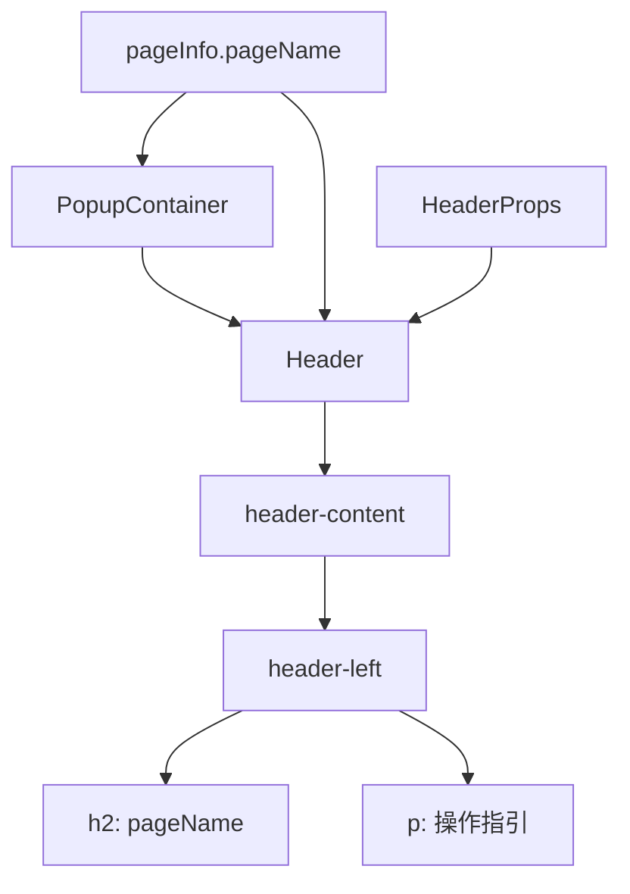
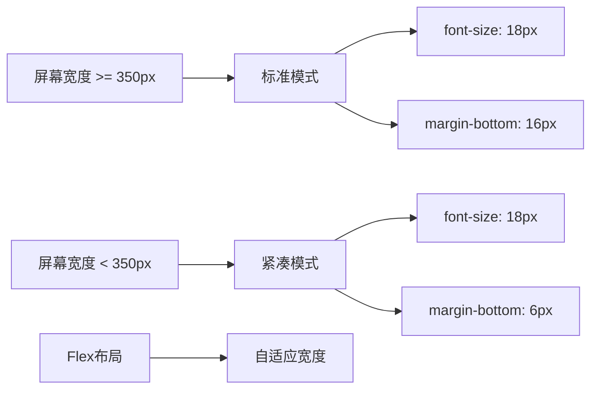
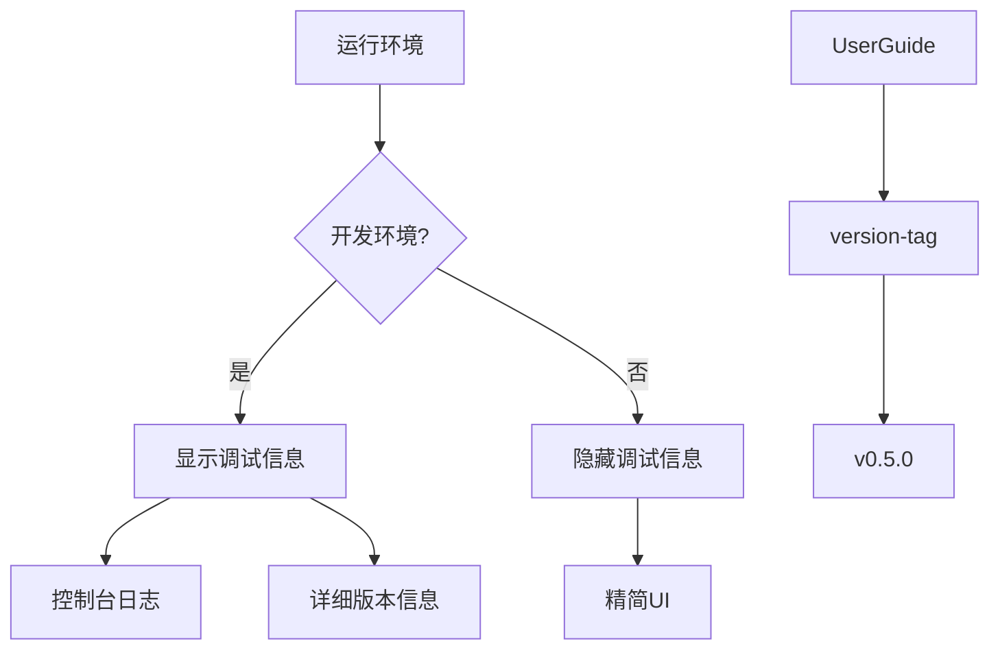
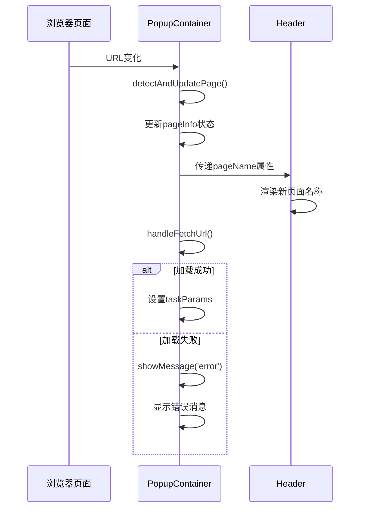
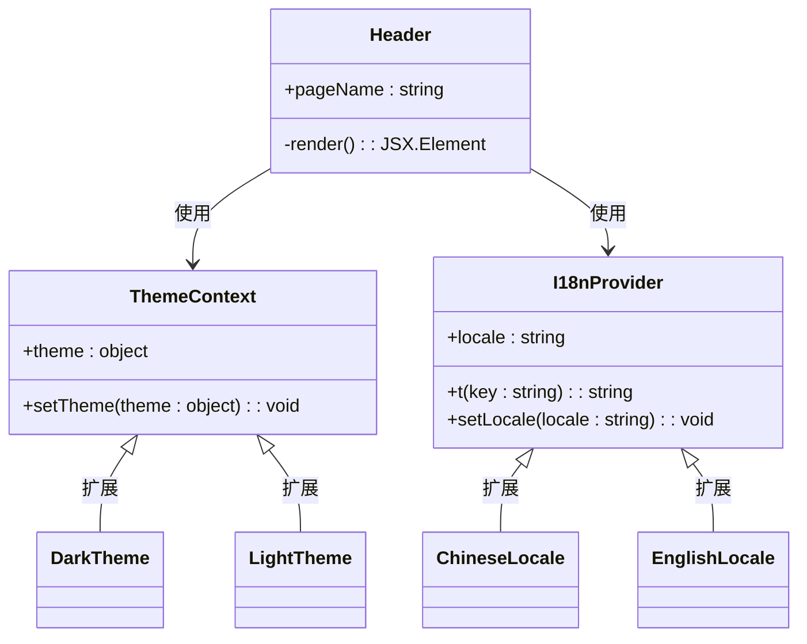

# Header 组件

<cite>
**Referenced Files in This Document**   
- [Header.tsx](file://src/components/Header.tsx)
- [PopupContainer.tsx](file://src/components/PopupContainer.tsx)
- [popup.css](file://src/styles/popup.css)
- [UserGuide.tsx](file://src/components/UserGuide.tsx)
</cite>

## 目录
1. [组件结构与布局逻辑](#组件结构与布局逻辑)
2. [响应式设计适配](#响应式设计适配)
3. [环境信息显示机制](#环境信息显示机制)
4. [状态联动机制](#状态联动机制)
5. [主题样式与国际化](#主题样式与国际化)
6. [封装建议](#封装建议)

## 组件结构与布局逻辑

Header 组件作为弹出界面的顶部导航区域，主要负责展示项目标识、页面名称和辅助说明信息。该组件通过简洁的布局结构实现了清晰的信息层级。

组件采用 Flex 布局实现内容的水平分布，左侧区域包含主标题和副标题，右侧可扩展快捷操作按钮。主标题使用 H2 标签展示当前页面名称，副标题提供用户操作指引，提示"切换Tab按钮可以查看对应内容"。

在 `PopupContainer` 中，Header 组件通过 `pageName` 属性接收来自 `pageInfo` 状态的页面名称，实现了动态内容更新。这种父子组件通信模式确保了头部信息与当前浏览页面的实时同步。



**Section sources**
- [Header.tsx](file://src/components/Header.tsx#L2-L17)
- [PopupContainer.tsx](file://src/components/PopupContainer.tsx#L20-L566)

## 响应式设计适配

Header 组件的响应式设计通过 CSS 媒体查询和弹性布局相结合的方式，确保在不同屏幕尺寸下都能提供良好的用户体验。

在桌面端，Header 保持标准的 20px 字号和适当的内边距，提供充足的视觉空间。当屏幕宽度小于 350px 时，系统会应用紧凑模式，将标题字号调整为 18px，并减少外边距，以适应小屏幕设备的显示需求。

CSS 样式文件中定义了多层响应式规则，通过 `@media (max-width: 350px)` 查询条件触发样式调整。这些规则不仅影响 Header 组件本身，还协调整个弹出容器的布局变化，确保整体界面的一致性。



**Diagram sources**
- [popup.css](file://src/styles/popup.css#L447-L533)
- [popup.css](file://src/popup/sidebar.css#L1616-L1695)

**Section sources**
- [popup.css](file://src/styles/popup.css#L447-L533)
- [popup.css](file://src/popup/sidebar.css#L1616-L1695)

## 环境信息显示机制

Header 组件通过集成 `UserGuide` 组件来实现版本信息和调试提示的显示。在开发环境中，系统会在 Header 区域显示详细的版本标签和调试信息，帮助开发者追踪功能变更。

版本信息通过 `UserGuide` 组件中的 `version-tag` 类实现，固定显示 "v0.5.0" 版本号。这个信息位于 Header 的右上角，与关闭按钮并列，形成完整的头部功能区。虽然当前实现是静态版本号，但架构上支持动态获取构建信息。

在生产环境中，系统通过配置开关控制调试信息的显示。当处于开发模式时，可以在控制台输出中看到详细的页面检测日志，如"[AIHC助手] 检测到页面变化"等调试信息，这些信息有助于追踪 Header 组件的状态变化。



**Diagram sources**
- [UserGuide.tsx](file://src/components/UserGuide.tsx#L67)
- [PopupContainer.tsx](file://src/components/PopupContainer.tsx#L20-L566)

**Section sources**
- [UserGuide.tsx](file://src/components/UserGuide.tsx#L67)
- [PopupContainer.tsx](file://src/components/PopupContainer.tsx#L20-L566)

## 状态联动机制

Header 组件与 `PopupContainer` 之间建立了紧密的状态联动机制，通过 React 的状态管理和属性传递实现双向通信。

`PopupContainer` 使用 `useState` 钩子管理 `pageInfo` 状态，其中包含 `pageName` 字段。当页面检测到 URL 变化时，`detectAndUpdatePage` 函数会更新 `pageInfo` 状态，这一变化会自动触发 Header 组件的重新渲染，确保显示最新的页面名称。

错误状态指示通过 `message` 状态实现。当发生加载失败或复制失败等异常时，`showMessage` 函数会设置消息内容，这些消息会在 Header 下方显示，为用户提供即时反馈。加载状态则通过 `isLoading` 布尔值控制，当为 true 时显示加载指示器。



**Diagram sources**
- [PopupContainer.tsx](file://src/components/PopupContainer.tsx#L20-L566)
- [Header.tsx](file://src/components/Header.tsx#L2-L17)

**Section sources**
- [PopupContainer.tsx](file://src/components/PopupContainer.tsx#L20-L566)

## 主题样式与国际化

Header 组件的主题样式通过外部 CSS 文件进行管理，实现了样式与逻辑的分离。主样式文件 `popup.css` 定义了基础的视觉规范，而 `sidebar.css` 提供了增强样式，支持主题的动态切换。

当前实现中，Header 组件的文本内容仍为中文硬编码，尚未实现完整的国际化支持。不过，代码结构为未来的 i18n 集成预留了空间。可以通过创建语言包对象，将所有文本内容抽取到独立的资源文件中，然后根据浏览器语言设置动态加载相应的翻译。

主题定制方面，组件支持通过 CSS 变量或主题上下文来改变颜色方案。例如，可以通过修改 `--header-color` 和 `--header-background` 等 CSS 自定义属性来快速切换主题，而无需修改组件逻辑。



**Diagram sources**
- [Header.tsx](file://src/components/Header.tsx#L2-L17)
- [popup.css](file://src/styles/popup.css#L447-L533)

**Section sources**
- [Header.tsx](file://src/components/Header.tsx#L2-L17)

## 封装建议

为了提高 Header 组件的复用性和可维护性，建议进行以下封装优化：

首先，应该将 Header 组件重构为更通用的形式，支持更多可配置的属性，如 `showVersion`、`showCloseButton`、`actions` 等。这将使其能够适应不同的使用场景，而不仅仅是当前的弹出窗口。

其次，建议实现插槽（Slot）机制，允许父组件向 Header 注入自定义内容。例如，可以在右侧区域插入特定于页面的快捷操作按钮，或者在标题下方添加额外的状态指示器。

最后，应该将国际化文本提取到独立的资源文件中，并建立类型安全的语言键系统。这样不仅可以支持多语言，还能在编译时检查文本引用的正确性，避免运行时错误。

```mermaid
flowchart TD
A[Header组件] --> B[Props接口]
B --> C[pageName: string]
B --> D[showVersion?: boolean]
B --> E[showClose?: boolean]
B --> F[actions?: Action[]]
B --> G[extraContent?: ReactNode]
A --> H[内部状态]
H --> I[loading: boolean]
H --> J[error: string | null]
A --> K[生命周期]
K --> L[useEffect监听props变化]
K --> M[useCallback处理事件]
A --> N[样式系统]
N --> O[CSS Modules]
N --> P[主题支持]
N --> Q[响应式断点]
```

**Diagram sources**
- [Header.tsx](file://src/components/Header.tsx#L2-L17)
- [PopupContainer.tsx](file://src/components/PopupContainer.tsx#L20-L566)