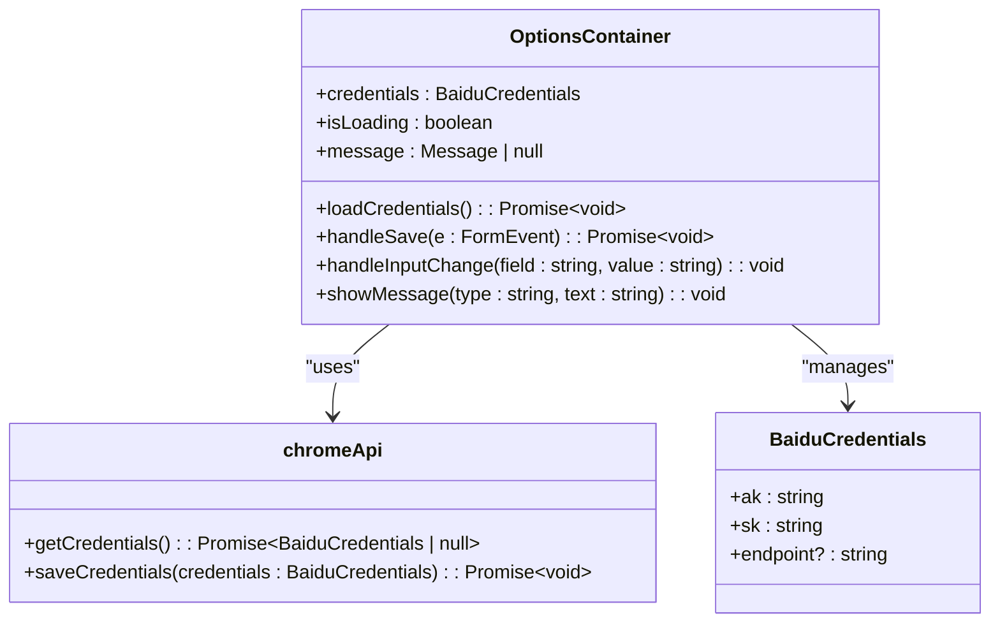
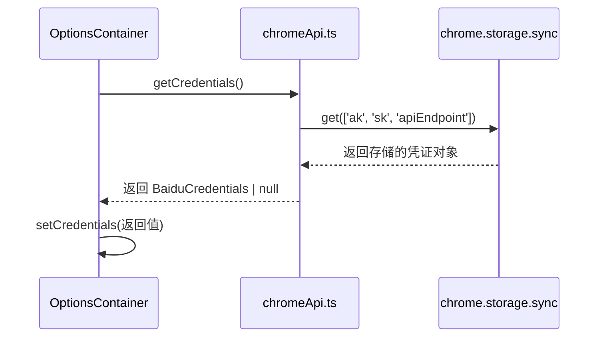
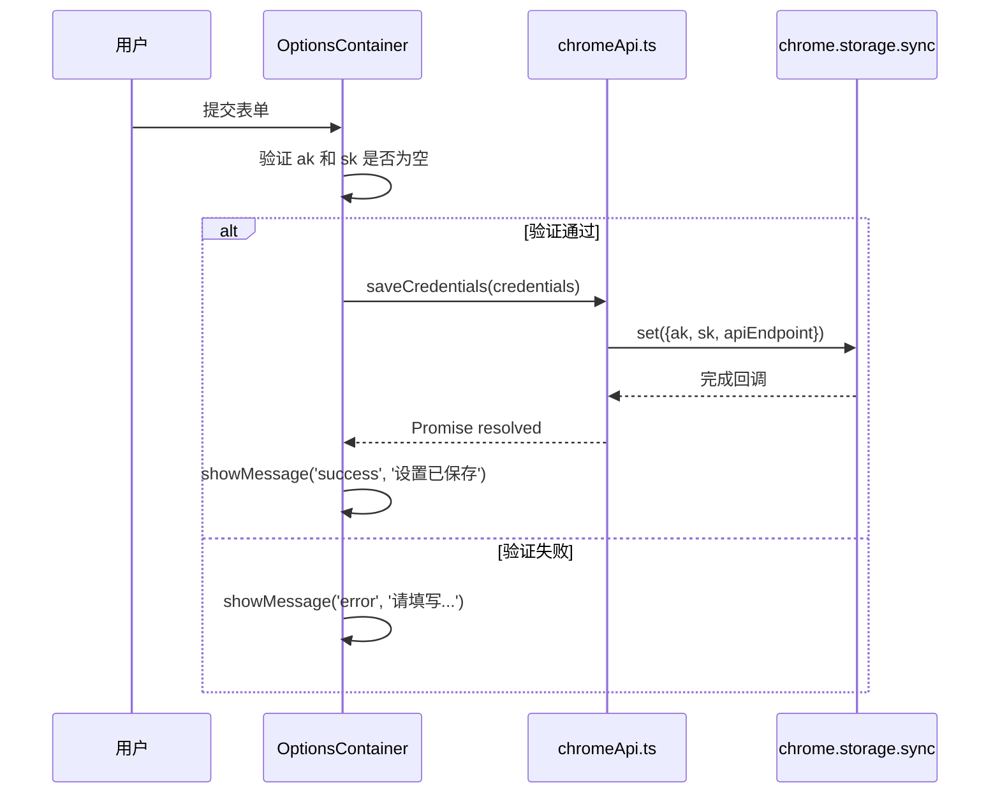
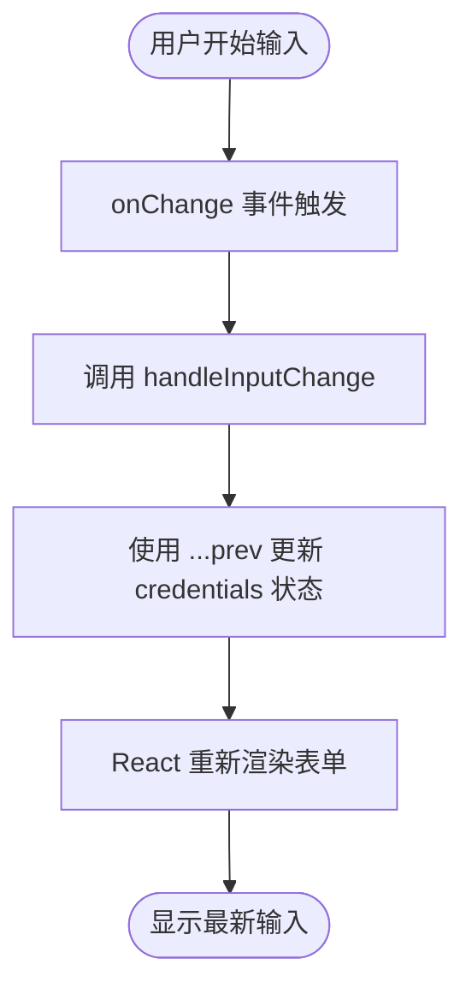
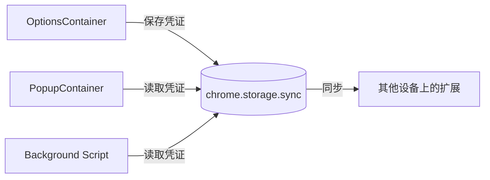

# OptionsContainer 组件

<cite>
**Referenced Files in This Document**   
- [OptionsContainer.tsx](file://src/components/OptionsContainer.tsx)
- [chromeApi.ts](file://src/utils/chromeApi.ts)
- [index.ts](file://src/background/index.ts)
- [PopupContainer.tsx](file://src/components/PopupContainer.tsx)
- [index.ts](file://src/types/index.ts)
</cite>

## 目录
1. [简介](#简介)
2. [核心功能与架构](#核心功能与架构)
3. [配置存储与同步机制](#配置存储与同步机制)
4. [表单验证与用户交互](#表单验证与用户交互)
5. [数据共享与事件监听](#数据共享与事件监听)
6. [安全最佳实践](#安全最佳实践)

## 简介

`OptionsContainer` 组件是 AIHCX 浏览器扩展的核心配置中心，为用户提供了一个直观的界面来管理其百度云 API 凭证和相关服务设置。该组件作为用户与插件后端逻辑之间的桥梁，实现了敏感信息的安全存储、跨设备同步以及与其他 UI 组件的数据共享。

作为一个 React 函数式组件，`OptionsContainer` 通过集成 Chrome 扩展的 `chrome.storage` API，确保了用户配置的持久化和安全性。它不仅支持基本的凭证（Access Key 和 Secret Key）输入，还允许用户自定义 API 端点，并提供了清晰的使用说明和错误反馈机制，极大地提升了用户体验。

本文档将深入解析 `OptionsContainer` 的设计与实现，重点阐述其在用户偏好设置管理中的角色，包括数据持久化、表单处理、跨组件通信及安全实践等关键方面。

## 核心功能与架构

`OptionsContainer` 组件采用典型的 React 函数式组件模式，结合状态管理和副作用处理，构建了一个响应式的用户配置界面。其核心架构围绕着用户凭证的读取、修改和保存展开。

该组件的主要职责包括：
- **初始化加载**：在组件挂载时，自动从 Chrome 同步存储中加载已保存的用户凭证。
- **状态管理**：使用 `useState` 钩子维护当前编辑的凭证、加载状态和操作消息。
- **用户交互**：提供一个表单供用户输入或修改其百度云 API 凭证。
- **持久化存储**：将用户提交的凭证安全地保存到 `chrome.storage.sync` 中，实现跨设备同步。
- **反馈机制**：通过临时消息提示用户操作结果（成功或失败）。

**Diagram sources**
- [OptionsContainer.tsx](file://src/components/OptionsContainer.tsx#L4-L143)
- [chromeApi.ts](file://src/utils/chromeApi.ts#L76-L95)
- [index.ts](file://src/types/index.ts#L67-L71)

**Section sources**
- [OptionsContainer.tsx](file://src/components/OptionsContainer.tsx#L4-L143)

## 配置存储与同步机制

`OptionsContainer` 组件利用 Chrome 扩展平台提供的 `chrome.storage` API 来实现用户配置的持久化和跨设备同步。这一机制是其作为“用户配置中心”角色的核心。

### 存储策略

组件主要依赖 `chrome.storage.sync` 命名空间进行数据存储。与 `chrome.storage.local` 不同，`sync` 存储会将数据加密并同步到用户的 Google 账户，这意味着当用户在不同设备上登录同一账户时，其配置会自动保持一致。

在代码实现上，`OptionsContainer` 并不直接调用 Chrome API，而是通过一个封装层——`src/utils/chromeApi.ts` 文件中的工具函数来进行操作。这种分层设计提高了代码的可维护性和可测试性。

### 数据流分析

当用户首次打开选项页面时，组件会触发 `useEffect` 钩子，调用 `loadCredentials()` 方法：

**Diagram sources**
- [OptionsContainer.tsx](file://src/components/OptionsContainer.tsx#L18-L30)
- [chromeApi.ts](file://src/utils/chromeApi.ts#L76-L86)

当用户填写表单并点击“保存设置”按钮时，会触发 `handleSave` 事件处理器，其流程如下：

**Diagram sources**
- [OptionsContainer.tsx](file://src/components/OptionsContainer.tsx#L32-L50)
- [chromeApi.ts](file://src/utils/chromeApi.ts#L89-L95)

值得注意的是，在后台脚本 `src/background/index.ts` 中也存在一个同名的 `getCredentials` 函数，这表明凭证的读取逻辑在多个上下文中被复用，确保了整个扩展内部数据访问的一致性。

**Section sources**
- [chromeApi.ts](file://src/utils/chromeApi.ts#L76-L95)
- [index.ts](file://src/background/index.ts#L283-L297)

## 表单验证与用户交互

`OptionsContainer` 组件提供了完善的表单验证和实时用户交互体验，确保用户能够正确、安全地配置其服务。

### 表单结构与字段

组件渲染一个包含三个主要输入字段的表单：
- **Access Key (AK)**：文本输入框，用于输入百度云的 Access Key。
- **Secret Key (SK)**：密码输入框，用于输入百度云的 Secret Key，输入内容会被隐藏。
- **API 端点 (可选)**：文本输入框，允许用户覆盖默认的 API 端点地址。

每个输入框都配备了标签、占位符和辅助性的小字说明，指导用户如何获取正确的凭证信息。

### 实时输入处理

组件通过 `handleInputChange` 方法实现了对用户输入的实时响应。每当用户在任一输入框中键入内容时，都会触发此方法，动态更新组件的 `credentials` 状态。

**Diagram sources**
- [OptionsContainer.tsx](file://src/components/OptionsContainer.tsx#L52-L57)

### 验证与反馈机制

在提交表单前，`handleSave` 方法会执行基本的客户端验证，检查 `ak` 和 `sk` 字段是否为空。如果验证失败，会立即通过 `showMessage` 函数向用户展示一条红色的错误消息。

无论保存操作成功与否，组件都会通过 `showMessage` 显示一条临时消息（绿色表示成功，红色表示失败），该消息会在 3 秒后自动消失。这种即时反馈机制让用户清楚地了解操作结果，无需猜测。

**Section sources**
- [OptionsContainer.tsx](file://src/components/OptionsContainer.tsx#L32-L50)

## 数据共享与事件监听

`OptionsContainer` 组件虽然独立运行于浏览器的选项页面，但它与扩展的其他部分（特别是弹出窗口 `PopupContainer`）保持着紧密的数据共享关系。

### 数据共享模式

`OptionsContainer` 本身并不直接与其他组件通信。相反，它通过 `chrome.storage.sync` 这个全局的、持久化的存储空间作为中介来实现数据共享。

- 当用户在 `OptionsContainer` 中保存了新的凭证后，这些数据被写入 `chrome.storage.sync`。
- `PopupContainer` 在需要调用 API 时，会从同一个 `chrome.storage.sync` 中读取最新的凭证。

这种基于共享存储的模式解耦了组件间的直接依赖，使得它们可以独立开发和测试。

**Diagram sources**
- [OptionsContainer.tsx](file://src/components/OptionsContainer.tsx#L4-L143)
- [PopupContainer.tsx](file://src/components/PopupContainer.tsx#L20-L566)

### 配置变更事件监听

尽管 `OptionsContainer` 没有显式地监听存储变更事件，但 `PopupContainer` 或其他组件可以通过监听 `chrome.storage.onChanged` 事件来感知配置的变化。例如，当 `OptionsContainer` 保存了新配置后，`PopupContainer` 可以立即刷新其界面或重新加载数据，以反映最新的设置。

然而，在当前代码中，`PopupContainer` 主要是在页面加载或特定操作时主动读取存储，而不是被动监听变更。这意味着配置的实时性依赖于组件自身的刷新逻辑。

**Section sources**
- [PopupContainer.tsx](file://src/components/PopupContainer.tsx#L20-L566)

## 安全最佳实践

在处理用户敏感信息（如 API 密钥）时，`OptionsContainer` 组件遵循了多项安全最佳实践。

### 敏感信息保护

- **加密存储**：`chrome.storage.sync` 会对存储的数据进行加密，保护用户凭证不被本地恶意软件轻易窃取。
- **避免明文传输**：虽然代码中没有涉及网络请求，但设计上应确保凭证不会在日志或错误消息中以明文形式暴露。目前的实现中，`console.error` 只记录了操作失败的事实，而没有打印具体的密钥值。
- **输入类型保护**：Secret Key 字段使用了 `type="password"`，防止在输入时被窥视。

### 安全建议

为了进一步提升安全性，建议采取以下措施：
- **最小权限原则**：确保生成的 AK/SK 仅具有执行必要操作的最低权限。
- **定期轮换密钥**：鼓励用户定期更换其 API 密钥，以降低长期泄露的风险。
- **环境隔离**：在开发和生产环境中使用不同的凭证，避免开发过程中的意外暴露影响生产系统。

**Section sources**
- [OptionsContainer.tsx](file://src/components/OptionsContainer.tsx#L4-L143)