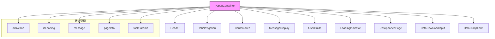
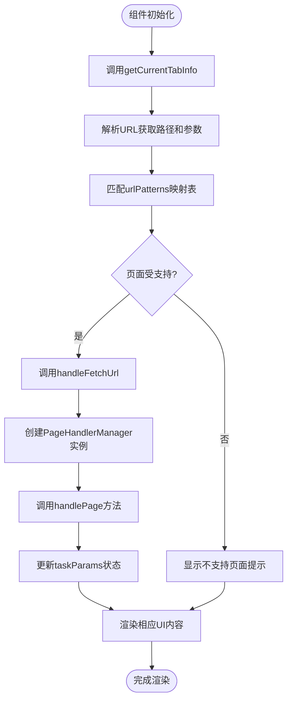
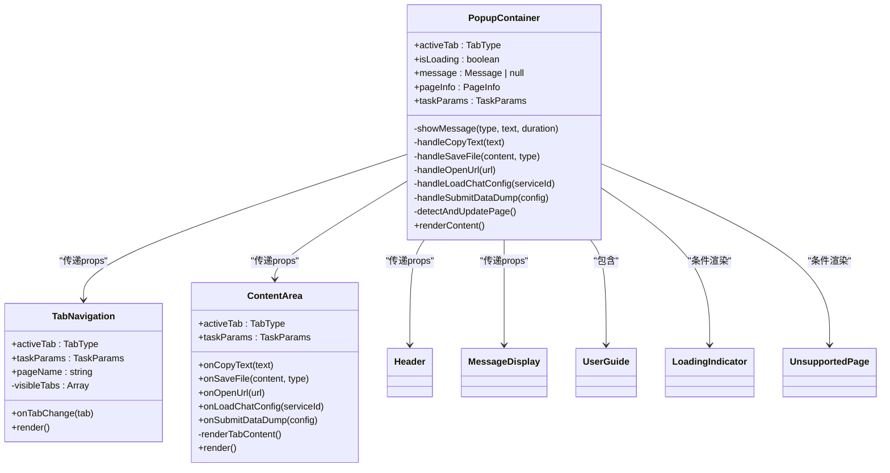

# PopupContainer 组件

<cite>
**Referenced Files in This Document**   
- [PopupContainer.tsx](file://src/components/PopupContainer.tsx)
- [TabNavigation.tsx](file://src/components/TabNavigation.tsx)
- [ContentArea.tsx](file://src/components/ContentArea.tsx)
- [pageDetection.ts](file://src/utils/pageDetection.ts)
- [PageHandlerManager.ts](file://src/handlers/PageHandlerManager.ts)
- [aihcApi.ts](file://src/services/aihcApi.ts)
- [index.ts](file://src/types/index.ts)
</cite>

## Table of Contents
1. [核心职责与架构概述](#核心职责与架构概述)
2. [生命周期管理与状态初始化](#生命周期管理与状态初始化)
3. [消息通信与全局状态协调](#消息通信与全局状态协调)
4. [组件集成与UI渲染流程](#组件集成与ui渲染流程)
5. [事件监听与响应机制](#事件监听与响应机制)
6. [错误边界处理与性能优化](#错误边界处理与性能优化)

## 核心职责与架构概述

PopupContainer 组件作为扩展弹出界面的主容器，承担着整个用户界面的核心协调职责。该组件采用 React 函数式组件模式，通过组合多个子组件（如 Header、TabNavigation、ContentArea 等）构建完整的用户交互界面。

其主要职责包括：初始化并管理与 background service worker 的消息通信，协调获取当前页面上下文和用户配置等全局状态，以及根据当前页面类型动态渲染相应的内容。组件通过依赖注入的方式创建 PageHandlerManager 实例，用于处理不同 AIHC 控制台页面的数据提取逻辑。



**Diagram sources**
- [PopupContainer.tsx](file://src/components/PopupContainer.tsx#L20-L566)

**Section sources**
- [PopupContainer.tsx](file://src/components/PopupContainer.tsx#L20-L566)

## 生命周期管理与状态初始化

PopupContainer 组件的生命周期始于 `useEffect` 钩子的执行，该钩子在组件挂载时触发 `detectAndUpdatePage` 函数，启动页面检测流程。组件维护了多个关键状态变量：

- `activeTab`: 当前激活的标签页类型
- `isLoading`: 加载状态指示器
- `message`: 临时消息提示
- `pageInfo`: 当前页面信息
- `taskParams`: 任务参数集合

这些状态通过 `useState` 钩子进行声明和管理，确保了组件状态的可预测性和可维护性。初始状态下，`pageInfo` 被设置为不支持的状态，并显示相应的引导信息。

```mermaid
sequenceDiagram
participant PC as PopupContainer
participant GD as getCurrentTabInfo
participant DT as detectPageType
participant HFU as handleFetchUrl
PC->>GD : 调用getCurrentTabInfo()
GD->>PC : 返回Promise<PageInfo>
PC->>DT : 使用URL调用detectPageType
DT-->>PC : 返回PageInfo对象
PC->>HFU : 调用handleFetchUrl(如果页面支持)
HFU->>PHM : 调用PageHandlerManager.handlePage
PHM-->>HFU : 返回处理结果
HFU->>PC : 更新taskParams状态
PC-->> : 完成初始化
```

**Diagram sources**
- [PopupContainer.tsx](file://src/components/PopupContainer.tsx#L20-L566)
- [pageDetection.ts](file://src/utils/pageDetection.ts#L99-L150)
- [PageHandlerManager.ts](file://src/handlers/PageHandlerManager.ts#L62-L78)

**Section sources**
- [PopupContainer.tsx](file://src/components/PopupContainer.tsx#L20-L566)
- [pageDetection.ts](file://src/utils/pageDetection.ts#L99-L150)

## 消息通信与全局状态协调

PopupContainer 组件通过多种机制实现与 background service worker 的消息通信和全局状态协调。首先，它利用 Chrome 扩展 API 监听标签页更新和激活事件，实时响应用户浏览行为的变化。

当检测到页面变化时，组件会调用 `getCurrentTabInfo` 函数获取当前活动标签页的信息，并通过 `detectPageType` 函数判断页面是否受支持。对于受支持的页面，组件会调用 `handleFetchUrl` 函数，通过 PageHandlerManager 处理器链获取相应的数据。



**Diagram sources**
- [PopupContainer.tsx](file://src/components/PopupContainer.tsx#L20-L566)
- [pageDetection.ts](file://src/utils/pageDetection.ts#L1-L150)
- [PageHandlerManager.ts](file://src/handlers/PageHandlerManager.ts#L62-L78)

**Section sources**
- [PopupContainer.tsx](file://src/components/PopupContainer.tsx#L20-L566)
- [pageDetection.ts](file://src/utils/pageDetection.ts#L1-L150)
- [PageHandlerManager.ts](file://src/handlers/PageHandlerManager.ts#L62-L78)

## 组件集成与UI渲染流程

PopupContainer 组件通过精心设计的集成方式与 TabNavigation 和 ContentArea 组件协同工作。组件的渲染流程由 `renderContent` 函数控制，该函数根据当前状态决定显示何种内容。

当页面不受支持时，直接渲染 UnsupportedPage 组件；当处于加载状态时，显示 LoadingIndicator 组件；对于特殊页面（如数据下载或数据转储），则直接渲染相应的输入表单。对于常规页面，则同时渲染 TabNavigation 和 ContentArea 组件。



**Diagram sources**
- [PopupContainer.tsx](file://src/components/PopupContainer.tsx#L20-L566)
- [TabNavigation.tsx](file://src/components/TabNavigation.tsx#L10-L88)
- [ContentArea.tsx](file://src/components/ContentArea.tsx#L21-L114)

**Section sources**
- [PopupContainer.tsx](file://src/components/PopupContainer.tsx#L20-L566)
- [TabNavigation.tsx](file://src/components/TabNavigation.tsx#L10-L88)
- [ContentArea.tsx](file://src/components/ContentArea.tsx#L21-L114)

## 事件监听与响应机制

PopupContainer 组件实现了完善的事件监听与响应机制，能够对 Chrome 扩展的各种事件做出及时反应。组件通过 `chrome.tabs.onUpdated` 和 `chrome.tabs.onActivated` 事件监听器，监控标签页的更新和激活状态。

为了防止频繁触发导致性能问题，组件采用了防抖技术，在 `detectAndUpdatePage` 函数中使用 `setTimeout` 设置了 200ms 的延迟，确保只有在用户停止操作一段时间后才执行页面检测逻辑。这种设计有效减少了不必要的计算和网络请求。

此外，组件还定义了一系列回调函数，如 `handleCopyText`、`handleSaveFile`、`handleOpenUrl` 等，这些函数被传递给子组件，形成自上而下的事件处理链条，实现了组件间的解耦和复用。

**Section sources**
- [PopupContainer.tsx](file://src/components/PopupContainer.tsx#L20-L566)

## 错误边界处理与性能优化

PopupContainer 组件在错误处理和性能优化方面采取了多项措施。首先，所有异步操作都被包裹在 try-catch 块中，确保任何异常都不会导致整个应用崩溃。例如，在 `handleFetchUrl` 和 `handleLoadChatConfig` 函数中，都包含了完整的错误捕获和处理逻辑。

其次，组件通过 `isLoading` 状态防止重复加载，避免了并发请求可能引发的问题。同时，使用 `useCallback` 钩子对关键函数进行记忆化处理，减少了不必要的重新渲染。

在性能优化方面，组件采用了按需渲染策略，只在必要时才渲染特定的 UI 元素。例如，`TabNavigation` 组件会根据 `taskParams` 中的数据是否存在来决定是否显示某个标签页，这不仅提升了渲染性能，也改善了用户体验。

**Section sources**
- [PopupContainer.tsx](file://src/components/PopupContainer.tsx#L20-L566)