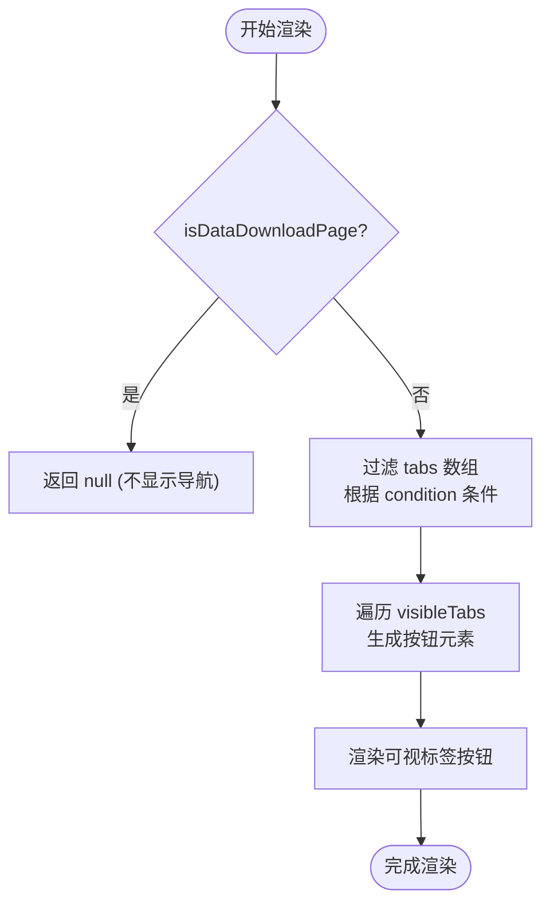
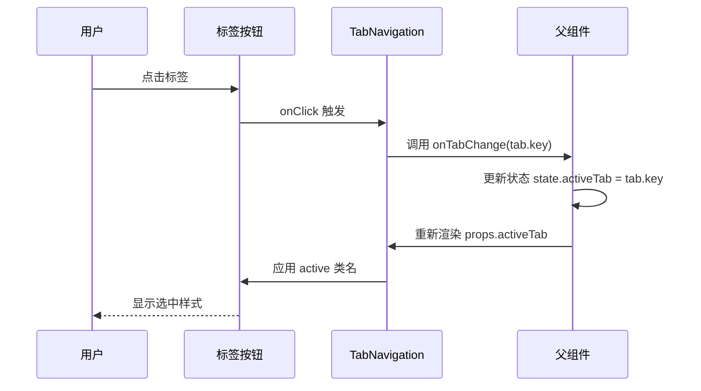

# TabNavigation 组件

<cite>
**Referenced Files in This Document**   
- [TabNavigation.tsx](file://src/components/TabNavigation.tsx)
- [ContentArea.tsx](file://src/components/ContentArea.tsx)
- [index.ts](file://src/types/index.ts)
</cite>

## 目录
1. [标签页切换机制](#标签页切换机制)
2. [状态管理与交互方式](#状态管理与交互方式)
3. [与 ContentArea 的通信协议](#与-contentarea-的通信协议)
4. [可访问性实现](#可访问性实现)
5. [动态注册新标签页扩展接口设计](#动态注册新标签页扩展接口设计)

## 标签页切换机制

`TabNavigation` 组件通过条件渲染和动态配置实现了灵活的标签页展示逻辑。组件根据传入的 `taskParams` 数据决定哪些标签可见，从而实现上下文感知的 UI 展示。

每个标签页的显示与否由其对应的 `condition` 字段控制，该字段基于 `taskParams` 中的数据存在性进行判断。例如：
- 当 `taskParams.cliItems.length > 0` 时，CLI命令标签可见
- 当 `taskParams.commandScript` 存在时，启动命令标签可见
- 特殊情况下（如“在线服务部署详情”页面），AI聊天标签才可能显示

这种机制确保了用户界面始终只展示有意义的内容，避免了空标签或无效功能入口。



**Diagram sources**
- [TabNavigation.tsx](file://src/components/TabNavigation.tsx#L21-L71)

**Section sources**
- [TabNavigation.tsx](file://src/components/TabNavigation.tsx#L10-L88)

## 状态管理与交互方式

`TabNavigation` 组件采用受控组件模式管理当前激活标签的状态。其核心状态 `activeTab` 并不由组件自身维护，而是通过 `onTabChange` 回调函数向上级组件传递状态变更请求。

### 状态流转机制
- **状态来源**：`activeTab` 属性由父组件提供，表示当前应高亮的标签
- **状态更新**：用户点击标签按钮时触发 `onClick` 事件处理器，调用 `onTabChange(tab.key)`
- **状态同步**：父组件接收到变更后重新渲染 `TabNavigation`，传入新的 `activeTab` 值

### 交互方式支持
#### 鼠标点击
组件为每个标签按钮绑定了 `onClick` 事件处理程序，直接调用 `onTabChange` 回调函数并传入对应标签类型。

#### 键盘导航
尽管当前实现中未显式添加键盘事件监听器，但原生 `<button>` 元素已具备基本的键盘可访问性：
- 支持 `Tab` 键顺序聚焦
- 支持 `Enter` 或 `Space` 键激活按钮

未来可通过增强实现更完善的键盘导航体验。



**Diagram sources**
- [TabNavigation.tsx](file://src/components/TabNavigation.tsx#L73-L90)
- [ContentArea.tsx](file://src/components/ContentArea.tsx#L53-L116)

**Section sources**
- [TabNavigation.tsx](file://src/components/TabNavigation.tsx#L10-L88)

## 与 ContentArea 的通信协议

`TabNavigation` 与 `ContentArea` 通过共享状态和回调函数形成完整的标签页系统。两者通过共同的父组件协调工作，实现标签切换与内容更新的联动。

### 通信流程
1. **状态定义**：父组件维护 `activeTab` 状态
2. **向下传递**：
   - 将 `activeTab` 作为 prop 传递给 `TabNavigation`
   - 同时将 `activeTab` 作为 prop 传递给 `ContentArea`
3. **事件回调**：
   - `TabNavigation` 在用户操作时通过 `onTabChange` 通知父组件
   - 父组件更新状态后触发重渲染
4. **内容响应**：`ContentArea` 根据新的 `activeTab` 值切换显示对应的内容组件

### 数据结构一致性
两者依赖统一的 `TabType` 枚举类型保证通信正确性：

```typescript
export type TabType = 'cli' | 'commandScript' | 'json' | 'yaml' | 'apiDocs' | 'chat';
```

此类型定义于 `types/index.ts`，被两个组件共同引用，确保标签类型的严格一致性。

```mermaid
classDiagram
class TabNavigation {
+activeTab : TabType
+onTabChange(tab : TabType) : void
+taskParams : TaskParams
+pageName : string
}
class ContentArea {
+activeTab : TabType
+taskParams : TaskParams
+onCopyText(text : string) : Promise~void~
+onSaveFile(content : string, type : FileType) : void
}
class ParentComponent {
-state : { activeTab : TabType }
-handleTabChange(tab : TabType)
}
ParentComponent --> TabNavigation : "传递 props"
ParentComponent --> ContentArea : "传递 props"
TabNavigation --> ParentComponent : "onTabChange 事件"
ContentArea --> ParentComponent : "操作回调"
```

**Diagram sources**
- [TabNavigation.tsx](file://src/components/TabNavigation.tsx#L10-L88)
- [ContentArea.tsx](file://src/components/ContentArea.tsx#L21-L114)
- [index.ts](file://src/types/index.ts#L73)

**Section sources**
- [TabNavigation.tsx](file://src/components/TabNavigation.tsx#L10-L88)
- [ContentArea.tsx](file://src/components/ContentArea.tsx#L21-L114)

## 可访问性实现

当前 `TabNavigation` 组件的基础可访问性依赖于语义化 HTML 元素和基本属性，但在 ARIA 规范遵循方面仍有改进空间。

### 已实现特性
- **语义化元素**：使用 `<button>` 元素而非 `<div>` 或 `<span>`，确保屏幕阅读器能正确识别为可交互控件
- **标题提示**：通过 `title` 属性提供完整标签名称（如“CLI命令”），辅助工具提示
- **视觉反馈**：通过 `active` CSS 类提供清晰的选中状态指示

### 待完善方面
目前缺少以下关键 ARIA 属性：
- `role="tablist"` 应应用于外层容器
- `role="tab"` 应应用于每个按钮
- `aria-selected` 应反映当前选中状态
- `aria-controls` 应关联到对应的内容区域 ID
- `tabindex` 管理需明确以支持键盘导航流

建议的改进方案：
```jsx
<div role="tablist" className="tabs-compact">
  {visibleTabs.map(tab => (
    <button
      key={tab.key}
      role="tab"
      aria-selected={activeTab === tab.key}
      aria-controls={`panel-${tab.key}`}
      tabIndex={activeTab === tab.key ? 0 : -1}
      ...
    >
      ...
    </button>
  ))}
</div>
```

同时应在 `ContentArea` 中为每个面板添加对应的 `role="tabpanel"` 和 ID 关联。

**Section sources**
- [TabNavigation.tsx](file://src/components/TabNavigation.tsx#L73-L90)

## 动态注册新标签页扩展接口设计

虽然当前实现采用静态配置方式定义标签页，但可通过抽象化设计实现动态注册机制，便于未来功能扩展。

### 扩展接口设计方案

#### 1. 标签注册中心
创建一个集中式的标签注册服务，允许模块在运行时注册新标签：

```typescript
interface TabRegistration {
  key: TabType;
  label: string;
  shortLabel: string;
  icon: string;
  condition: (taskParams: TaskParams, pageName: string) => boolean;
  component: React.ComponentType<any>;
}

class TabRegistry {
  private registry = new Map<string, TabRegistration>();
  
  register(tab: TabRegistration) {
    this.registry.set(tab.key, tab);
  }
  
  getTabs() {
    return Array.from(this.registry.values());
  }
}
```

#### 2. 动态集成点
修改 `TabNavigation` 从注册中心获取标签配置：

```tsx
// 替换硬编码数组
// const tabs = [...] 
const tabs = tabRegistry.getTabs();
```

#### 3. 模块化注册示例
新增功能模块可在初始化时自行注册：

```typescript
// 新增的监控模块
import { PerformanceMonitorTab } from './tabs/PerformanceMonitorTab';

tabRegistry.register({
  key: 'monitor',
  label: '性能监控',
  shortLabel: '监控',
  icon: '📊',
  condition: (params) => params.hasMonitoringData,
  component: PerformanceMonitorTab
});
```

#### 4. 加载时机
推荐在应用启动阶段完成所有注册，确保标签配置完整性。

这种设计模式具有以下优势：
- **解耦合**：各功能模块独立管理自身标签配置
- **可扩展**：无需修改核心组件即可添加新标签
- **灵活性**：支持按需加载和条件注册
- **维护性**：集中管理所有标签元数据

**Section sources**
- [TabNavigation.tsx](file://src/components/TabNavigation.tsx#L21-L71)
- [index.ts](file://src/types/index.ts#L73)