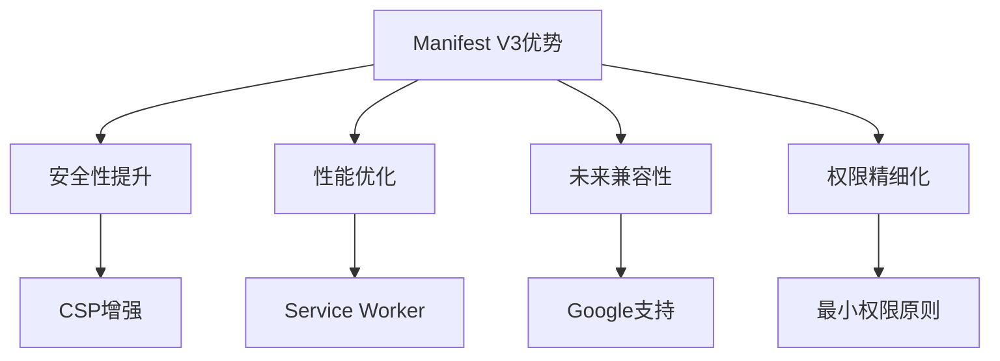
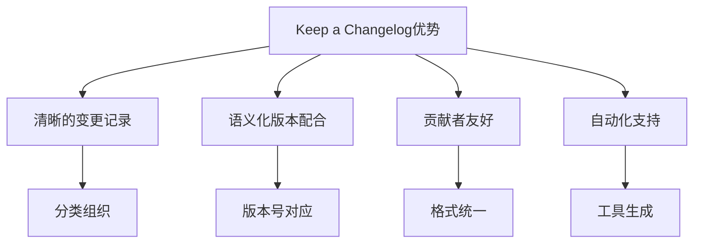

# 参考资料

<cite>
**本文档引用的文件**
- [README.md](file://README.md)
- [CHANGELOG.md](file://CHANGELOG.md)
- [src/manifest.json](file://src/manifest.json)
- [RELEASE.md](file://RELEASE.md)
</cite>

## 目录
1. [外部权威参考资料](#外部权威参考资料)
2. [项目内部设计决策依据](#项目内部设计决策依据)

## 外部权威参考资料

### Chrome扩展开发文档
- **官方文档**: [Chrome Extension Manifest V3](https://developer.chrome.com/docs/extensions/mv3/)
- **适用场景**: 本项目采用Manifest V3架构，该文档详细说明了服务工作线程、权限系统、内容安全策略等核心概念，适用于开发现代Chrome扩展程序。

### 百度云AIHC API手册
- **数据集管理API**: 
  - [数据集列表](https://cloud.baidu.com/doc/AIHC/s/Emc099va4)
  - [数据集详情](https://cloud.baidu.com/doc/AIHC/s/Dmc09bpj1)
  - [数据集版本](https://cloud.baidu.com/doc/AIHC/s/Tmc09d4k0)
- **模型管理API**:
  - [模型列表](https://cloud.baidu.com/doc/AIHC/s/amc1fmz95)
  - [模型详情](https://cloud.baidu.com/doc/AIHC/s/Xmc1flhmc)
  - [模型版本](https://cloud.baidu.com/doc/AIHC/s/Lmc1fr4lc)
- **任务管理API**:
  - [任务详情](https://cloud.baidu.com/doc/AIHC/s/xmayvctia)
  - [直接传参方式创建任务](https://cloud.baidu.com/doc/AIHC/s/Tm7x702fo#%E7%9B%B4%E6%8E%A5%E4%BC%A0%E5%8F%82%E6%96%B9%E5%BC%8F%E5%88%9B%E5%BB%BA%E4%BB%BB%E5%8A%A1)
  - [获取任务详情](https://cloud.baidu.com/doc/AIHC/s/Tm7x702fo#%E8%8E%B7%E5%8F%96%E4%BB%BB%E5%8A%A1%E8%AF%A6%E6%83%85)
- **资源池管理API**:
  - [资源池列表](https://cloud.baidu.com/doc/AIHC/s/Tm7x702fo#%E8%8E%B7%E5%8F%96%E8%B5%84%E6%BA%90%E6%B1%A0%E5%88%97%E8%A1%A8)
  - [资源池详情](https://cloud.baidu.com/doc/AIHC/s/Tm7x702fo#%E8%8E%B7%E5%8F%96%E8%B5%84%E6%BA%90%E6%B1%A0%E8%AF%A6%E6%83%85)
- **队列管理API**:
  - [队列列表](https://cloud.baidu.com/doc/AIHC/s/Tm7x702fo#%E8%8E%B7%E5%8F%96%E9%98%9F%E5%88%97%E5%88%97%E8%A1%A8)
- **其他功能API**:
  - [自定义部署](https://cloud.baidu.com/doc/AIHC/s/Imb4v5905)
  - [在线服务部署详情](https://cloud.baidu.com/doc/AIHC/s/4mb4v7wn5)
- **适用场景**: 这些API文档为扩展程序提供了与百舸AIHC控制台交互的基础，用于生成CLI命令、参数配置和提供上下文相关的API文档链接。

### React框架指南
- **官方文档**: [React 官方文档](https://zh-hans.react.dev/)
- **适用场景**: 本项目使用React 18构建用户界面，该文档涵盖了Hooks、函数式组件、状态管理等核心概念，适用于开发现代化的前端组件。

### TypeScript语言规范
- **官方文档**: [TypeScript 官方文档](https://www.typescriptlang.org/docs/)
- **适用场景**: 本项目采用TypeScript 5.7进行开发，该文档详细说明了类型系统、接口、泛型等特性，有助于确保代码的类型安全和可维护性。

### Vite构建工具文档
- **官方文档**: [Vite 官方文档](https://cn.vitejs.dev/)
- **适用场景**: 本项目使用Vite 6.2作为构建工具，该文档介绍了快速开发服务器、生产构建、插件系统等功能，适用于优化开发体验和构建性能。

**Section sources**
- [README.md](file://README.md#L1-L422)

## 项目内部设计决策依据

### 选择Manifest V3架构的原因
- **安全性提升**: Manifest V3引入了更严格的内容安全策略(CSP)，禁止执行内联脚本和eval()，减少了XSS攻击的风险。
- **性能优化**: 使用Service Worker替代background page，提高了后台脚本的效率和资源利用率。
- **未来兼容性**: Google已明确表示将逐步淘汰Manifest V2，采用V3确保了扩展的长期可用性。
- **权限精细化**: 提供了更细粒度的权限控制，遵循最小权限原则，只请求必要的权限。

**Diagram sources**
- [src/manifest.json](file://src/manifest.json#L1-L51)

### 采用Keep a Changelog格式的原因
- **清晰的变更记录**: 按照新增、变更、修复、移除等类别组织变更日志，便于用户快速了解版本差异。
- **语义化版本配合**: 与语义化版本规范(SemVer)完美配合，主版本号对应不兼容的API修改，次版本号对应向下兼容的功能性新增，修订号对应向下兼容的问题修正。
- **贡献者友好**: 明确的格式要求使得贡献者能够轻松地更新变更日志，保持文档的一致性。
- **自动化支持**: 支持通过工具自动生成变更日志，减少手动维护的工作量。

**Diagram sources**
- [CHANGELOG.md](file://CHANGELOG.md#L1-L76)

### 技术栈选择依据
- **React + TypeScript**: 提供类型安全的现代化UI开发体验，结合Hooks和函数式组件模式，提高代码可读性和可维护性。
- **Vite构建工具**: 利用ES模块原生支持实现极快的冷启动和热更新，显著提升开发效率。
- **Chrome APIs集成**: 充分利用storage、tabs、runtime、sidePanel等API，实现丰富的浏览器扩展功能。

**Section sources**
- [README.md](file://README.md#L1-L422)
- [CHANGELOG.md](file://CHANGELOG.md#L1-L76)
- [src/manifest.json](file://src/manifest.json#L1-L51)
- [RELEASE.md](file://RELEASE.md#L1-L192)