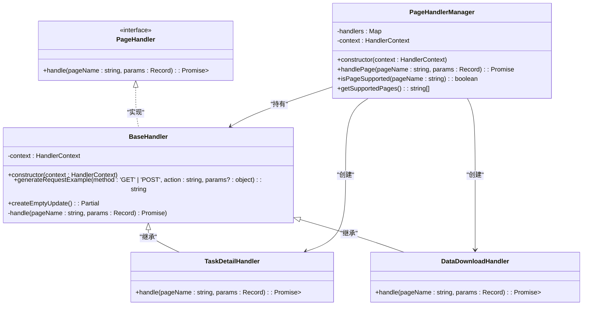

# 术语表

<cite>
**Referenced Files in This Document **   
- [manifest.json](file://src/manifest.json)
- [index.ts](file://src/background/index.ts)
- [index.ts](file://src/content/index.ts)
- [PageHandlerManager.ts](file://src/handlers/PageHandlerManager.ts)
- [BaseHandler.ts](file://src/handlers/BaseHandler.ts)
- [types.ts](file://src/handlers/types.ts)
- [index.ts](file://src/types/index.ts)
</cite>

## Table of Contents
1. [AIHC](#aihc)
2. [Manifest V3](#manifest-v3)
3. [PageHandler](#pagehandler)
4. [CLI](#cli)
5. [Content Script](#content-script)
6. [Background Service Worker](#background-service-worker)
7. [Side Panel](#side-panel)

## AIHC

百度云人工智能高性能计算平台（AIHC）是本扩展所服务的核心产品，为用户提供大规模机器学习和深度学习任务的计算资源管理与调度能力。该扩展通过解析AIHC控制台页面，自动生成相应的API调用示例、命令行接口（CLI）命令及参数配置，帮助开发者快速理解并操作AIHC平台。

**Section sources**
- [index.ts](file://src/content/index.ts#L100-L105)
- [index.ts](file://src/background/index.ts#L489-L492)

## Manifest V3

Chrome扩展第三代清单架构（Manifest V3）是Google Chrome浏览器扩展程序的新一代开发规范。在本项目中，`manifest.json`文件明确声明了`"manifest_version": 3`，标志着该项目遵循此现代标准。Manifest V3引入了更安全的执行环境，将传统的后台页面（background page）替换为生命周期更可控的后台服务工作线程（Service Worker），并强化了内容安全策略（CSP），提升了扩展的安全性和性能。

```mermaid
erDiagram
MANIFEST-V3 ||--o{ SERVICE-WORKER : "使用"
MANIFEST-V3 ||--o{ CONTENT-SCRIPT : "注入到"
MANIFEST-V3 ||--o{ SIDE-PANEL : "包含"
MANIFEST-V3 ||--o{ OPTIONS-PAGE : "包含"
SERVICE-WORKER }|-- BACKGROUND : "实现"
CONTENT-SCRIPT }|-- CONTENT : "实现"
SIDE-PANEL }|-- POPUP : "默认路径"
```

**Diagram sources **
- [manifest.json](file://src/manifest.json#L1-L10)

**Section sources**
- [manifest.json](file://src/manifest.json#L1-L5)

## PageHandler

页面处理器（PageHandler）是一种逻辑单元，用于解析和适配特定的AIHC控制台页面。它是一个实现了`PageHandler`接口的类，负责根据当前页面的上下文生成对应的API文档、CLI命令和参数配置。所有具体的处理器都继承自`BaseHandler`抽象基类，并由`PageHandlerManager`统一管理和调度。



**Diagram sources **
- [types.ts](file://src/handlers/types.ts#L2-L10)
- [BaseHandler.ts](file://src/handlers/BaseHandler.ts#L3-L36)
- [PageHandlerManager.ts](file://src/handlers/PageHandlerManager.ts#L21-L93)

**Section sources**
- [types.ts](file://src/handlers/types.ts#L2-L10)
- [BaseHandler.ts](file://src/handlers/BaseHandler.ts#L3-L36)
- [PageHandlerManager.ts](file://src/handlers/PageHandlerManager.ts#L21-L93)

## CLI

命令行界面工具（CLI）在此项目中指代一种可直接在终端执行的命令，用于与AIHC平台进行交互。扩展会根据不同控制台页面的上下文，生成相应的CLI命令。例如，在“任务列表”页面，会生成`aihc job list -p ${params.clusterUuid}`这样的命令，方便用户在本地环境中复现或自动化相关操作。

**Section sources**
- [TaskListHandler.ts](file://src/handlers/pages/TaskListHandler.ts#L25-L28)
- [ResourcePoolDetailHandler.ts](file://src/handlers/pages/ResourcePoolDetailHandler.ts#L18-L21)

## Content Script

内容脚本（Content Script）是注入到网页DOM中的JavaScript代码，运行在宿主页面的上下文中，但拥有独立的JavaScript环境。在本项目中，`src/content/index.ts`是内容脚本的入口文件，它负责检测当前是否为AIHC控制台页面，向页面注入UI组件（如侧边栏切换按钮），并监听来自后台脚本的消息以响应用户操作。

**Section sources**
- [index.ts](file://src/content/index.ts#L98-L105)
- [manifest.json](file://src/manifest.json#L38-L41)

## Background Service Worker

后台服务工作线程（Background Service Worker）是Manifest V3中替代传统后台页面的持久化任务处理机制。在本项目中，`src/background/index.ts`是后台服务工作线程的入口文件，它负责处理来自弹出页（popup）、内容脚本（content script）和侧边栏（side panel）的消息，管理扩展的全局状态（如用户凭证、任务列表），并执行需要持久化连接或后台运行的任务。

**Section sources**
- [index.ts](file://src/background/index.ts#L53-L56)
- [manifest.json](file://src/manifest.json#L34-L37)

## Side Panel

侧边栏（Side Panel）是Chrome扩展提供的一种UI展示区域，通常从浏览器窗口的右侧滑出，用于显示扩展的主要功能界面。在本项目中，侧边栏的默认路径被设置为`popup/index.html`，当用户点击扩展图标时，会打开此侧边栏，展示由`PageHandler`根据当前页面生成的各种信息，如API文档、CLI命令等。

**Section sources**
- [manifest.json](file://src/manifest.json#L31-L33)
- [index.ts](file://src/background/index.ts#L6-L15)