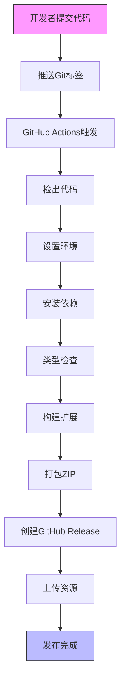
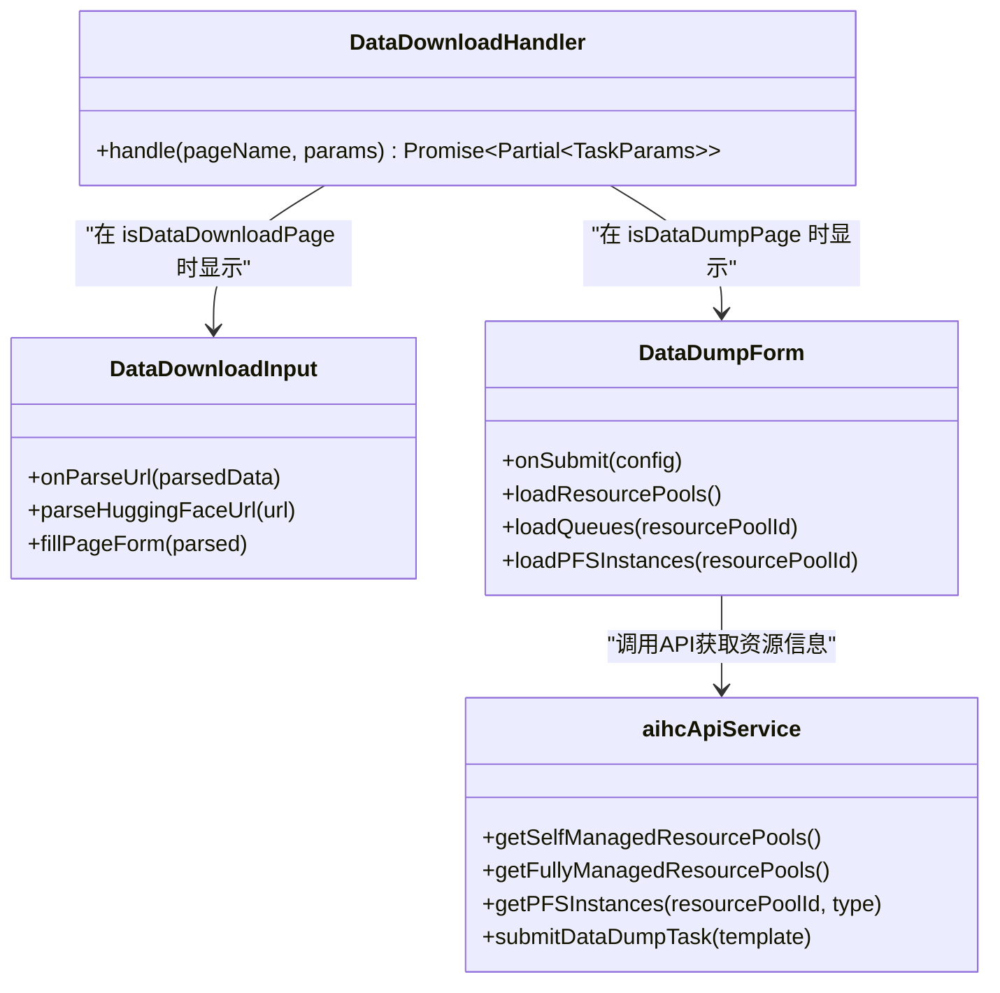

# 版本历史

<cite>
**本文档引用的文件**
- [CHANGELOG.md](file://CHANGELOG.md)
- [RELEASE.md](file://RELEASE.md)
- [DataDownloadHandler.ts](file://src/handlers/pages/DataDownloadHandler.ts)
- [DataDownloadInput.tsx](file://src/components/DataDownloadInput.tsx)
- [DataDumpForm.tsx](file://src/components/DataDumpForm.tsx)
- [aihcApi.ts](file://src/services/aihcApi.ts)
</cite>

## 目录
1. [版本概览](#版本概览)
2. [详细版本记录](#详细版本记录)
3. [自动化发布流程](#自动化发布流程)
4. [重大更新说明](#重大更新说明)

## 版本概览

AIHC助手浏览器扩展遵循[语义化版本](https://semver.org/lang/zh-CN/)规范，所有重要变更均记录在`CHANGELOG.md`文件中。项目采用自动化发布流程，确保版本的一致性和可追溯性。

当前已知的最高版本为 **0.5.0**，于2024年1月发布。该版本为首次正式发布，包含了核心功能集和对多种AIHC控制台页面的支持。

**版本号含义：**
- **主版本号 (MAJOR)**: 不兼容的API修改
- **次版本号 (MINOR)**: 向下兼容的功能性新增
- **修订号 (PATCH)**: 向下兼容的问题修正

## 详细版本记录

### [0.5.0] - 2024-01-XX

#### 新增
- 🎉 首次发布AIHC助手浏览器扩展
- 🎯 智能页面识别功能，自动识别AIHC控制台的各种页面
- 🔧 CLI命令生成功能，一键生成对应的命令行工具命令
- 📄 参数格式化功能，支持JSON和YAML格式
- 📚 API文档查看功能
- 🎨 基于React的现代化用户界面
- 📱 响应式设计，适配不同屏幕尺寸
- ✅ 支持数据下载页面（`/dataDownload/create`）
- ✅ 支持数据转储任务详情页面（`/dataDownload/info`）

#### 变更
- 无

#### 修复
- 无

#### 移除
- 无

**Section sources**
- [CHANGELOG.md](file://CHANGELOG.md#L7-L68)

## 自动化发布流程

项目的发布流程完全自动化，通过GitHub Actions实现，确保了每次发布的高质量、可重复性和可追溯性。

### 发布步骤

1.  **准备发布**：确保所有功能完成测试，更新`package.json`中的版本号和`CHANGELOG.md`文件。
2.  **本地测试**：运行 `npm run test-release` 进行完整的发布流程测试。
3.  **创建Git标签**：使用 `git tag v0.5.0` 创建标签，并通过 `git push origin v0.5.0` 推送到远程仓库。
4.  **自动发布**：推送标签后，GitHub Actions会自动触发以下流程：
    *   检出代码
    *   设置Node.js环境并安装依赖
    *   运行TypeScript类型检查
    *   构建生产版本
    *   打包为ZIP文件
    *   在GitHub上创建新的Release
    *   上传扩展包作为发布资源

### 发布产物

每次发布都会生成以下产物：
- **GitHub Release**：包含详细的发布说明和自动生成的变更日志。
- **扩展包文件**：`aihc-helper-extension-v{version}.zip`，可直接下载并安装到Chrome浏览器。
- **构建产物**：`dist/`目录下的完整扩展程序文件。

**Diagram sources**
- [RELEASE.md](file://RELEASE.md#L10-L191)

**Section sources**
- [RELEASE.md](file://RELEASE.md#L10-L191)

## 重大更新说明

### 支持新的页面类型：数据下载与数据转储

在 **v0.5.0** 版本中，扩展增加了对两种关键页面类型的支持：

1.  **数据下载页面 (`/dataDownload/create`)**:
    *   **功能**：当用户访问此页面时，扩展会检测到这是一个数据下载请求，并提供一个输入框，允许用户粘贴HuggingFace数据集或模型的URL。
    *   **实现**：由 `DataDownloadHandler` 处理器处理，它会将页面标记为 `isDataDownloadPage: true`，从而触发UI显示 `DataDownloadInput` 组件。
    *   **影响**：极大地简化了从HuggingFace导入数据的过程，用户无需手动填写复杂的表单。

2.  **数据转储任务详情页面 (`/dataDownload/info`)**:
    *   **功能**：此页面用于配置和提交数据转储任务。扩展会在此页面上显示一个专门的表单，帮助用户选择资源池、队列、PFS实例和存储路径。
    *   **实现**：同样由 `DataDownloadHandler` 处理，但根据 `_pageName` 的值将其标记为 `isDataDumpPage: true`，从而触发UI显示 `DataDumpForm` 组件。
    *   **技术细节**：`DataDumpForm` 组件通过调用 `aihcApiService` 中的 `getPFSInstances` 等方法，动态获取可用的PFS实例列表，实现了智能化的资源配置。

**Diagram sources**
- [DataDownloadHandler.ts](file://src/handlers/pages/DataDownloadHandler.ts#L7-L41)
- [DataDownloadInput.tsx](file://src/components/DataDownloadInput.tsx#L14-L369)
- [DataDumpForm.tsx](file://src/components/DataDumpForm.tsx#L14-L709)
- [aihcApi.ts](file://src/services/aihcApi.ts#L1-L558)

**Section sources**
- [DataDownloadHandler.ts](file://src/handlers/pages/DataDownloadHandler.ts#L7-L41)
- [DataDownloadInput.tsx](file://src/components/DataDownloadInput.tsx#L14-L369)
- [DataDumpForm.tsx](file://src/components/DataDumpForm.tsx#L14-L709)
- [aihcApi.ts](file://src/services/aihcApi.ts#L1-L558)

### CLI命令生成能力增强

虽然v0.5.0是首次发布，但其CLI命令生成功能已经具备强大能力：
*   **多格式支持**：不仅生成CLI命令，还支持以JSON和YAML格式展示参数。
*   **一键复制**：用户可以点击按钮直接将命令复制到剪贴板。
*   **文档链接**：为每个命令提供指向官方CLI使用手册的链接。

### 性能优化

尽管在初始版本中未明确列出性能优化项，但其架构设计本身就体现了性能考量：
*   **按需加载**：通过 `PageHandlerManager` 动态管理页面处理器，只在需要时才处理特定页面的数据。
*   **异步处理**：所有API调用均为异步操作，避免阻塞UI线程。
*   **请求取消机制**：在 `DataDumpForm` 中使用 `AbortController` 实现了请求取消，防止因快速切换选项而产生过多网络请求。