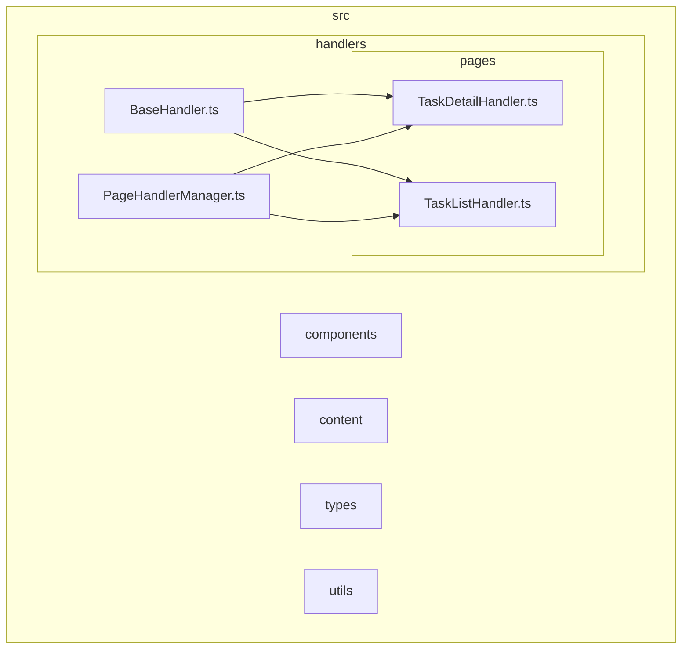
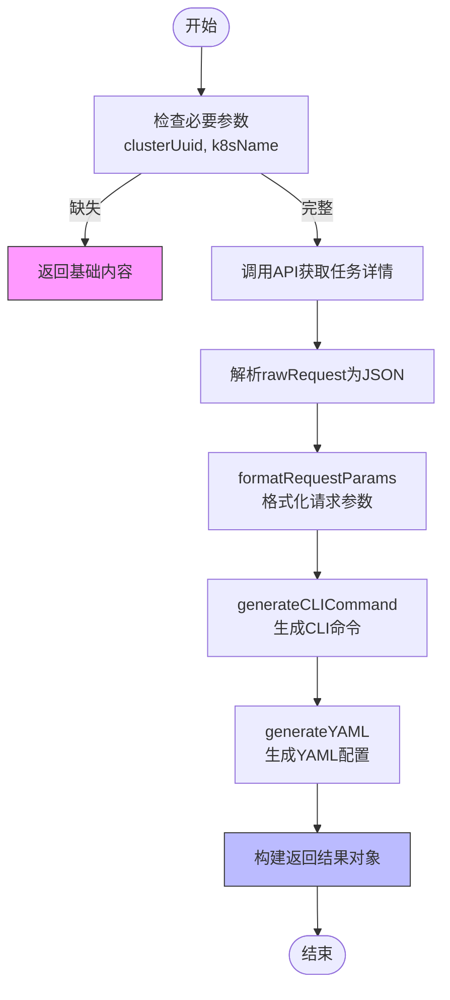
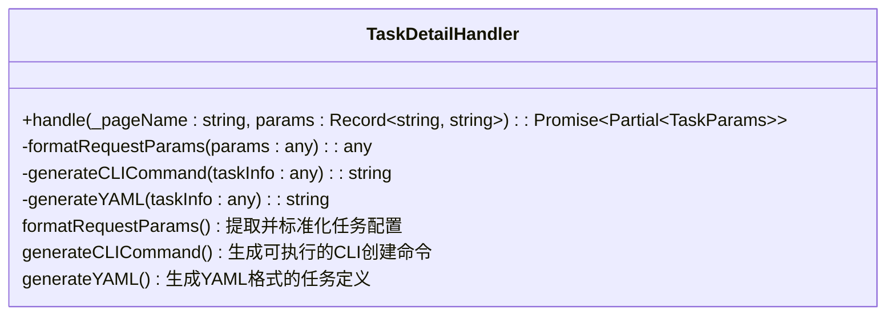
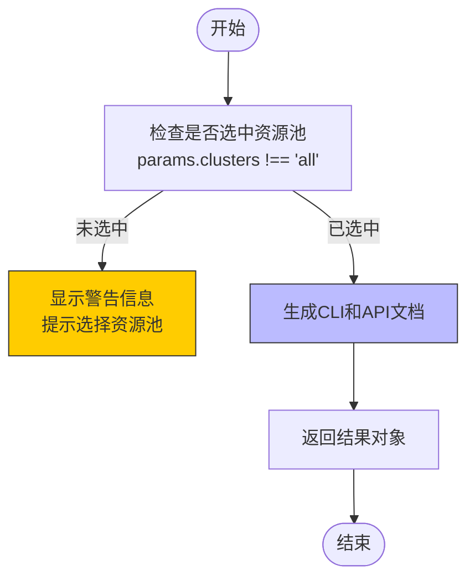
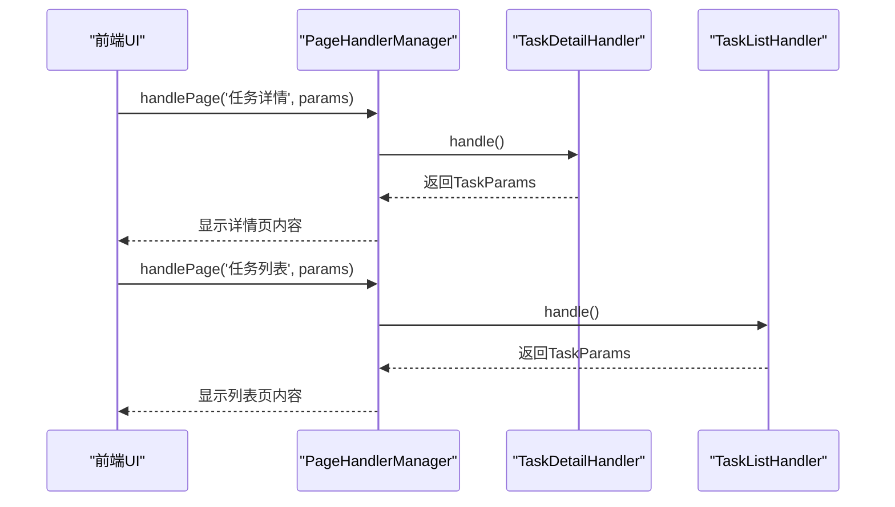
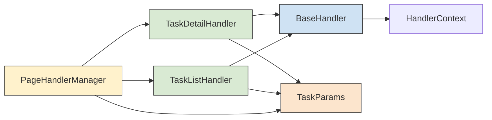

# 任务处理器

<cite>
**本文档中引用的文件**
- [TaskDetailHandler.ts](file://src/handlers/pages/TaskDetailHandler.ts)
- [TaskListHandler.ts](file://src/handlers/pages/TaskListHandler.ts)
- [BaseHandler.ts](file://src/handlers/BaseHandler.ts)
- [PageHandlerManager.ts](file://src/handlers/PageHandlerManager.ts)
- [types.ts](file://src/handlers/types.ts)
- [index.ts](file://src/types/index.ts)
</cite>

## 目录
1. [简介](#简介)
2. [项目结构](#项目结构)
3. [核心组件](#核心组件)
4. [架构概述](#架构概述)
5. [详细组件分析](#详细组件分析)
6. [依赖关系分析](#依赖关系分析)
7. [性能考虑](#性能考虑)
8. [故障排除指南](#故障排除指南)
9. [结论](#结论)

## 简介
本技术文档深入解析AIHC控制台扩展插件中与任务相关的页面处理器实现机制。重点阐述`TaskDetailHandler`和`TaskListHandler`如何从任务详情页和任务列表页提取结构化数据，并将其转化为CLI命令、JSON/YAML配置等格式。文档涵盖其继承自`BaseHandler`后的特化逻辑，包括上下文构建、参数生成规则及两类处理器之间的协同关系，并提供新增任务类页面支持的扩展指南。

## 项目结构



**图示来源**
- [TaskDetailHandler.ts](file://src/handlers/pages/TaskDetailHandler.ts#L7-L272)
- [TaskListHandler.ts](file://src/handlers/pages/TaskListHandler.ts#L7-L48)
- [BaseHandler.ts](file://src/handlers/BaseHandler.ts#L3-L36)
- [PageHandlerManager.ts](file://src/handlers/PageHandlerManager.ts#L21-L93)

**节来源**
- [TaskDetailHandler.ts](file://src/handlers/pages/TaskDetailHandler.ts#L7-L272)
- [TaskListHandler.ts](file://src/handlers/pages/TaskListHandler.ts#L7-L48)
- [BaseHandler.ts](file://src/handlers/BaseHandler.ts#L3-L36)

## 核心组件

`TaskDetailHandler` 和 `TaskListHandler` 是处理AIHC控制台中任务相关页面的核心处理器类，均继承自抽象基类 `BaseHandler`。它们通过统一接口 `PageHandler` 被 `PageHandlerManager` 管理和调用，实现了对任务详情页和任务列表页的数据提取与转换功能。

**节来源**
- [TaskDetailHandler.ts](file://src/handlers/pages/TaskDetailHandler.ts#L7-L272)
- [TaskListHandler.ts](file://src/handlers/pages/TaskListHandler.ts#L7-L48)
- [BaseHandler.ts](file://src/handlers/BaseHandler.ts#L3-L36)

## 架构概述

```mermaid
classDiagram
class PageHandler {
<<interface>>
+handle(pageName : string, params : Record~string, string~) : Promise~Partial~TaskParams~~
}
class BaseHandler {
-context : HandlerContext
+constructor(context : HandlerContext)
+abstract handle(pageName : string, params : Record~string, string~) : Promise~Partial~TaskParams~~
+generateRequestExample(method : 'GET'|'POST', action : string, params? : object) : string
+createEmptyUpdate() : Partial~TaskParams~
}
class TaskDetailHandler {
+handle(_pageName : string, params : Record~string, string~) : Promise~Partial~TaskParams~~
-formatRequestParams(params : any) : any
-generateCLICommand(taskInfo : any) : string
-generateYAML(taskInfo : any) : string
}
class TaskListHandler {
+handle(_pageName : string, params : Record~string, string~) : Promise~Partial~TaskParams~~
}
class PageHandlerManager {
-handlers : Map~string, PageHandler~
-context : HandlerContext
+constructor(context : HandlerContext)
+handlePage(pageName : string, params : Record~string, string~) : Promise~object~
+isPageSupported(pageName : string) : boolean
+getSupportedPages() : string[]
}
class TaskParams {
+type : string
+dataSource : string
+priority : string
+customParams : string
+generated : string
+name : string
+commandScript : string
+jsonItems : {title : string; text : string}[]
+yamlItems : {title : string; text : string}[]
+cliItems : {title : string; text : string; doc? : string}[]
+apiDocs : {title : string; text : string; requestExample? : string}[]
+chatConfig? : {serviceUrl : string; accessToken : string; basePath : string; serviceId? : string; isLoaded? : boolean}
+chatLoading? : boolean
+chatError? : string
+isDataDownloadPage? : boolean
+isDataDumpPage? : boolean
+datasetId? : string
+category? : string
}
PageHandler <|-- BaseHandler
BaseHandler <|-- TaskDetailHandler
BaseHandler <|-- TaskListHandler
PageHandlerManager --> TaskDetailHandler : "管理"
PageHandlerManager --> TaskListHandler : "管理"
TaskDetailHandler ..> TaskParams : "返回"
TaskListHandler ..> TaskParams : "返回"
PageHandlerManager ..> TaskParams : "返回"
```

**图示来源**
- [TaskDetailHandler.ts](file://src/handlers/pages/TaskDetailHandler.ts#L7-L272)
- [TaskListHandler.ts](file://src/handlers/pages/TaskListHandler.ts#L7-L48)
- [BaseHandler.ts](file://src/handlers/BaseHandler.ts#L3-L36)
- [PageHandlerManager.ts](file://src/handlers/PageHandlerManager.ts#L21-L93)
- [types.ts](file://src/handlers/types.ts#L2-L18)
- [index.ts](file://src/types/index.ts#L12-L37)

## 详细组件分析

### TaskDetailHandler 分析

`TaskDetailHandler` 专门用于处理任务详情页面的数据提取与转换。它通过调用后端API获取原始任务信息，并将其格式化为多种可用形式。

#### 处理流程


**图示来源**
- [TaskDetailHandler.ts](file://src/handlers/pages/TaskDetailHandler.ts#L8-L145)

#### 核心方法


**图示来源**
- [TaskDetailHandler.ts](file://src/handlers/pages/TaskDetailHandler.ts#L148-L271)

**节来源**
- [TaskDetailHandler.ts](file://src/handlers/pages/TaskDetailHandler.ts#L8-L272)

### TaskListHandler 分析

`TaskListHandler` 负责处理任务列表页面的上下文信息，主要作用是检查用户是否已选择资源池，并提供相应的操作指引。

#### 处理逻辑


**图示来源**
- [TaskListHandler.ts](file://src/handlers/pages/TaskListHandler.ts#L8-L47)

**节来源**
- [TaskListHandler.ts](file://src/handlers/pages/TaskListHandler.ts#L7-L48)

### 协同关系分析



**图示来源**
- [PageHandlerManager.ts](file://src/handlers/PageHandlerManager.ts#L62-L78)
- [TaskDetailHandler.ts](file://src/handlers/pages/TaskDetailHandler.ts#L8-L145)
- [TaskListHandler.ts](file://src/handlers/pages/TaskListHandler.ts#L8-L47)

## 依赖关系分析



**图示来源**
- [TaskDetailHandler.ts](file://src/handlers/pages/TaskDetailHandler.ts#L7-L272)
- [TaskListHandler.ts](file://src/handlers/pages/TaskListHandler.ts#L7-L48)
- [BaseHandler.ts](file://src/handlers/BaseHandler.ts#L3-L36)
- [PageHandlerManager.ts](file://src/handlers/PageHandlerManager.ts#L21-L93)
- [index.ts](file://src/types/index.ts#L12-L37)

**节来源**
- [PageHandlerManager.ts](file://src/handlers/PageHandlerManager.ts#L21-L93)

## 性能考虑
`TaskDetailHandler` 在处理任务详情时引入了10秒的API调用超时机制（使用AbortController），有效防止了因网络问题导致的界面卡顿。同时，通过异步fetch方式获取数据，避免阻塞主线程，保证了用户体验的流畅性。

## 故障排除指南
当任务详情无法正确加载时，应首先检查浏览器控制台日志中的错误信息。常见问题包括：缺少必要URL参数（如clusterUuid、k8sName）、API响应缺少关键字段（result.rawRequest）或JSON解析失败。处理器已内置错误处理逻辑，在异常情况下会返回基础CLI命令作为降级方案。

**节来源**
- [TaskDetailHandler.ts](file://src/handlers/pages/TaskDetailHandler.ts#L8-L145)

## 结论
`TaskDetailHandler` 和 `TaskListHandler` 通过继承 `BaseHandler` 实现了代码复用和接口统一。前者专注于深度解析单个任务的完整配置并生成多格式输出，后者侧重于列表页的上下文检查与基本指令生成。两者均由 `PageHandlerManager` 统一调度，构成了AIHC控制台任务相关功能的核心处理链路。该设计模式清晰、职责分明，便于后续扩展新的页面处理器。