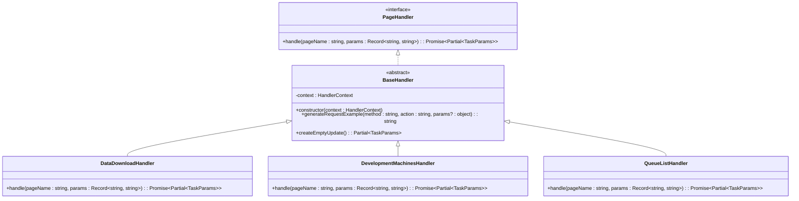

# 其他处理器

<cite>
**本文档中引用的文件**  
- [DataDownloadHandler.ts](file://src/handlers/pages/DataDownloadHandler.ts)
- [DevelopmentMachinesHandler.ts](file://src/handlers/pages/DevelopmentMachinesHandler.ts)
- [QueueListHandler.ts](file://src/handlers/pages/QueueListHandler.ts)
- [index.ts](file://src/handlers/pages/index.ts)
- [PageHandlerManager.ts](file://src/handlers/PageHandlerManager.ts)
- [BaseHandler.ts](file://src/handlers/BaseHandler.ts)
- [types.ts](file://src/handlers/types.ts)
</cite>

## 目录
1. [简介](#简介)
2. [核心功能概述](#核心功能概述)
3. [各处理器实现细节](#各处理器实现细节)
   - [DataDownloadHandler：下载链接解析与命令生成](#datadownloadhandler下载链接解析与命令生成)
   - [DevelopmentMachinesHandler：开发机配置获取](#developmentmachineshandler开发机配置获取)
   - [QueueListHandler：任务队列状态监控](#queuelisthandler任务队列状态监控)
4. [模块自动发现与注册机制](#模块自动发现与注册机制)
5. [共有的简约设计原则](#共有的简约设计原则)
6. [扩展新处理器的最佳实践](#扩展新处理器的最佳实践)

## 简介
本文档旨在系统性地介绍 AIHCX 扩展中除主流程外的若干辅助性页面处理器。这些处理器虽功能轻量，但在提升用户体验、增强工具实用性方面发挥着关键作用。通过分析 `DataDownloadHandler`、`DevelopmentMachinesHandler` 和 `QueueListHandler` 的具体实现，并结合 `PageHandlerManager` 的自动化管理机制，揭示其背后的设计哲学与可扩展架构。

## 核心功能概述
三个主要辅助处理器分别服务于不同的用户场景：
- **DataDownloadHandler**：处理数据下载相关页面，解析 URL 参数以生成 CLI 命令或标记特殊页面类型。
- **DevelopmentMachinesHandler**：为开发机列表页提供 API 文档支持，便于用户远程连接。
- **QueueListHandler**：根据页面名称区分自运维与全托管队列，动态生成对应的 CLI 与 API 调用指令。

所有处理器均继承自统一的基类，遵循一致的接口规范，并由管理器集中调度，体现了高内聚、低耦合的设计思想。

## 各处理器实现细节

### DataDownloadHandler：下载链接解析与命令生成
该处理器负责 `/dataDownload/create` 和 `/dataDownload/info` 页面的数据处理。它从 URL 参数中提取 `datasetId` 和 `category` 字段，并根据当前页面名称判断是否为“数据转储”详情页。

当处于数据转储页面时（即 `_pageName === '数据下载任务详情'`），处理器返回一个包含 `isDataDumpPage: true` 的对象，同时携带数据集信息，供前端进行特殊渲染；而在普通数据下载页面，则仅标记 `isDataDownloadPage: true`，指示前端显示输入组件而非标准 Tab 内容。

此设计避免了重复逻辑，利用单一处理器覆盖多个相似页面，提升了代码复用率。

**Section sources**
- [DataDownloadHandler.ts](file://src/handlers/pages/DataDownloadHandler.ts#L1-L42)

### DevelopmentMachinesHandler：开发机配置获取
该处理器针对 `/developmentMachines` 页面，提供标准化的 API 接口文档指引。其核心功能是返回一个预定义的 `apiDocs` 数组，其中包含指向官方文档的链接以及通过基类方法 `generateRequestExample` 自动生成的请求示例。

该处理器不依赖任何 URL 参数，专注于静态资源的组织与展示，适用于那些无需复杂参数解析但需引导用户使用 API 的场景。

**Section sources**
- [DevelopmentMachinesHandler.ts](file://src/handlers/pages/DevelopmentMachinesHandler.ts#L1-L21)

### QueueListHandler：任务队列状态监控
该处理器用于处理队列列表页面，能够智能识别“自运维”和“全托管”两种模式。通过判断传入的 `pageName` 是否为“全托管队列列表”，决定队列类型及对应的 `resourcePoolId`。

对于全托管环境，`resourcePoolId` 固定为 `'aihc-serverless'`；而对于自运维环境，则从 URL 参数 `clusterUuid` 中获取。随后，处理器利用该 ID 构造出精确的 CLI 命令（如 `aihc queue list -p ${resourcePoolId}`）和带有参数填充的 API 请求示例，帮助用户快速执行操作。

这种基于上下文动态生成命令的能力，显著增强了工具的智能化水平。

**Section sources**
- [QueueListHandler.ts](file://src/handlers/pages/QueueListHandler.ts#L1-L34)

## 模块自动发现与注册机制
尽管 `index.ts` 文件位于 `handlers/pages/` 目录下，看似仅为模块导出入口，但实际上它是实现“自动发现”的关键一环。该文件通过命名导出方式将所有处理器类暴露给外部模块：

```ts
export { DataDownloadHandler } from './DataDownloadHandler';
export { DevelopmentMachinesHandler } from './DevelopmentMachinesHandler';
// ...
```

在 `PageHandlerManager` 中，通过显式导入这些导出项并手动注册到 `Map` 结构中完成初始化：

```ts
import {
  DataDownloadHandler,
  DevelopmentMachinesHandler,
  QueueListHandler
  // ...
} from './pages';

// ...

this.handlers.set('数据下载', new DataDownloadHandler(this.context));
this.handlers.set('开发机列表', new DevelopmentMachinesHandler(this.context));
this.handlers.set('队列列表', new QueueListHandler(this.context));
```

虽然未采用运行时动态加载（如文件扫描），但由于 `index.ts` 集中管理了所有处理器的导出，使得新增处理器只需在此文件中添加一行导出语句，并在 `PageHandlerManager` 中注册即可，实现了逻辑上的“集中发现”与“便捷注册”。

**Section sources**
- [index.ts](file://src/handlers/pages/index.ts#L1-L16)
- [PageHandlerManager.ts](file://src/handlers/PageHandlerManager.ts#L6-L94)

## 共有的简约设计原则
上述处理器共同遵循以下设计原则：

1. **单一职责原则（SRP）**  
   每个处理器仅关注特定页面的数据提取与结构化输出，不涉及 UI 渲染或状态管理。

2. **继承复用机制**  
   所有处理器继承自 `BaseHandler`，复用 `generateRequestExample` 和 `createEmptyUpdate` 等通用方法，减少冗余代码。

3. **不可变数据输出**  
   `handle` 方法始终返回新的 `Partial<TaskParams>` 对象，确保状态更新的可预测性。

4. **声明式配置优先**  
   大量使用对象字面量直接构造响应内容，简洁明了，易于维护。

5. **上下文隔离**  
   处理器仅接收必要的 `pageName` 和 `params`，不直接访问全局状态，保证了模块独立性。



**Diagram sources**
- [BaseHandler.ts](file://src/handlers/BaseHandler.ts#L3-L36)
- [types.ts](file://src/handlers/types.ts#L1-L18)
- [DataDownloadHandler.ts](file://src/handlers/pages/DataDownloadHandler.ts#L1-L42)
- [DevelopmentMachinesHandler.ts](file://src/handlers/pages/DevelopmentMachinesHandler.ts#L1-L21)
- [QueueListHandler.ts](file://src/handlers/pages/QueueListHandler.ts#L1-L34)

## 扩展新处理器的最佳实践
要快速创建一个新的工具型处理器，建议遵循以下步骤：

1. **创建处理器文件**  
   在 `src/handlers/pages/` 下新建 `[Feature]Handler.ts` 文件。

2. **继承 BaseHandler**  
   导入并继承 `BaseHandler`，实现 `handle` 抽象方法。

3. **解析参数并构造响应**  
   使用 `params` 提取所需字段，调用 `generateRequestExample` 生成示例，构造 `Partial<TaskParams>` 返回。

4. **导出类**  
   在 `index.ts` 中添加 `export { [Feature]Handler } from './[Feature]Handler';`。

5. **注册处理器**  
   在 `PageHandlerManager` 的 `initializeHandlers` 方法中，使用 `this.handlers.set('页面名称', new [Feature]Handler(this.context));` 完成注册。

此流程清晰、低侵入，极大降低了新增功能的门槛，有利于团队协作与长期维护。

**Section sources**
- [BaseHandler.ts](file://src/handlers/BaseHandler.ts#L3-L36)
- [PageHandlerManager.ts](file://src/handlers/PageHandlerManager.ts#L6-L94)
- [index.ts](file://src/handlers/pages/index.ts#L1-L16)