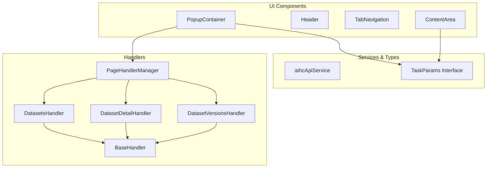
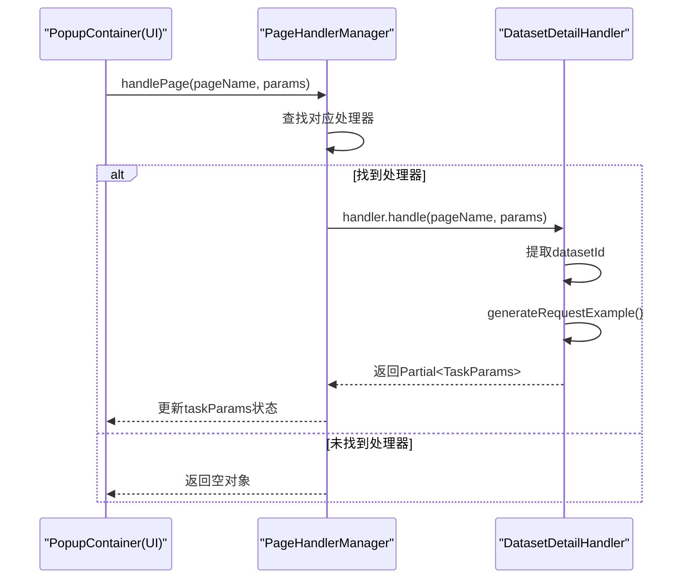
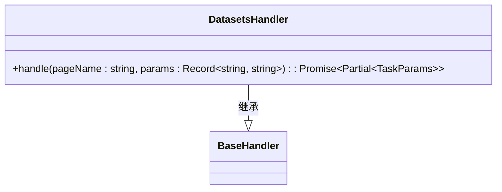
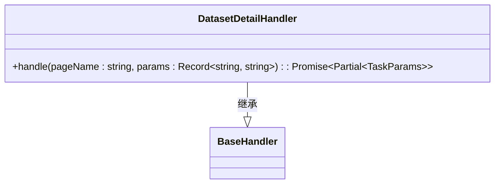
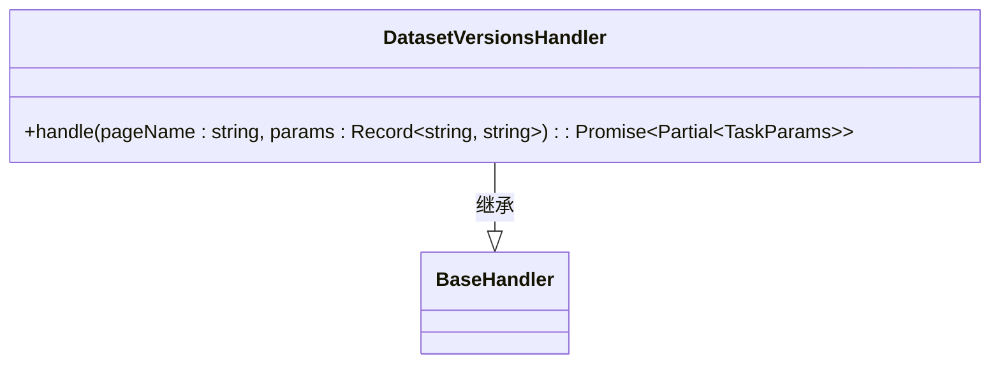
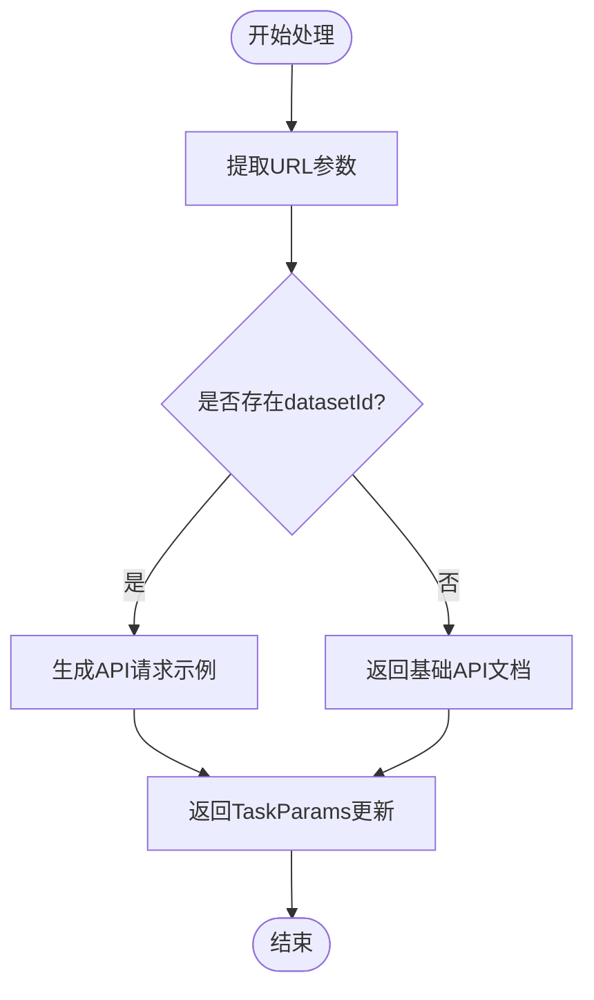
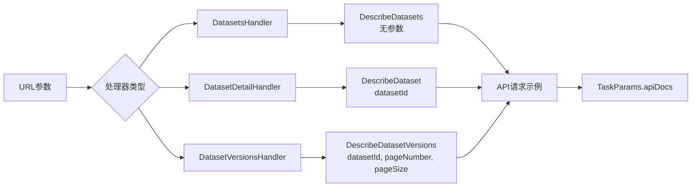
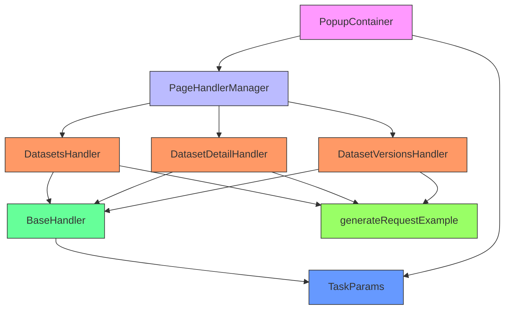

# 数据集处理器

<cite>
**Referenced Files in This Document**   
- [DatasetsHandler.ts](file://src/handlers/pages/DatasetsHandler.ts)
- [DatasetDetailHandler.ts](file://src/handlers/pages/DatasetDetailHandler.ts)
- [DatasetVersionsHandler.ts](file://src/handlers/pages/DatasetVersionsHandler.ts)
- [BaseHandler.ts](file://src/handlers/BaseHandler.ts)
- [PageHandlerManager.ts](file://src/handlers/PageHandlerManager.ts)
- [types.ts](file://src/types/index.ts)
- [PopupContainer.tsx](file://src/components/PopupContainer.tsx)
</cite>

## 目录
1. [简介](#简介)
2. [项目结构](#项目结构)
3. [核心组件](#核心组件)
4. [架构概述](#架构概述)
5. [详细组件分析](#详细组件分析)
6. [依赖分析](#依赖分析)
7. [性能考虑](#性能考虑)
8. [故障排除指南](#故障排除指南)
9. [结论](#结论)

## 简介
本文档系统化描述了AIHCX-EXT扩展中数据集全生命周期管理相关的处理器体系。重点涵盖`DatasetsHandler`（数据集列表）、`DatasetDetailHandler`（数据集详情）和`DatasetVersionsHandler`（版本管理）三者的分工与协作机制。文档详细记录了各处理器对数据集关键属性的抓取方法、在生成数据准备脚本和训练输入参数时的数据转换流程，并结合具体用例说明跨页面上下文传递机制，为开发者提供新功能开发的指导。

## 项目结构
该扩展项目采用模块化分层架构，主要分为背景脚本、UI组件、业务处理器、服务接口和工具函数等部分。数据集管理功能的核心逻辑位于`src/handlers/pages/`目录下，通过统一的处理器模式实现不同页面的数据提取与转换。

**Diagram sources**
- [PopupContainer.tsx](file://src/components/PopupContainer.tsx)
- [PageHandlerManager.ts](file://src/handlers/PageHandlerManager.ts)
- [BaseHandler.ts](file://src/handlers/BaseHandler.ts)
- [types.ts](file://src/types/index.ts)

**Section sources**
- [project_structure](file://project_structure)

## 核心组件
数据集处理器体系由三个核心类组成：`DatasetsHandler`负责处理数据集列表页面，`DatasetDetailHandler`处理数据集详情页面，`DatasetVersionsHandler`处理数据集版本管理页面。这些处理器均继承自`BaseHandler`抽象基类，实现了统一的处理接口。

**Section sources**
- [DatasetsHandler.ts](file://src/handlers/pages/DatasetsHandler.ts)
- [DatasetDetailHandler.ts](file://src/handlers/pages/DatasetDetailHandler.ts)
- [DatasetVersionsHandler.ts](file://src/handlers/pages/DatasetVersionsHandler.ts)
- [BaseHandler.ts](file://src/handlers/BaseHandler.ts)

## 架构概述
整个处理器体系遵循责任链设计模式，由`PageHandlerManager`作为中央调度器，根据当前页面名称选择合适的处理器进行数据处理。所有处理器通过`TaskParams`接口与UI层通信，实现数据的标准化输出。

**Diagram sources**
- [PopupContainer.tsx](file://src/components/PopupContainer.tsx#L20-L566)
- [PageHandlerManager.ts](file://src/handlers/PageHandlerManager.ts#L80-L100)
- [DatasetDetailHandler.ts](file://src/handlers/pages/DatasetDetailHandler.ts#L8-L21)

## 详细组件分析

### 处理器分工与协作
三个数据集处理器各司其职，共同完成数据集全生命周期的信息提取：

#### DatasetsHandler (数据集列表)
负责处理`/datasets`页面，获取数据集列表信息。该处理器不依赖任何URL参数，直接返回获取数据集列表的API文档。

**Diagram sources**
- [DatasetsHandler.ts](file://src/handlers/pages/DatasetsHandler.ts#L7-L20)

#### DatasetDetailHandler (数据集详情)
负责处理`/dataset/info?`页面，需要从URL参数中提取`datasetId`，用于生成获取特定数据集详情的API请求示例。

**Diagram sources**
- [DatasetDetailHandler.ts](file://src/handlers/pages/DatasetDetailHandler.ts#L7-L22)

#### DatasetVersionsHandler (版本管理)
负责处理`/dataset/info?tab=versions&`页面，同样需要`datasetId`参数，并生成两个API文档：获取版本列表和获取特定版本信息。

**Diagram sources**
- [DatasetVersionsHandler.ts](file://src/handlers/pages/DatasetVersionsHandler.ts#L7-L34)

### 关键属性抓取方法
所有处理器通过`params`参数对象从URL中抓取关键属性。`DatasetDetailHandler`和`DatasetVersionsHandler`均使用`params.datasetId`获取数据集标识符，这是构建API请求的关键参数。

**Diagram sources**
- [DatasetDetailHandler.ts](file://src/handlers/pages/DatasetDetailHandler.ts#L8-L21)
- [DatasetVersionsHandler.ts](file://src/handlers/pages/DatasetVersionsHandler.ts#L8-L33)

### 数据转换流程
处理器将原始URL参数转换为标准化的`TaskParams`格式，用于生成数据准备脚本和训练输入参数。转换过程通过`generateRequestExample`方法实现，该方法由`BaseHandler`提供。

**Diagram sources**
- [BaseHandler.ts](file://src/handlers/BaseHandler.ts#L26-L35)
- [types.ts](file://src/types/index.ts#L12-L37)

## 依赖分析
处理器体系具有清晰的依赖关系，确保了代码的可维护性和扩展性。

**Diagram sources**
- [PageHandlerManager.ts](file://src/handlers/PageHandlerManager.ts)
- [BaseHandler.ts](file://src/handlers/BaseHandler.ts)
- [types.ts](file://src/types/index.ts)

## 性能考虑
处理器体系设计注重性能优化：
- **异步处理**：所有`handle`方法均为异步，避免阻塞UI线程
- **按需加载**：仅在需要时才创建处理器实例
- **缓存机制**：`PageHandlerManager`缓存已创建的处理器实例
- **超时控制**：API调用包含超时机制，防止长时间等待

## 故障排除指南
当处理器功能异常时，可参考以下排查步骤：

**Section sources**
- [PageHandlerManager.ts](file://src/handlers/PageHandlerManager.ts#L80-L100)
- [PopupContainer.tsx](file://src/components/PopupContainer.tsx#L20-L566)

1. 检查页面名称是否正确注册到`PageHandlerManager`
2. 验证URL参数是否符合预期格式
3. 确认`datasetId`参数是否存在且有效
4. 查看浏览器控制台日志中的错误信息
5. 检查API端点是否可达

## 结论
本文档全面解析了AIHCX-EXT扩展中数据集处理器的架构与实现。通过`DatasetsHandler`、`DatasetDetailHandler`和`DatasetVersionsHandler`的协同工作，实现了数据集全生命周期的信息提取与转换。该设计模式具有良好的扩展性，开发者可参照此模式为新的数据管理功能开发兼容的处理器模块。