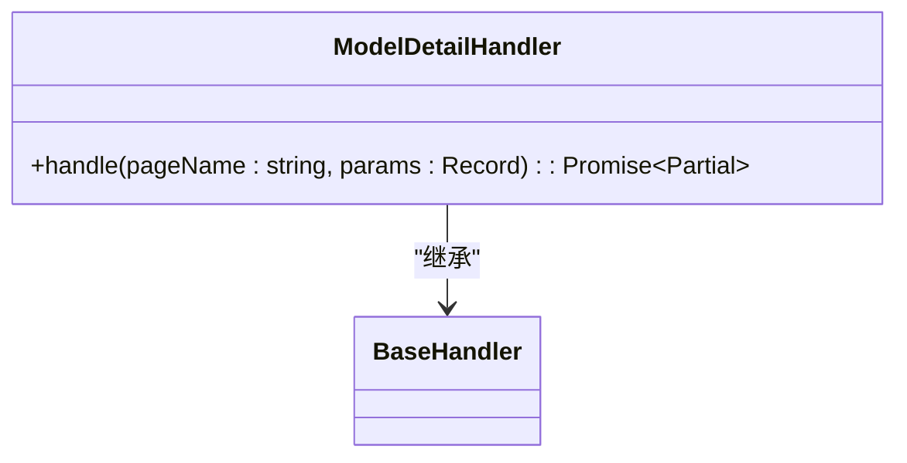
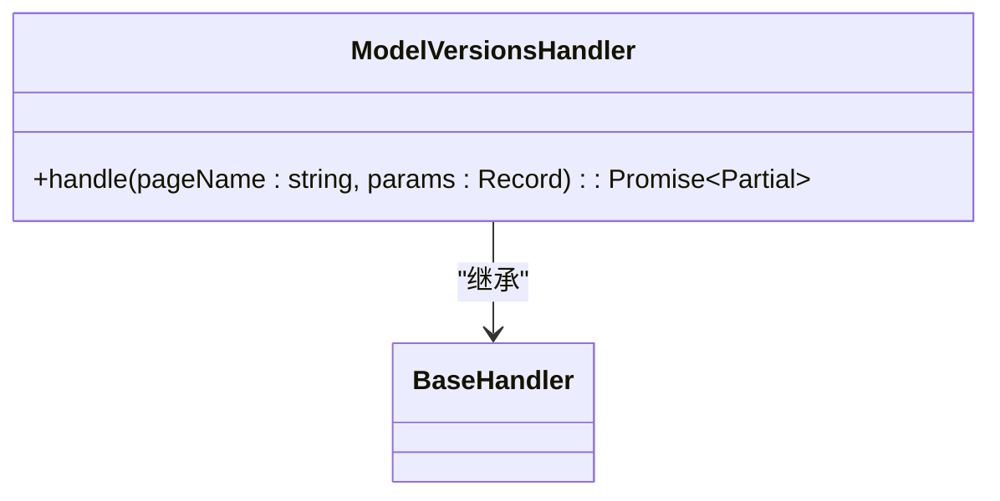
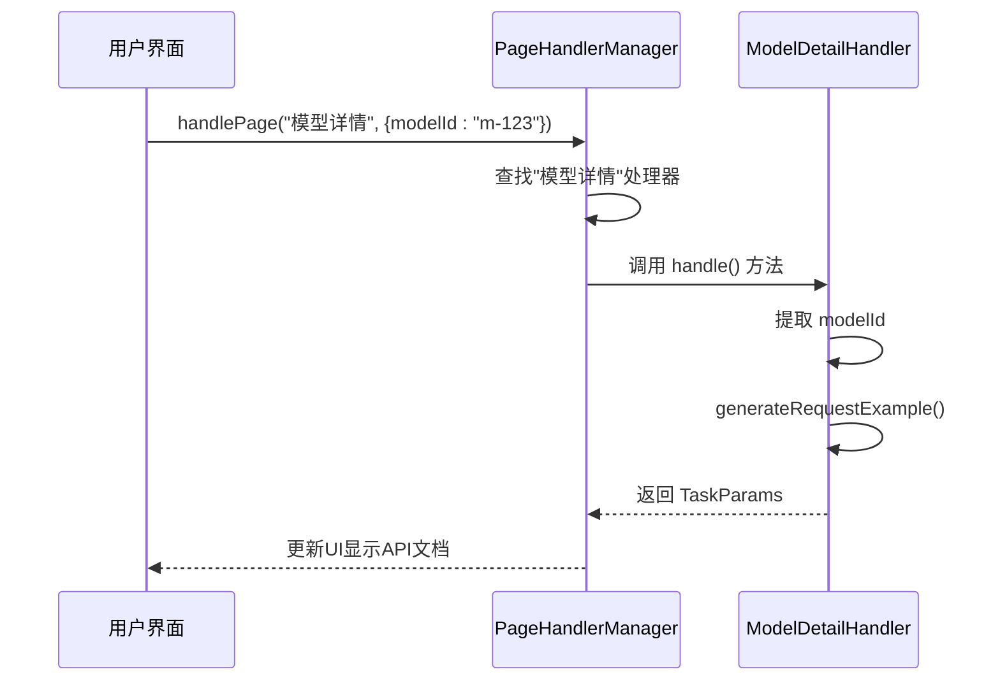
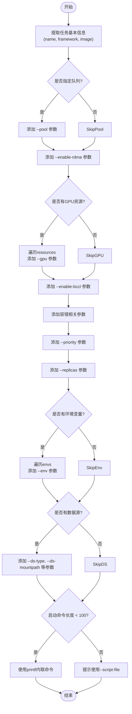

# 模型处理器

<cite>
**本文档引用文件**  
- [ModelDetailHandler.ts](file://src/handlers/pages/ModelDetailHandler.ts)
- [ModelManageListHandler.ts](file://src/handlers/pages/ModelManageListHandler.ts)
- [ModelVersionsHandler.ts](file://src/handlers/pages/ModelVersionsHandler.ts)
- [BaseHandler.ts](file://src/handlers/BaseHandler.ts)
- [index.ts](file://src/handlers/PageHandlerManager.ts)
- [common.ts](file://src/utils/common.ts)
- [types.ts](file://src/types/index.ts)
</cite>

## 目录
1. [引言](#引言)
2. [核心处理器分析](#核心处理器分析)
3. [架构协同机制](#架构协同机制)
4. [参数转换逻辑](#参数转换逻辑)
5. [数据提取与安全策略](#数据提取与安全策略)
6. [错误诊断路径](#错误诊断路径)
7. [性能优化建议](#性能优化建议)
8. [扩展新处理器开发指南](#扩展新处理器开发指南)

## 引言
本项目为AIHCX浏览器扩展，旨在增强百度智能云AI平台的用户体验。该扩展通过注入内容脚本，识别当前页面类型并展示相关API文档、CLI命令等信息。模型管理模块是其核心功能之一，负责处理模型详情、模型列表和模型版本等关键页面的数据提取与呈现。

## 核心处理器分析

### ModelDetailHandler 分析
`ModelDetailHandler` 负责处理模型详情页面（`/modelManage/info?`）的数据。它从URL参数中提取 `modelId`，生成获取模型详情的API请求示例，并提供官方文档链接。



**图示来源**
- [ModelDetailHandler.ts](file://src/handlers/pages/ModelDetailHandler.ts#L7-L22)

**节来源**
- [ModelDetailHandler.ts](file://src/handlers/pages/ModelDetailHandler.ts#L7-L22)

### ModelManageListHandler 分析
`ModelManageListHandler` 用于处理模型管理列表页面（`/modelManage/list`）。它不依赖特定参数，直接生成获取模型列表的API请求示例。


**图示来源**
- [ModelManageListHandler.ts](file://src/handlers/pages/ModelManageListHandler.ts#L7-L20)

**节来源**
- [ModelManageListHandler.ts](file://src/handlers/pages/ModelManageListHandler.ts#L7-L20)

### ModelVersionsHandler 分析
`ModelVersionsHandler` 处理模型版本列表页面（`/modelManage/info?tab=versions&`）。它利用 `modelId` 参数，生成两个API请求：获取模型版本列表和获取特定版本信息，并预设分页参数。



**图示来源**
- [ModelVersionsHandler.ts](file://src/handlers/pages/ModelVersionsHandler.ts#L7-L34)

**节来源**
- [ModelVersionsHandler.ts](file://src/handlers/pages/ModelVersionsHandler.ts#L7-L34)

## 架构协同机制

### 处理器注册与分发
所有页面处理器（包括模型相关的三个处理器）都在 `PageHandlerManager` 中集中注册。系统根据页面名称（如“模型详情”、“模型管理列表”）将请求路由到对应的处理器实例。



**图示来源**
- [PageHandlerManager.ts](file://src/handlers/PageHandlerManager.ts#L41-L67)
- [ModelDetailHandler.ts](file://src/handlers/pages/ModelDetailHandler.ts#L7-L22)

**节来源**
- [PageHandlerManager.ts](file://src/handlers/PageHandlerManager.ts#L41-L67)

## 参数转换逻辑

### 复杂配置到脚本参数的转化
虽然模型处理器本身主要生成API文档，但系统中的通用工具函数（如 `generateCLICommand`）展示了如何将复杂的JSON配置转化为可执行的CLI命令或YAML脚本。

#### CLI命令生成流程


**图示来源**
- [common.ts](file://src/utils/common.ts#L262-L303)

**节来源**
- [common.ts](file://src/utils/common.ts#L262-L303)

## 数据提取与安全策略

### DOM数据定位技术
本扩展通过 `pageDetection` 工具模块结合Chrome的 `chrome.tabs.executeScript` API，在目标页面上下文中执行JavaScript代码来精准定位DOM元素。例如，可以查询包含特定文本（如“模型ID”）的标签，然后获取其相邻元素的值。

### 敏感字段安全处理
在凭证提取方面，系统实现了严格的安全策略：
1. **多源凭证聚合**：从 `ak/sk`、`Authorization`、`token` 或 `x-api-key` 多个头部提取认证信息。
2. **大小写归一化**：对所有HTTP头部进行小写处理，确保匹配的健壮性。
3. **格式解析**：解析 `Bearer ak|sk|region` 这样的复合格式。
4. **日志脱敏**：在输出日志时，对AK/SK进行部分掩码（如 `****`），防止敏感信息泄露。

```mermaid
flowchart LR
A[HTTP Headers] --> B{标准化键名<br/>toLowercase()}
B --> C["检查 ak/sk"]
B --> D["检查 Authorization"]
B --> E["检查 token"]
B --> F["检查 x-api-key"]
C --> G{是否都缺失?}
D --> H["解析 Bearer ak|sk|region"]
E --> I["解析 Bearer ak|sk|region"]
F --> J["解析 ak|sk|region"]
H --> K[合并凭证]
I --> K
J --> K
G --> |是| L[抛出错误]
G --> |否| M[返回 {ak, sk, region}]
K --> M
```

**图示来源**
- [common.ts](file://src/utils/common.ts#L10-L90)

**节来源**
- [common.ts](file://src/utils/common.ts#L10-L90)

## 错误诊断路径

当页面处理出现问题时，应遵循以下诊断路径：

1.  **确认页面支持性**：检查 `PageHandlerManager.getSupportedPages()` 的输出，确认当前页面名称（如“模型详情”）是否在支持列表中。
2.  **检查处理器注册**：查看 `PageHandlerManager.initializeHandlers()` 方法，确认 `this.handlers.set('模型详情', new ModelDetailHandler(...))` 是否被正确调用。
3.  **验证参数传递**：在 `ModelDetailHandler.handle()` 中，检查 `params.modelId` 是否存在且有效。这通常由页面URL的查询参数决定。
4.  **审查请求生成**：如果API文档未显示，检查 `BaseHandler.generateRequestExample()` 方法的调用是否成功，以及传入的 `action` 和 `params` 是否正确。
5.  **查看控制台日志**：系统在 `handlePage` 方法中使用 `console.log` 和 `console.error` 输出关键信息和错误，这是首要的排查依据。

**节来源**
- [PageHandlerManager.ts](file://src/handlers/PageHandlerManager.ts#L69-L88)

## 性能优化建议

1.  **减少重复计算**：`formatRequestParams` 和 `generateCLICommand` 等函数可能被频繁调用。对于不变的配置项（如默认镜像），应将其定义为常量，避免在每次调用时重新创建对象。
2.  **异步操作批处理**：如果未来需要从多个API获取数据，应考虑使用 `Promise.all()` 并行发起请求，而不是串行等待。
3.  **内存泄漏防范**：确保 `PageHandlerManager` 中的 `handlers` Map 不会无限增长。目前的实现是静态注册，风险较低，但在动态场景下需注意清理。
4.  **DOM查询优化**：在内容脚本中执行的DOM查询应尽可能使用高效的CSS选择器（如ID、类名），避免复杂的XPath或遍历。

## 扩展新处理器开发指南

要为新的模型操作类型（如“模型部署”）开发处理器，请遵循以下步骤：

1.  **创建处理器文件**：在 `src/handlers/pages/` 目录下创建 `ModelDeploymentHandler.ts`。
2.  **继承基类**：实现 `extends BaseHandler`。
3.  **实现 handle 方法**：根据业务需求，从 `params` 中提取必要参数（如 `modelId`, `versionId`, `resourcePoolId`），并填充 `TaskParams` 对象。
    ```typescript
    return {
      apiDocs: [{
        title: '部署模型',
        text: 'https://cloud.baidu.com/doc/AIHC/s/xxx',
        requestExample: this.generateRequestExample('POST', 'DeployModel', { modelId, versionId, resourcePoolId })
      }],
      // 可选：生成CLI命令、JSON/YAML配置等
      cliItems: [...],
      jsonItems: [...]
    };
    ```
4.  **导出处理器**：在 `src/handlers/pages/index.ts` 文件中添加 `export { ModelDeploymentHandler } from './ModelDeploymentHandler';`。
5.  **注册处理器**：在 `src/handlers/PageHandlerManager.ts` 的 `initializeHandlers` 方法中，添加 `this.handlers.set('模型部署', new ModelDeploymentHandler(this.context));`。
6.  **测试**：确保目标页面的标题或URL能被正确识别，并触发新处理器。

**节来源**
- [BaseHandler.ts](file://src/handlers/BaseHandler.ts#L3-L36)
- [PageHandlerManager.ts](file://src/handlers/PageHandlerManager.ts#L41-L67)