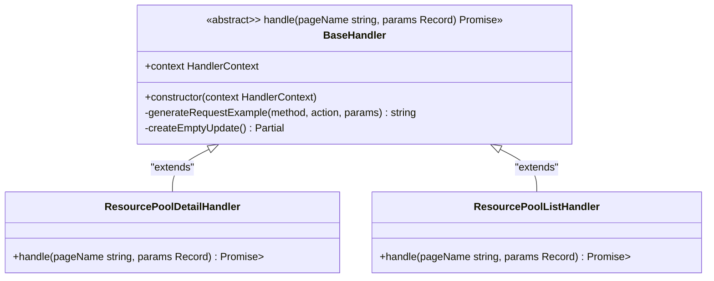
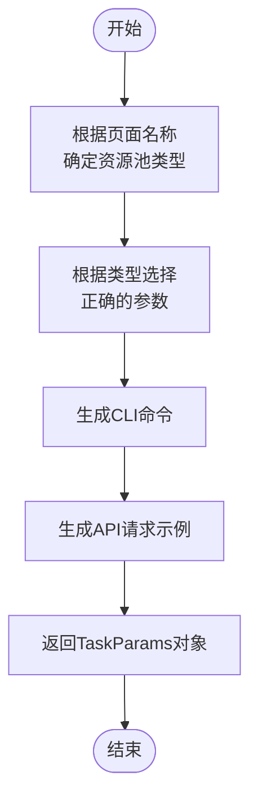
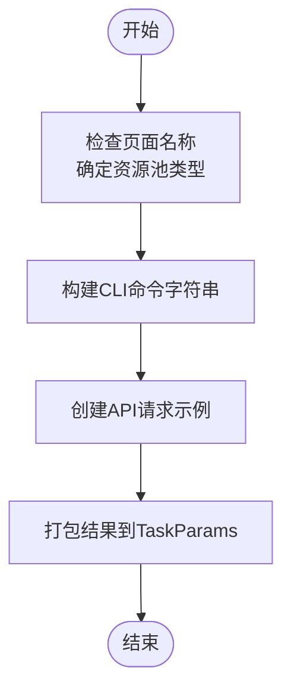
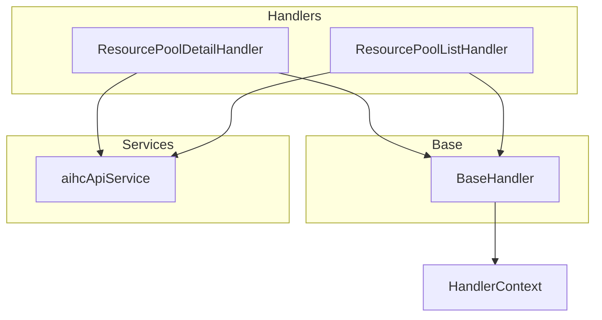

# 资源池处理器

<cite>
**Referenced Files in This Document **   
- [ResourcePoolDetailHandler.ts](file://src/handlers/pages/ResourcePoolDetailHandler.ts)
- [ResourcePoolListHandler.ts](file://src/handlers/pages/ResourcePoolListHandler.ts)
- [BaseHandler.ts](file://src/handlers/BaseHandler.ts)
- [types.ts](file://src/handlers/types.ts)
- [resourcePools.ts](file://src/utils/resourcePools.ts)
- [aihcApi.ts](file://src/services/aihcApi.ts)
</cite>

## 目录
1. [简介](#简介)
2. [核心组件分析](#核心组件分析)
3. [架构概览](#架构概览)
4. [详细组件分析](#详细组件分析)
5. [依赖关系分析](#依赖关系分析)
6. [性能考量](#性能考量)
7. [故障排查指南](#故障排查指南)
8. [结论](#结论)

## 简介
本文档全面阐述了资源池管理页面的处理逻辑，重点分析 `ResourcePoolDetailHandler` 和 `ResourcePoolListHandler` 如何识别并解析资源池的规格、节点分布、运行状态等信息。文档说明了处理器如何利用统一的 `HandlerContext` 模型提取公共元数据，并针对不同视图（详情/列表）定制数据输出结构。通过实际代码片段展示资源信息到API调用参数的映射过程，讨论权限边界处理、异常场景恢复机制，并给出向系统添加新型资源视图处理器的最佳实践。

## 核心组件分析
本节深入分析资源池处理器的核心组件，包括 `ResourcePoolDetailHandler`、`ResourcePoolListHandler` 以及它们所继承的基类 `BaseHandler`。这些组件共同构成了资源池信息处理的核心逻辑，负责从用户界面请求中提取关键参数，并将其转换为可执行的CLI命令和API调用示例。

**Section sources**
- [ResourcePoolDetailHandler.ts](file://src/handlers/pages/ResourcePoolDetailHandler.ts#L8-L35)
- [ResourcePoolListHandler.ts](file://src/handlers/pages/ResourcePoolListHandler.ts#L8-L33)
- [BaseHandler.ts](file://src/handlers/BaseHandler.ts#L8-L37)

## 架构概览
资源池处理器采用分层架构设计，其中具体的处理器类（如 `ResourcePoolDetailHandler` 和 `ResourcePoolListHandler`）继承自一个抽象的基类 `BaseHandler`。这种设计模式实现了代码复用和职责分离，使得每个处理器可以专注于其特定的业务逻辑，而通用的功能则由基类提供。

**Diagram sources **
- [BaseHandler.ts](file://src/handlers/BaseHandler.ts#L8-L37)
- [ResourcePoolDetailHandler.ts](file://src/handlers/pages/ResourcePoolDetailHandler.ts#L8-L35)
- [ResourcePoolListHandler.ts](file://src/handlers/pages/ResourcePoolListHandler.ts#L8-L33)

## 详细组件分析
本节将对 `ResourcePoolDetailHandler` 和 `ResourcePoolListHandler` 进行详细的分析，探讨它们如何处理不同的视图需求，并生成相应的CLI命令和API文档。

### ResourcePoolDetailHandler 分析
`ResourcePoolDetailHandler` 负责处理资源池详情页面的数据。它根据传入的页面名称判断是“全托管”还是“自运维”类型的资源池，并据此选择正确的参数进行后续处理。

#### 处理逻辑流程
该处理器的处理逻辑遵循以下步骤：
1. 根据页面名称确定资源池类型。
2. 根据资源池类型选择对应的ID参数（`resourcePoolId` 或 `clusterUuid`）。
3. 使用基类提供的 `generateRequestExample` 方法生成API请求示例。
4. 返回包含CLI命令和API文档的 `TaskParams` 对象。

**Diagram sources **
- [ResourcePoolDetailHandler.ts](file://src/handlers/pages/ResourcePoolDetailHandler.ts#L8-L35)

**Section sources**
- [ResourcePoolDetailHandler.ts](file://src/handlers/pages/ResourcePoolDetailHandler.ts#L8-L35)

### ResourcePoolListHandler 分析
`ResourcePoolListHandler` 负责处理资源池列表页面的数据。与详情处理器类似，它也根据页面名称来区分资源池类型，并生成相应的CLI和API调用指令。

#### 处理逻辑流程
该处理器的处理逻辑如下：
1. 根据页面名称判断资源池类型。
2. 构建适用于该类型的CLI命令字符串。
3. 生成API请求示例，指定资源池类型作为查询参数。
4. 返回封装好的 `TaskParams` 结果。

**Diagram sources **
- [ResourcePoolListHandler.ts](file://src/handlers/pages/ResourcePoolListHandler.ts#L8-L33)

**Section sources**
- [ResourcePoolListHandler.ts](file://src/handlers/pages/ResourcePoolListHandler.ts#L8-L33)

## 依赖关系分析
资源池处理器不仅依赖于自身的实现，还与其他模块紧密协作，以确保功能的完整性和健壮性。特别是，`BaseHandler` 提供了通用的方法支持，而外部服务如 `aihcApi` 则提供了底层的数据访问能力。

**Diagram sources **
- [BaseHandler.ts](file://src/handlers/BaseHandler.ts#L8-L37)
- [ResourcePoolDetailHandler.ts](file://src/handlers/pages/ResourcePoolDetailHandler.ts#L8-L35)
- [ResourcePoolListHandler.ts](file://src/handlers/pages/ResourcePoolListHandler.ts#L8-L33)
- [aihcApi.ts](file://src/services/aihcApi.ts#L1-L558)

**Section sources**
- [BaseHandler.ts](file://src/handlers/BaseHandler.ts#L8-L37)
- [ResourcePoolDetailHandler.ts](file://src/handlers/pages/ResourcePoolDetailHandler.ts#L8-L35)
- [ResourcePoolListHandler.ts](file://src/handlers/pages/ResourcePoolListHandler.ts#L8-L33)
- [aihcApi.ts](file://src/services/aihcApi.ts#L1-L558)

## 性能考量
在处理资源池信息时，性能是一个重要的考虑因素。系统通过多种方式优化性能，例如使用缓存机制减少重复的API调用，以及在前端组件中合理地管理加载状态和错误处理。

此外，`aihcApiService` 中的各个方法都包含了对响应数据的过滤和映射操作，这有助于减少不必要的数据传输和处理开销。同时，异常处理机制确保了即使在部分失败的情况下，系统也能优雅地降级并提供有意义的反馈。

## 故障排查指南
当遇到资源池相关的问题时，可以从以下几个方面进行排查：

1. **检查网络连接**：确保客户端能够正常访问后端API服务。
2. **验证参数正确性**：确认传递给处理器的参数是否符合预期格式。
3. **查看日志输出**：利用控制台日志定位问题发生的具体位置。
4. **测试API端点**：直接调用相关的API端点，验证其返回结果是否正确。

**Section sources**
- [aihcApi.ts](file://src/services/aihcApi.ts#L1-L558)
- [resourcePools.ts](file://src/utils/resourcePools.ts#L40-L63)

## 结论
通过对 `ResourcePoolDetailHandler` 和 `ResourcePoolListHandler` 的深入分析，我们了解到这两个处理器如何有效地管理和呈现资源池的信息。它们通过继承 `BaseHandler` 实现了代码复用，并利用 `HandlerContext` 模型提取公共元数据。此外，系统的异常处理和权限边界管理机制保证了稳定可靠的用户体验。未来扩展新的资源视图处理器时，应遵循相同的设计原则，确保一致性和可维护性。