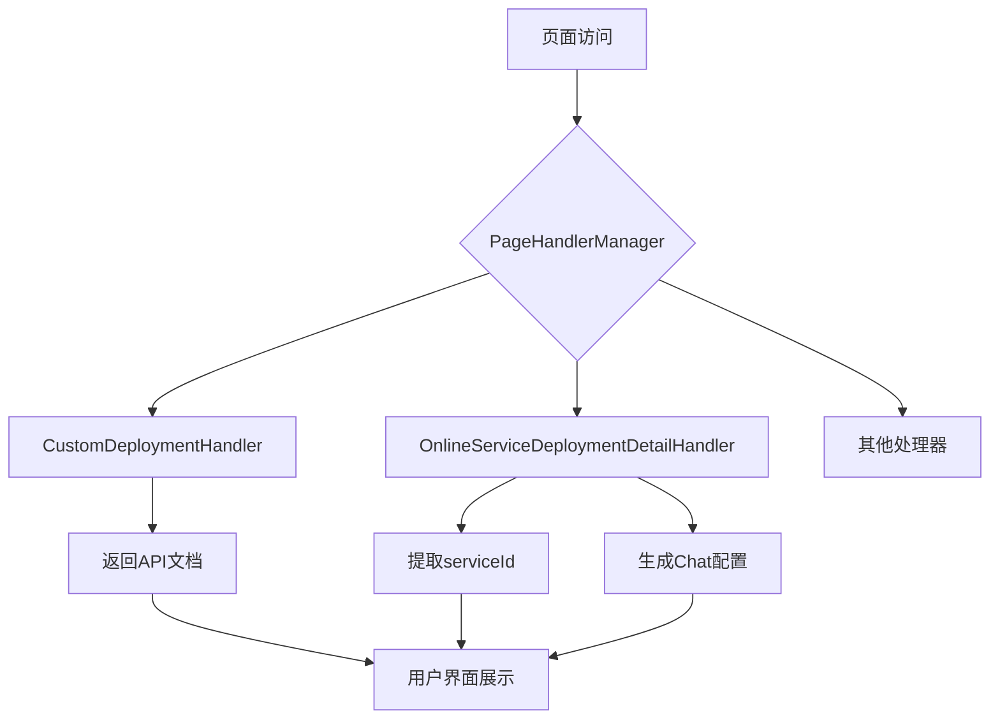

# 部署处理器

<cite>
**本文档引用的文件**   
- [CustomDeploymentHandler.ts](file://src/handlers/pages/CustomDeploymentHandler.ts)
- [OnlineServiceDeploymentDetailHandler.ts](file://src/handlers/pages/OnlineServiceDeploymentDetailHandler.ts)
- [BaseHandler.ts](file://src/handlers/BaseHandler.ts)
- [types.ts](file://src/types/index.ts)
- [PageHandlerManager.ts](file://src/handlers/PageHandlerManager.ts)
</cite>

## 目录
1. [简介](#简介)
2. [核心处理机制](#核心处理机制)
3. [自定义部署处理器分析](#自定义部署处理器分析)
4. [在线服务部署详情处理器分析](#在线服务部署详情处理器分析)
5. [配置提取与导出](#配置提取与导出)
6. [安全上下文与凭证隔离](#安全上下文与凭证隔离)
7. [插件化开发指引](#插件化开发指引)
8. [结论](#结论)

## 简介
本文档详细说明了AIHCX扩展中服务部署类页面的处理机制。重点解析`CustomDeploymentHandler`和`OnlineServiceDeploymentDetailHandler`如何捕获自定义部署与在线服务部署的关键配置项，包括镜像地址、端口映射、扩缩容策略等。文档描述了其特有的环境变量注入逻辑和健康检查参数提取方法，并演示如何将部署配置导出为Kubernetes兼容的YAML片段或CLI一键部署命令。同时强调了安全上下文处理、凭证隔离机制，并提供了适配未来部署形态的插件化开发指引。

**Section sources**
- [CustomDeploymentHandler.ts](file://src/handlers/pages/CustomDeploymentHandler.ts#L7-L20)
- [OnlineServiceDeploymentDetailHandler.ts](file://src/handlers/pages/OnlineServiceDeploymentDetailHandler.ts#L7-L48)

## 核心处理机制
部署处理器的核心机制基于一个统一的处理器管理框架，通过继承`BaseHandler`抽象类实现特定页面的数据处理。每个处理器负责从URL参数中提取关键信息，并生成相应的API文档、CLI命令和其他辅助信息。



**Diagram sources **
- [PageHandlerManager.ts](file://src/handlers/PageHandlerManager.ts#L21-L93)
- [CustomDeploymentHandler.ts](file://src/handlers/pages/CustomDeploymentHandler.ts#L7-L20)
- [OnlineServiceDeploymentDetailHandler.ts](file://src/handlers/pages/OnlineServiceDeploymentDetailHandler.ts#L7-L48)

**Section sources**
- [PageHandlerManager.ts](file://src/handlers/PageHandlerManager.ts#L21-L93)
- [BaseHandler.ts](file://src/handlers/BaseHandler.ts#L3-L36)

## 自定义部署处理器分析
`CustomDeploymentHandler`负责处理自定义部署页面的数据。该处理器主要功能是生成获取在线服务部署列表的API文档链接和请求示例。

```mermaid
classDiagram
    class CustomDeploymentHandler {
        +handle(pageName: string, params: Record<string, string>): Promise~Partial<TaskParams>~
    }
    
    CustomDeploymentHandler --|> BaseHandler : 继承
    
    class BaseHandler {
        +context: HandlerContext
        +handle(pageName: string, params: Record<string, string>): Promise~Partial<TaskParams>~
        +generateRequestExample(method: 'GET' | 'POST', action: string, params?: object): string
        +createEmptyUpdate(): Partial<TaskParams>
    }
    
    class TaskParams {
        +cliItems: { title: string; text: string; doc?: string }[]
        +apiDocs: { title: string; text: string; requestExample?: string }[]
        +jsonItems: { title: string; text: string }[]
        +yaml