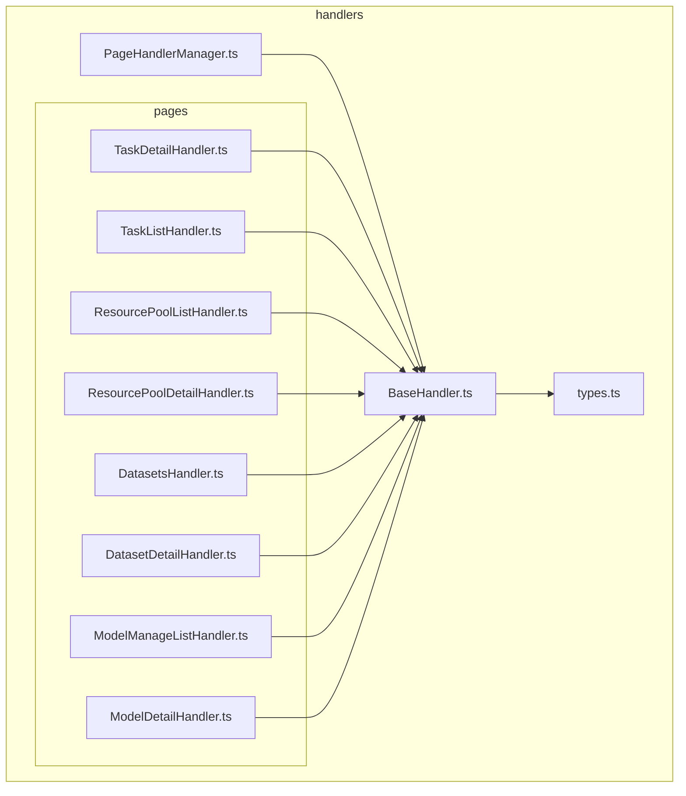
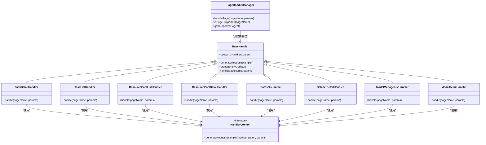
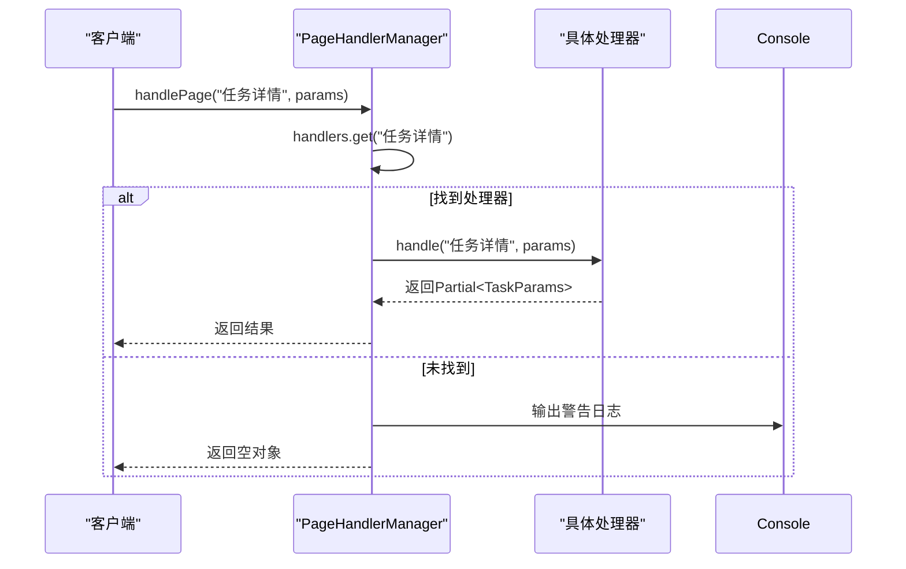
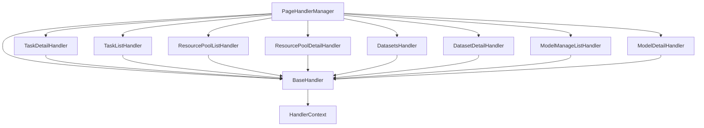

# 页面处理器

<cite>
**本文档引用的文件**  
- [PageHandlerManager.ts](file://src/handlers/PageHandlerManager.ts)
- [BaseHandler.ts](file://src/handlers/BaseHandler.ts)
- [types.ts](file://src/handlers/types.ts)
- [TaskDetailHandler.ts](file://src/handlers/pages/TaskDetailHandler.ts)
- [TaskListHandler.ts](file://src/handlers/pages/TaskListHandler.ts)
- [ResourcePoolListHandler.ts](file://src/handlers/pages/ResourcePoolListHandler.ts)
- [ResourcePoolDetailHandler.ts](file://src/handlers/pages/ResourcePoolDetailHandler.ts)
- [DatasetsHandler.ts](file://src/handlers/pages/DatasetsHandler.ts)
- [DatasetDetailHandler.ts](file://src/handlers/pages/DatasetDetailHandler.ts)
- [ModelManageListHandler.ts](file://src/handlers/pages/ModelManageListHandler.ts)
- [ModelDetailHandler.ts](file://src/handlers/pages/ModelDetailHandler.ts)
</cite>

## 目录
1. [介绍](#介绍)
2. [项目结构](#项目结构)
3. [核心组件](#核心组件)
4. [架构概述](#架构概述)
5. [详细组件分析](#详细组件分析)
6. [依赖分析](#依赖分析)
7. [性能考虑](#性能考虑)
8. [故障排除指南](#故障排除指南)
9. [结论](#结论)

## 介绍
本系统为AIHC控制台提供页面处理能力，通过模块化设计支持多种页面类型。其核心是`PageHandlerManager`，负责集中管理所有页面处理器，并根据当前页面名称调用相应的处理器实例。每个处理器继承自`BaseHandler`，共享统一的上下文对象`HandlerContext`，从而实现功能复用和一致性。

该体系具备良好的可扩展性，开发者可通过新增处理器类并注册到管理器中，快速支持新的控制台页面类型。目前系统已覆盖任务、资源池、数据集、模型等多个业务领域，能够提取关键参数并生成CLI命令、API文档示例等辅助信息。

## 项目结构

**图源**
- [PageHandlerManager.ts](file://src/handlers/PageHandlerManager.ts)
- [BaseHandler.ts](file://src/handlers/BaseHandler.ts)
- [types.ts](file://src/handlers/types.ts)

**节源**
- [PageHandlerManager.ts](file://src/handlers/PageHandlerManager.ts)
- [BaseHandler.ts](file://src/handlers/BaseHandler.ts)
- [types.ts](file://src/handlers/types.ts)

## 核心组件

页面处理器体系由三大核心部分构成：`PageHandlerManager`作为调度中枢，`BaseHandler`作为所有处理器的基类，以及`HandlerContext`接口定义共享上下文。这种设计实现了职责分离与代码复用，确保各处理器在统一规范下运行。

**节源**
- [PageHandlerManager.ts](file://src/handlers/PageHandlerManager.ts)
- [BaseHandler.ts](file://src/handlers/BaseHandler.ts)
- [types.ts](file://src/handlers/types.ts)

## 架构概述

**图源**
- [PageHandlerManager.ts](file://src/handlers/PageHandlerManager.ts#L21-L93)
- [BaseHandler.ts](file://src/handlers/BaseHandler.ts#L3-L36)
- [types.ts](file://src/handlers/types.ts#L12-L18)

## 详细组件分析

### HandlerContext 对象结构与共享机制

`HandlerContext` 是一个接口，定义了处理器间共享的功能方法。当前唯一的方法 `generateRequestExample` 用于生成标准化的API请求示例，接受HTTP方法、操作名及可选参数对象。该上下文在 `PageHandlerManager` 初始化时传入，并通过构造函数传递给每一个处理器实例，确保所有处理器都能访问相同的上下文服务。

**节源**
- [types.ts](file://src/handlers/types.ts#L12-L18)
- [BaseHandler.ts](file://src/handlers/BaseHandler.ts#L3-L36)

### PageHandlerManager 注册与管理机制

`PageHandlerManager` 使用 `Map<string, PageHandler>` 结构存储页面名称与其对应处理器的映射关系。在构造函数中调用 `initializeHandlers()` 方法完成所有处理器的注册。注册过程采用硬编码方式将不同页面名称（如“任务详情”、“资源池列表”）与具体处理器实例关联，支持同一处理器被多个页面名称引用（如“自运维资源池列表”和“全托管资源池列表”均使用 `ResourcePoolListHandler`）。

外部通过 `handlePage(pageName, params)` 方法触发处理流程，管理器查找对应处理器并执行其 `handle` 方法，返回标准化结果。若未找到匹配处理器，则输出警告并返回空对象。

**图源**
- [PageHandlerManager.ts](file://src/handlers/PageHandlerManager.ts#L21-L93)

**节源**
- [PageHandlerManager.ts](file://src/handlers/PageHandlerManager.ts#L21-L93)

### 不同领域处理器的业务逻辑分析

#### 任务相关处理器

- **TaskDetailHandler**: 处理“任务详情”页面。从URL参数中提取 `clusterUuid` 和 `k8sName`，调用后端API获取原始任务配置，解析后生成创建任务所需的CLI命令、JSON/YAML参数及执行脚本。包含完整的错误处理与降级方案。
- **TaskListHandler**: 处理“任务列表”页面。检查是否已选择资源池（通过 `clusters` 参数判断），若未选择则提示用户；否则生成获取任务列表的CLI和API调用指令。

**节源**
- [TaskDetailHandler.ts](file://src/handlers/pages/TaskDetailHandler.ts#L7-L272)
- [TaskListHandler.ts](file://src/handlers/pages/TaskListHandler.ts#L7-L48)

#### 资源池相关处理器

- **ResourcePoolListHandler**: 区分“自运维”与“全托管”资源池列表，动态生成对应的CLI命令和API请求示例，参数 `resourcePoolType` 根据页面名称确定。
- **ResourcePoolDetailHandler**: 类似地根据页面名称判断资源池类型，并从 `params` 中选取正确的ID字段（`clusterUuid` 或 `resourcePoolId`）生成详情查询命令。

**节源**
- [ResourcePoolListHandler.ts](file://src/handlers/pages/ResourcePoolListHandler.ts#L7-L34)
- [ResourcePoolDetailHandler.ts](file://src/handlers/pages/ResourcePoolDetailHandler.ts#L7-L36)

#### 数据集相关处理器

- **DatasetsHandler**: 提供数据集列表的API文档链接和请求示例，无CLI命令。
- **DatasetDetailHandler**: 接收 `datasetId` 参数，生成获取特定数据集详情的API请求示例。

**节源**
- [DatasetsHandler.ts](file://src/handlers/pages/DatasetsHandler.ts#L7-L20)
- [DatasetDetailHandler.ts](file://src/handlers/pages/DatasetDetailHandler.ts#L7-L22)

#### 模型相关处理器

- **ModelManageListHandler**: 生成获取模型列表的API文档和请求示例。
- **ModelDetailHandler**: 接收 `modelId` 参数，生成获取模型详情的API请求示例。

**节源**
- [ModelManageListHandler.ts](file://src/handlers/pages/ModelManageListHandler.ts#L7-L20)
- [ModelDetailHandler.ts](file://src/handlers/pages/ModelDetailHandler.ts#L7-L22)

### 添加新页面处理器的扩展方法

要添加新的页面处理器以支持未来AIHC控制台的新页面类型，需遵循以下步骤：

1. 创建新的处理器类，继承自 `BaseHandler`；
2. 实现 `handle` 方法，根据业务需求提取参数、调用API或生成内容；
3. 在 `PageHandlerManager.initializeHandlers()` 方法中使用 `this.handlers.set('页面名称', new YourHandler(this.context))` 进行注册；
4. 确保处理器返回符合 `Partial<TaskParams>` 类型的结果对象。

此机制具有高度可扩展性，无需修改核心调度逻辑即可接入新功能。

**节源**
- [PageHandlerManager.ts](file://src/handlers/PageHandlerManager.ts#L30-L57)
- [BaseHandler.ts](file://src/handlers/BaseHandler.ts#L3-L36)

## 依赖分析

**图源**
- [PageHandlerManager.ts](file://src/handlers/PageHandlerManager.ts)
- [BaseHandler.ts](file://src/handlers/BaseHandler.ts)

**节源**
- [PageHandlerManager.ts](file://src/handlers/PageHandlerManager.ts)
- [BaseHandler.ts](file://src/handlers/BaseHandler.ts)

## 性能考虑
系统采用同步初始化方式加载所有处理器，在应用启动时完成注册，避免运行时查找开销。`Map` 数据结构保证了页面名称查找的时间复杂度为 O(1)。对于涉及网络请求的处理器（如 `TaskDetailHandler`），已内置超时控制（10秒）和异常捕获机制，防止阻塞主线程。整体设计轻量高效，适合浏览器扩展环境。

## 故障排除指南
当某个页面无法正常显示助手内容时，请按以下步骤排查：
1. 确认页面名称是否准确匹配注册表中的键名；
2. 检查URL参数是否齐全且格式正确；
3. 查看浏览器控制台是否有 `[PageHandlerManager] 未找到页面处理器` 警告；
4. 验证新添加的处理器是否已在 `initializeHandlers` 中正确注册；
5. 确保处理器返回的对象结构符合 `Partial<TaskParams>` 类型要求。

**节源**
- [PageHandlerManager.ts](file://src/handlers/PageHandlerManager.ts#L60-L75)
- [BaseHandler.ts](file://src/handlers/BaseHandler.ts#L20-L36)

## 结论
页面处理器体系通过清晰的分层设计和规范化的接口定义，实现了对AIHC控制台多类型页面的支持。`PageHandlerManager` 的集中管理机制与 `BaseHandler` 的抽象封装相结合，既保证了系统的稳定性，又提供了良好的可扩展性。通过简单的注册流程即可接入新页面类型，便于后续功能迭代与维护。